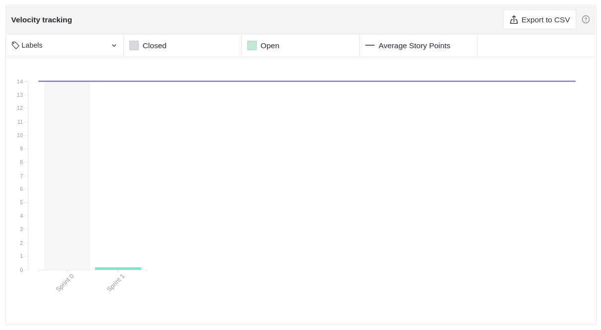

# Resultados Sprint 00 (_Design Sprint_)

A sprint 0 foi marcada pelas definições de projeto e pela definição do escopo de atuação. Foi proposto ao time um nicho de trabalho e o escolhido foram as [ODS](https://brasil.un.org/pt-br/sdgs) (Objetivos de Desenvolvimento Sustentável) da ONU. A ritual de escolha, as propostas levantadas pelo time e a vencedora foram disponibilizadas nesse [documento](_docs/produto/themes_vote.md).

Vale ressaltar que este foi o primeiro contato mais próximos dos times de _EPS_ e _MDS_ pois, apesar de terem combinado o grupo no final do semestre anterior, ainda não tinha tido tanto contato. Dessa forma foi proposto pelo _Scrum Master_ duas dinâmicas para quebrar o gelo ([#5](https://github.com/fga-eps-mds/2020.2-Lend.it/issues/5)) na primeira reunião conjunta do time (03/02/2021), momento que foi pedido que:

- Os membros definissem suas expectativas com a matéria em apenas uma palavra

- Cada um pensasse em 3 música, durante 10 minutos, e compartilhar com os membros. As músicas deviam estar dentro de 3 propostas:
  - Uma música que define sua personalidade
  - Uma música que gosta cantada por uma pessoa/banda que odeia
  - Uma música para ser tocada no seu funeral

Outro ponto muito abordado nessa sprint foram os dojos, realizado pelo _DevOps_, para começar o treinamento do time de _MDS_ em algumas tecnologias que são comuns a todos os projetos, tais como _Git_ e _Docker_. Foi feito também o [_roadmap_](https://docs.google.com/spreadsheets/d/1mUBDM7covg2bMSA_dbjxosfBFmCLuXOJutKxEjRi-eo/edit#gid=0) da matéria, pelo _Product Owner_, até a **Release 1** para guiar os próximos passos do time.

## Fechamento da Sprint

|                            _Issue_                             |                       Título                       |  _Status_   | Pontos |
| :------------------------------------------------------------: | :------------------------------------------------: | :---------: | :----: |
|  [#4](https://github.com/fga-eps-mds/2020.2-Lend.it/issues/4)  |              Pull requests educativos              | _Concluído_ |   1    |
|  [#5](https://github.com/fga-eps-mds/2020.2-Lend.it/issues/5)  |              Dinâmica de quebra gelo               | _Concluído_ |   1    |
|  [#6](https://github.com/fga-eps-mds/2020.2-Lend.it/issues/6)  |                    Dojo Docker                     | _Concluído_ |   1    |
|  [#7](https://github.com/fga-eps-mds/2020.2-Lend.it/issues/7)  |               Quadro de conhecimento               | _Concluído_ |   1    |
|  [#8](https://github.com/fga-eps-mds/2020.2-Lend.it/issues/8)  |         Práticas ágeis do time: Pareamento         | _Concluído_ |   1    |
|  [#9](https://github.com/fga-eps-mds/2020.2-Lend.it/issues/9)  |      Práticas ágeis do time: Sprint time box       | _Concluído_ |   1    |
| [#10](https://github.com/fga-eps-mds/2020.2-Lend.it/issues/10) |  Práticas ágeis do time: Definir Rituais do Time   | _Concluído_ |   1    |
| [#11](https://github.com/fga-eps-mds/2020.2-Lend.it/issues/11) |     Praticas de comunidades de software livre      | _Concluído_ |   1    |
| [#12](https://github.com/fga-eps-mds/2020.2-Lend.it/issues/12) |  Práticas ágeis do time: retrospectiva na sprint   | _Concluído_ |   1    |
| [#13](https://github.com/fga-eps-mds/2020.2-Lend.it/issues/13) | Práticas ágeis do time: codigo escrito com padroes | _Concluído_ |   1    |
| [#14](https://github.com/fga-eps-mds/2020.2-Lend.it/issues/14) |   Práticas ágeis do time: Planejamento da sprint   | _Concluído_ |   1    |
| [#15](https://github.com/fga-eps-mds/2020.2-Lend.it/issues/15) |     Práticas ágeis do time: Roadmap da matéria     | _Concluído_ |   1    |
| [#16](https://github.com/fga-eps-mds/2020.2-Lend.it/issues/16) |                        Wiki                        | _Concluído_ |   1    |
| [#20](https://github.com/fga-eps-mds/2020.2-Lend.it/issues/20) |       Documento de planejamento da sprint 0        | _Concluído_ |   1    |
| [#23](https://github.com/fga-eps-mds/2020.2-Lend.it/issues/23) |                    Dojo de Git                     | _Concluído_ |   1    |
| [#28](https://github.com/fga-eps-mds/2020.2-Lend.it/issues/28) |         Documento de conclusão de sprint 0         | _Concluído_ |   1    |

Pontos Planejados Concluídos: 17

Pontos de Dívida Concluídos: 0

Pontos Não Agregados: 0

> [_Sprint_ _Backlog_](https://github.com/fga-eps-mds/2020.2-Lend.it/milestone/1?closed=1)

## Burndown

Por se tratar de uma sprint de ambientação no inicio da sprint as issues haviam sido registradas no _Trello_ da equipe e foram transferidas para o _GitHub_ do time no dia 06/02, o que explica a queda abrupta de pontos neste dia.

Vale ressaltar que, como o time ainda estava se ambientando ao ritmo do projeto, algumas issues foram fechadas posteriormente. Essas não foram tidas como dívidas pois se tratavam da documentação da sprint ([#20](https://github.com/fga-eps-mds/2020.2-Lend.it/issues/20) e [#28](https://github.com/fga-eps-mds/2020.2-Lend.it/issues/28)) e a issue [#42](https://github.com/fga-eps-mds/2020.2-Lend.it/issues/42) que foi identificada no momento de definição desses documentos que está dentro do contexto da sprint, uma vez que as definições foram feitas nessa sprint.

## Velocity

Por se tratar da Sprint 0 ainda não é possível aferir com precisão a quantidade de pontos que o time é capaz de entregar a cada iteração.

## Quadro de Conhecimento

Analisando o primeiro quadro é possível ver que a distribuição de conhecimento entre o time de _EPS_ se dá pela afinidade de cada membro com as áreas de desenvolvimento que cada um tem e se mostra positivo pois os mesmos são capazes de ministrar dojos que compartilhe esse conhecimento. Já quanto ao time de _MDS_ é possível ver que o conhecimento não está distribuído de forma igualitária, tendo alguns muito bons em conhecimentos básicos e já avançados, e outros que necessitam de auxílio nos conceitos mais básicos.

O segundo quadro diz respeito aos aspectos de gerências que o time de _EPS_ vai transmitir ao time de _MDS_ para poder melhor prepará-los para quando estiverem do outro lado do time, em caráter extra. Isso se dará após a consolidação dos conhecimentos necessários ao desenvolvimento da aplicação, mas a aferição já será realizada.

<iframe src="https://docs.google.com/spreadsheets/d/e/2PACX-1vQt9zLphgqw_af_Kz6vaOhzGt4M4xnPEfbVTrtfh-CvbbsX1HziKhaXO5_nenI8iGToZQJNdfrqNvoJ/pubhtml?gid=1585311913&amp;single=true&amp;widget=true&amp;headers=false" height="600"></iframe>

## Avaliação do Scrum Master

Por se tratar de uma _sprint_ de ambientação, a partir da análise dos dados, é possível ver que o time ainda estava se ambientando ao projeto e definindo metodologias importantes para a sequência dos trabalhos. As métricas levantadas ainda se mostram pouco confiáveis dado todo esse contexto. Com o escopo e _backlog_ definidos e um _roadmap_ de desenvolvimento claro será possível coletar melhores métricas de acompanhamento do time.

Os dojos serão criados de acordo com a arquitetura e tecnologia definidas para o projeto, de forma que possa melhor guiar e compartilhar o conhecimento entre os times de _EPS_ e _MDS_. Os que foram ministrados se mostraram bem positivos.

O time se mostrou bem animado quanto a proposta de Tema escolhida o que é um fator motivador para o time poder desenvolver o projeto. A participação ativa do time de _MDS_ é um fator que agrega bastante a essas definições de projeto que afetam todos, pois dessa forma seus pontos de vista e vontades são levados em consideração.

**Autor:** [Rogério Júnior](https://github.com/rogerioo)
