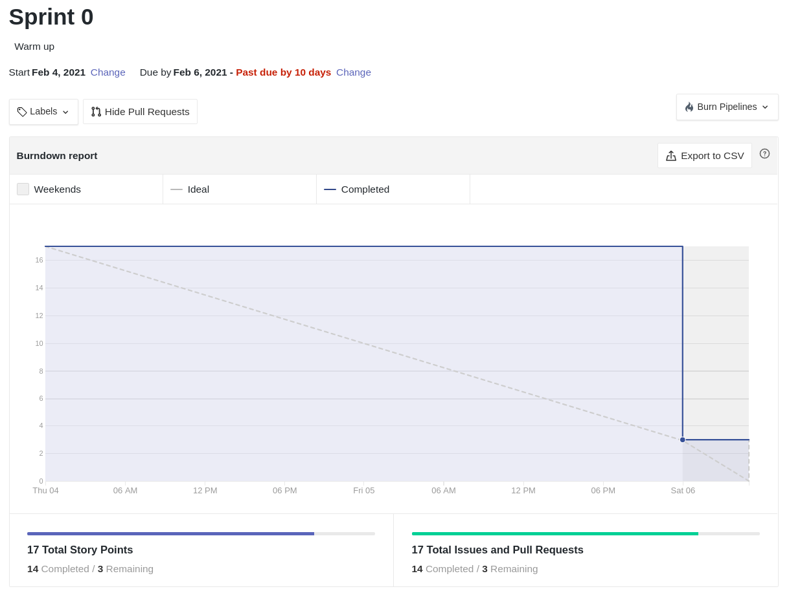

# Resultados Sprint 0 (*Design Sprint*)

Fazer a restrospectiva da *sprint* explicando de forma detalhada qual foi o resultado e buscar sempre linkar com aquilo que seja relevante às explicações.

## Fechamento da Sprint

| *Issue* | Título | *Status* | Pontos |
| :-----: | :----: | :------: | :----: |
| [#4](https://github.com/issues/4) | Pull requests educativos | *Closed* | 1 |
| [#5](https://github.com/issues/5) | Dinâmica de quebra gelo | *Closed* | 1 |
| [#6](https://github.com/issues/6) | Dojo Docker | *Closed* | 1 |
| [#7](https://github.com/issues/7) | Quadro de conhecimento | *Closed* | 1 |
| [#8](https://github.com/issues/8) | Práticas ágeis do time: Pareamento | *Closed* | 1 |
| [#9](https://github.com/issues/9) | Práticas ágeis do time: Sprint time box | *Closed* | 1 |
| [#10](https://github.com/issues/10) | Práticas ágeis do time: Definir Rituais do Time | *Closed* | 1 |
| [#11](https://github.com/issues/11) | Praticas de comunidades de software livre | *Closed* | 1 |
| [#12](https://github.com/issues/12) | Práticas ágeis do time: retrospectiva na sprint  | *Closed* | 1 |
| [#13](https://github.com/issues/13) | Práticas ágeis do time: codigo escrito com padroes | *Closed* | 1 |
| [#14](https://github.com/issues/14) | Práticas ágeis do time: Planejamento da sprint | *Closed* | 1 |
| [#15](https://github.com/issues/15) | Práticas ágeis do time: Roadmap da matéria | *Closed* | 1 |
| [#16](https://github.com/issues/16) | Wiki  | *Closed* | 1 |
| [#20](https://github.com/issues/20) | Documento de planejamento da sprint 0  | *Closed* | 1 |
| [#23](https://github.com/issues/23) | Dojo de Git  | *Closed* | 1 |
| [#28](https://github.com/issues/28) | Documento de conclusão de sprint 0 | *Closed* | 1 |
| [#42](https://github.com/issues/42) | Documentar Prática Ágil  | *Closed* | 1 |

Pontos Planejados Concluídos: 17

Pontos de Dívida Concluídos:  0

Pontos Não Agregados: 0

> [_Sprint_ _Backlog_](https://github.com/fga-eps-mds/EPS-2020-2-G1/milestone/1?closed=1)

## Burndown

Explicação sobre em cima dos dados.

## Velocity

Explicação sobre em cima dos dados.

## Quadro de Conhecimento

Breve aval sobre o quadro de conhecimento.

<iframe src="https://docs.google.com/spreadsheets/d/e/2PACX-1vQt9zLphgqw_af_Kz6vaOhzGt4M4xnPEfbVTrtfh-CvbbsX1HziKhaXO5_nenI8iGToZQJNdfrqNvoJ/pubhtml?gid=1585311913&amp;single=true&amp;widget=true&amp;headers=false" height="600"></iframe>

## Avaliação do Scrum Master
