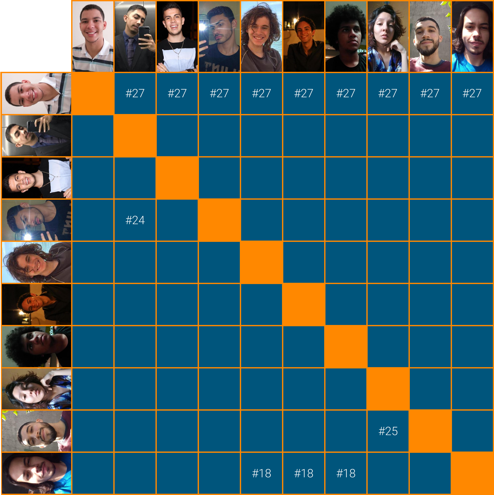

# Planejamento Sprint 01

Sprint dedicada a definição do escopo de atuação do projeto: a partir dos _supertemas_ definidos pelo professor, os passos seguintes do time foram dados para definir o tema do projeto, embasar essa decisão com pesquisas de mercado e ambientais, dado o escopo de atuação serem as [ODS](https://brasil.un.org/pt-br/sdgs) (Objetivos de Desenvolvimento Sustentável) da ONU.

Para poder começar a dar os passos necessários para construção do backlog, foi usado o método de _prototipação_ da **Engenharia de Requisitos** para que os membros pudessem começar a pensar nas funcionalidades da aplicação.

## Tamanho da Sprint 01

**Início:** 07/02/2021

**Término:** 13/02/2020

**Duração:** Sete dias

## Objetivos

|                            _Issue_                             |                 Titulo                 | Pontos |                                                                                                                                                                                                                                                             _Assign_                                                                                                                                                                                                                                                             |
| :------------------------------------------------------------: | :------------------------------------: | :----: | :------------------------------------------------------------------------------------------------------------------------------------------------------------------------------------------------------------------------------------------------------------------------------------------------------------------------------------------------------------------------------------------------------------------------------------------------------------------------------------------------------------------------------: |
| [#18](https://github.com/fga-eps-mds/2020.2-Lend.it/issues/18) |            Pesquisa do tema            |   2    |                                                                                                                                                 [Mateus Maia](https://github.com/mateuscunhamaia), [Matheus Afonso](https://github.com/Matheusafonsouza), [Matheus Monteiro](https://github.com/matheusyanmonteiro) e [Vinícius Saturnino](https://github.com/viniciussaturnino)                                                                                                                                                 |
| [#19](https://github.com/fga-eps-mds/2020.2-Lend.it/issues/19) |             Brainstorming              |   3    |                                                                                                                                                                                                                                          [Esio Gustavo](https://github.com/EsioFreitas)                                                                                                                                                                                                                                          |
| [#21](https://github.com/fga-eps-mds/2020.2-Lend.it/issues/21) |    Criação do template de documento    |   1    |                                                                                                                                                                                                                                         [Youssef Muhamad](https://github.com/youssef-md)                                                                                                                                                                                                                                         |
| [#22](https://github.com/fga-eps-mds/2020.2-Lend.it/issues/22) |      Documento de escolha do tema      |   2    |                                                                                                                                                                                                                                          [Rogério Júnior](https://github.com/rogerioo)                                                                                                                                                                                                                                           |
| [#24](https://github.com/fga-eps-mds/2020.2-Lend.it/issues/24) |   Pesquisa de mercado para o produto   |   2    |                                                                                                                                                                                                                 [Lucas Dutra](https://github.com/lucasdutraf) e [Youssef Muhamad](https://github.com/youssef-md)                                                                                                                                                                                                                 |
| [#25](https://github.com/fga-eps-mds/2020.2-Lend.it/issues/25) | Pesquisa tema ambiental para o produto |   2    |                                                                                                                                                                                                                 [Thais Rebouças](https://github.com/Thais-ra) e [Thiago Mesquita](https://github.com/thiagompc)                                                                                                                                                                                                                  |
| [#27](https://github.com/fga-eps-mds/2020.2-Lend.it/issues/27) |     Protótipo de baixa fidelidade      |   5    | [Esio Gustavo](https://github.com/EsioFreitas), [Lucas Dutra](https://github.com/lucasdutraf), [Mateus Maia](https://github.com/mateuscunhamaia), [Matheus Afonso](https://github.com/Matheusafonsouza), [Matheus Monteiro](https://github.com/matheusyanmonteiro), [Rogério Júnior](https://github.com/rogerioo), [Thais Rebouças](https://github.com/Thais-ra), [Thiago Mesquita](https://github.com/thiagompc), [Vinícius Saturnino](https://github.com/viniciussaturnino) e [Youssef Muhamad](https://github.com/youssef-md) |
| [#31](https://github.com/fga-eps-mds/2020.2-Lend.it/issues/31) |   Documento de conclusão de sprint 1   |   3    |                                                                                                                                                                                                                                          [Rogério Júnior](https://github.com/rogerioo)                                                                                                                                                                                                                                           |
| [#33](https://github.com/fga-eps-mds/2020.2-Lend.it/issues/33) | Documento de planejamento da sprint 1  |   3    |                                                                                                                                                                                                                                          [Rogério Júnior](https://github.com/rogerioo)                                                                                                                                                                                                                                           |

<b>Total de pontos planejados: 23</b>

---

 Total de pontos da <i>sprint</i>: 23 
  

<!---Colocar no link abaixo as issues alocadas no milestone da Sprint--->

> [_Sprint_ _Backlog_](https://github.com/fga-eps-mds/2020.2-Lend.it/milestone/2?closed=1)

## Pareamentos

Por se tratar de uma sprint de pesquisas os pareamentos foram feitos ao acaso. Vale ressaltar que a _issue_ [#27](https://github.com/fga-eps-mds/2020.2-Lend.it/issues/27) foi feita em conjunto pelo time para que pudesse ter a visão de cada um sobre o projeto.

## Papeis

**_Scrum Master_:** [Rogério Júnior](https://github.com/rogerioo)

**_Product Manager_:** [Esio Gustavo](https://github.com/EsioFreitas)

**_Arquiteto:_** [Youssef Muhamad](https://github.com/youssef-md)

**_DevOps_:** [Lucas Dutra](https://github.com/lucasdutraf)

**Equipe de Desenvolvimento:**

- [Mateus Maia](https://github.com/mateuscunhamaia)
- [Matheus Afonso](https://github.com/Matheusafonsouza)
- [Matheus Monteiro](https://github.com/matheusyanmonteiro)
- [Thais Rebouças](https://github.com/Thais-ra)
- [Thiago Mesquita](https://github.com/thiagompc)
- [Vinícius Saturnino](https://github.com/viniciussaturnino)

**Autor:** [Rogério Júnior](https://github.com/rogerioo)
