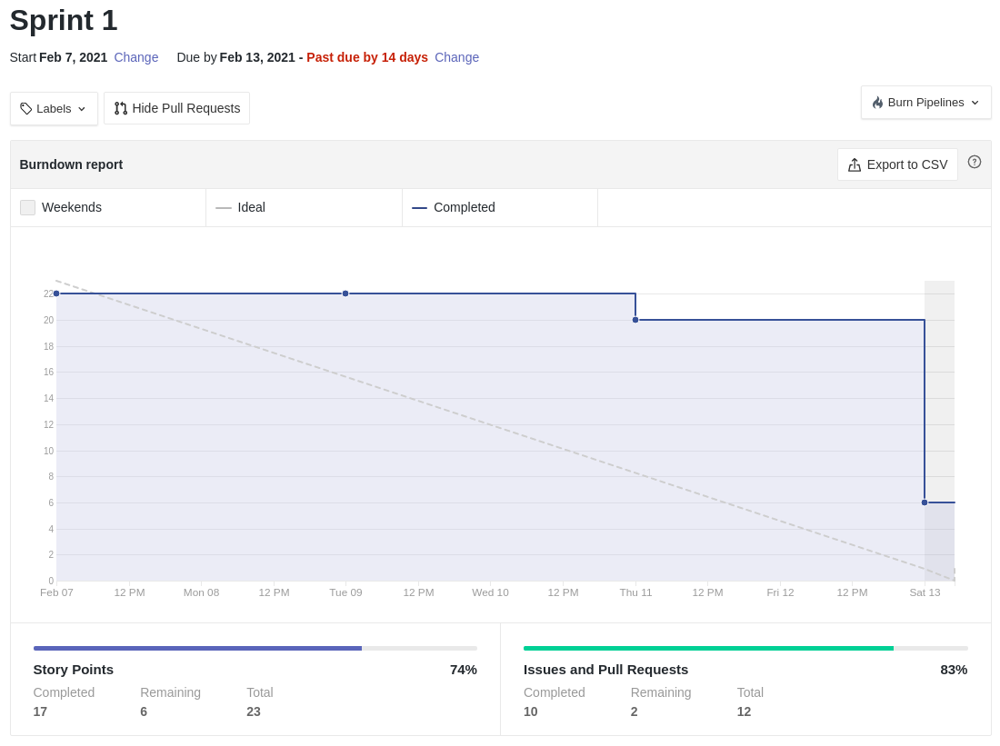
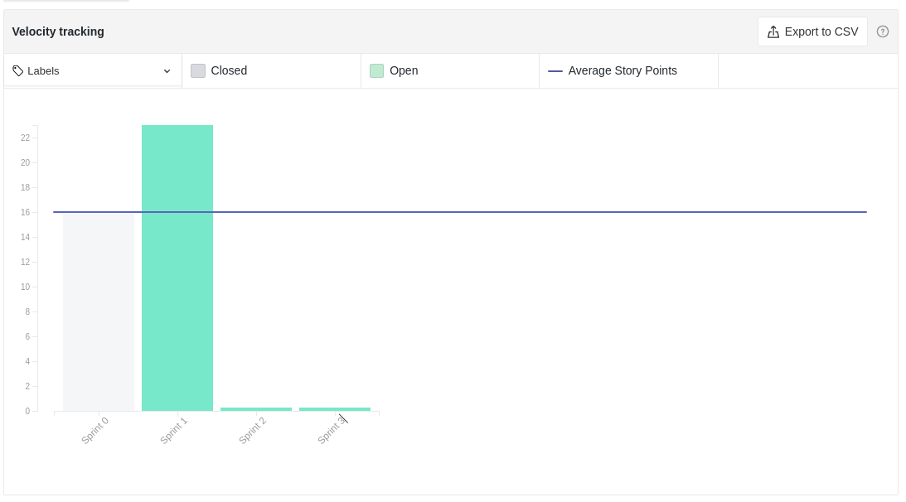

# Resultados Sprint 01

Sprint marcada pela definição do tema e por pesquisas que reafirmassem e embasassem as escolhas do time.

Foram levantadas as funcionalidades da aplicação e gerado o primeiro rascunho do *backlog*, que vai ser refinado e documentado pelo nosso *PO* durante a próxima sprint.

## Fechamento da Sprint

| *Issue* | Título | *Status* | Pontos |
| :-----: | :----: | :------: | :----: |
| [#18](https://github.com/fga-eps-mds/2020.2-Lend.it/issues/18) | Pesquisa do tema | Concluído | 2 |
| [#19](https://github.com/fga-eps-mds/2020.2-Lend.it/issues/19) | Brainstorming | Concluído | 3 |
| [#21](https://github.com/fga-eps-mds/2020.2-Lend.it/issues/21) | Criação do template de documento | Concluído | 1 |
| [#22](https://github.com/fga-eps-mds/2020.2-Lend.it/issues/22) | Documento de escolha do tema | Concluído | 2 |
| [#24](https://github.com/fga-eps-mds/2020.2-Lend.it/issues/24) | Pesquisa de mercado para o produto | Concluído | 2 |
| [#25](https://github.com/fga-eps-mds/2020.2-Lend.it/issues/25) | Pesquisa tema ambiental para o produto | Concluído | 2 |
| [#27](https://github.com/fga-eps-mds/2020.2-Lend.it/issues/27) | Protótipo de baixa fidelidade | Concluído | 5 |
| [#31](https://github.com/fga-eps-mds/2020.2-Lend.it/issues/31) | Documento de conclusão de sprint 1 | Concluído | 3 |
| [#33](https://github.com/fga-eps-mds/2020.2-Lend.it/issues/33) | Documento de planejamento da sprint 1 | Concluído | 3 |

Pontos Planejados Concluídos: 23

Pontos de Dívida Concluídos:  0

Pontos Não Agregados: 0

> [_Sprint_ _Backlog_](https://github.com/fga-eps-mds/2020.2-Lend.it/milestone/2?closed=1)

## Burndown

É possível ver que o time ainda não está no ritmo da matéria e que está se adaptando a um projeto complexo como esse junto aos desafios do EAD. Contudo pode-se ver que as tarefas foram entregues, faltando somente as issues [#31](https://github.com/fga-eps-mds/2020.2-Lend.it/issues/31) e [#33](https://github.com/fga-eps-mds/2020.2-Lend.it/issues/33) de documentação da sprint.

## Velocity

É possível ver o aumento da produtividade do time, explicitado no gráfico, dado pelo tamanho maior da sprint e pelo time estar começando a se habituar ao projeto.

## Quadro de Conhecimento

Como o acompanhamento da evolução do conhecimento é feito a cada 15 dias, não houveram alterações com relação a s print anterior.

<iframe src="https://docs.google.com/spreadsheets/d/e/2PACX-1vQt9zLphgqw_af_Kz6vaOhzGt4M4xnPEfbVTrtfh-CvbbsX1HziKhaXO5_nenI8iGToZQJNdfrqNvoJ/pubhtml?gid=1585311913&amp;single=true&amp;widget=true&amp;headers=false" height="600"></iframe>

## Avaliação do Scrum Master

O time está com um ritmo bom e se mostra bem comprometido com as entregas do projeto. Ainda que não tenham o hábito de fazer um pouco por dia, é possível ver que têm o compromisso de entregar as tarefas dentro do *timebox* da sprint. O fato de não haverem dívidas se mostra bastante positivo.

Pelo andamento da matéria, o time de EPS ainda está confuso com relação a metodologia utilizada para a matéria e ainda não iniciou a fazer os acompanhamentos diários das tarefas (*Daily*) por essa razão.

**Autor:** [Rogério Júnior](https://github.com/rogerioo)
