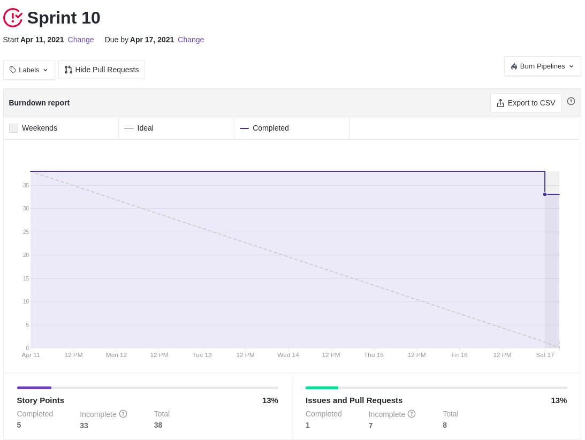
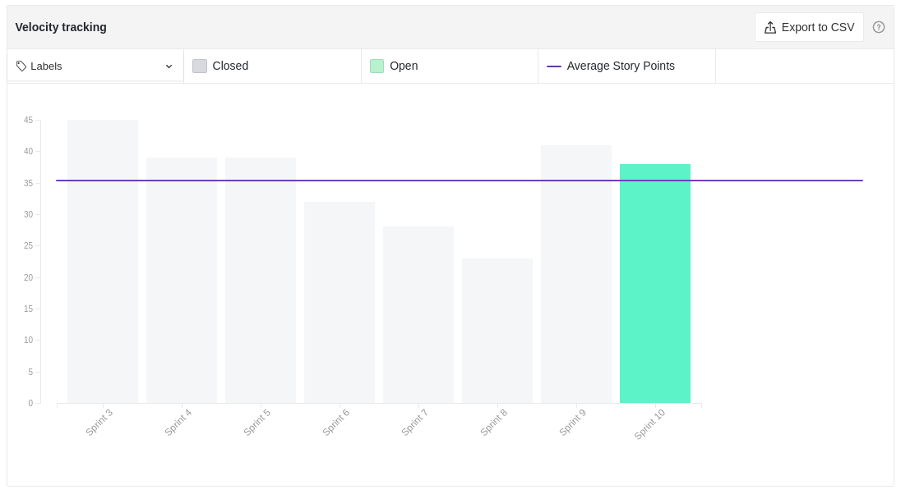

# Resultados Sprint 10

Como pode ser observado, apyth _sprint_ 10 foram bem abaixo da media devido a algumas circunstâncias de motivação e desempenho da equipe.

## Fechamento da Sprint

|                             _Issue_                              |            Título             |    _Status_     | Pontos |
| :--------------------------------------------------------------: | :---------------------------: | :-------------: | :----: |
| [#126](https://github.com/fga-eps-mds/2020.2-Lend.it/issues/126) |        [FIX] LendCard         | _Não concluído_ |   3    |
| [#127](https://github.com/fga-eps-mds/2020.2-Lend.it/issues/127) |   [US04] - Recuperar senha    | _Não concluído_ |   5    |
| [#130](https://github.com/fga-eps-mds/2020.2-Lend.it/issues/130) |           Firebase            | _Não concluído_ |   8    |
| [#132](https://github.com/fga-eps-mds/2020.2-Lend.it/issues/132) |      [US26] - ver perfil      |   _Concluído_   |   5    |
| [#133](https://github.com/fga-eps-mds/2020.2-Lend.it/issues/133) | [US19] - sistema deletar lend | _Não concluído_ |   2    |
| [#134](https://github.com/fga-eps-mds/2020.2-Lend.it/issues/134) |  [US25] - feedback numerico   | _Não concluído_ |   5    |
| [#136](https://github.com/fga-eps-mds/2020.2-Lend.it/issues/136) |    [US29] - Fazer denuncia    | _Não concluído_ |   5    |
| [#183](https://github.com/fga-eps-mds/2020.2-Lend.it/issues/183) |    Documentação Sprint 10     | _Não concluído_ |   5    |

Pontos Planejados Concluídos: 05

Pontos de Dívida Concluídos: 00

Pontos Não Agregados: 32

> [_Sprint_ _Backlog_](https://github.com/fga-eps-mds/2020.2-Lend.it/milestone/11?closed=1)

## Burndown

Semana muito corrida para todo mundo do time, com muitas provas e trabalhos de outras matérias, fazendo com que as entregas nessa _sprint_
fossem bem abaixo da média das outras _sprints_.

## Velocity

O gráfico evidencia que houve um aumento de pontos planejados para essa _sprint_ na intenção de compensar os pontos que não foram entregues na _sprint_ passada.

## Riscos

O gráfico mostra que os riscos mativeram praticamente os mesmos valores da _sprint_ passada, isso se deve ao fato de estarmos no meio do processo de desenvolvimento.

<iframe height="1100" src="https://docs.google.com/spreadsheets/d/e/2PACX-1vSGve6AsoRvxahK_yskgryTE1aQStxGh6_ls8RDjuH0DrdupIi26AptTJj64YT4vspgkpsoBKA2MZTd/pubchart?oid=1502568892&format=interactive"></iframe>

## Retrospectiva

O quadro de empatia mostrou muitos aspectos possitivos, diferente da _sprint_ passada, evidenciando que o time está bem esperançoso com o resultado final do projeto, mesmo com a correria do semestre.Além disso, alguns problemas de planejamento, que ocorreram anteriormente, foram corrigidos nessa _sprint_, mostrando que as fraquezas relatadas na _sprint_ anterior foram corrigidas.

<iframe height="1100" src="https://docs.google.com/spreadsheets/d/e/2PACX-1vTj1IyAJxxw19_Cq4hQ_79XLBX_i0j7eiWpLziOrktPOOr_dLWtZRZQcGtoepJl8LQeekhC2erEvBuL/pubhtml?gid=1892790&single=true"></iframe>

## Quadro de Conhecimento

Em comparação com _sprints_ anteriores o time, de maneira geral, mostrou uma evolução no quesito técnico de técnologias, apesar de que essa evolução não foi tão grande como anteriormente. Vale ressaltar que, o time de MDS, mostrou uma evolução notória em ralação ao conteúdo de EPS.

<iframe height="600" src="https://docs.google.com/spreadsheets/d/e/2PACX-1vQt9zLphgqw_af_Kz6vaOhzGt4M4xnPEfbVTrtfh-CvbbsX1HziKhaXO5_nenI8iGToZQJNdfrqNvoJ/pubhtml?gid=1911557590&single=true"></iframe>

## Quadro de Sentimentos

Mesmo com algumas issues iniciadas no inicio da semana e com o quadro de sentimento com uma média maior que nas outras _sprints_, o time não entregou todos os pontos antes da review, que era o esperado a se fazer.

<iframe height="627" seamless frameborder="0" scrolling="no" src="https://docs.google.com/spreadsheets/d/e/2PACX-1vQfmC1hXrOlqXL8ZBsKvi7WktZEdpPOwa5KIKgUKkee2U96ua7g0-bkQL0XZRrCYFGCVWSukZ8ActfD/pubchart?oid=1657570794&format=interactive"></iframe>
<iframe height="509" seamless frameborder="0" scrolling="no" src="https://docs.google.com/spreadsheets/d/e/2PACX-1vQYTAqkgguUNHq1_L4lwKSwU04oXAoBtm2tj4GrTBb9ND0mj0pBrldy-VPLaeM5fp0KIPX7SbWDH9ia/pubchart?oid=1806457026&format=interactive"></iframe>
<iframe height="371" seamless frameborder="0" scrolling="no" src="https://docs.google.com/spreadsheets/d/e/2PACX-1vR7kDZjRAC-EVBplLf7K6B9FQOQW3As3S17ffv4DMo6_dn0-c43DWpxoylg1mpDB41mPCOX0Dcp34bB/pubchart?oid=1565268140&format=interactive"></iframe>

## Registro de Presença nas _Dailies_

|    Nome     | Segunda Feira | Terça Feira | Quarta Feira | Quinta Feira | Sexta Feira |
| :---------: | :-----------: | :---------: | :----------: | :----------: | :---------: |
|    Ésio     |       ✔       |      ✔      |      ✘       |      ✔       |      ✔      |
|    Lucas    |       ✔       |      ✔      |      ✔       |      ✔       |      ✔      |
|   M. Maia   |       ✔       |      ✔      |      ✔       |      ✔       |      ✔      |
|  M. Afonso  |       ✔       |      ✔      |      ✔       |      ✔       |      ✔      |
| M. Monteiro |       ✔       |      ✔      |      ✘       |      ✔       |      ✔      |
|   Rogério   |       ✔       |      ✔      |      ✔       |      ✔       |      ✘      |
|    Thaís    |       ✔       |      ✘      |      ✔       |      ✔       |      ✔      |
|   Thiago    |       ✔       |      ✔      |      ✔       |      ✔       |      ✔      |
|  Vinicius   |       ✔       |      ✔      |      ✔       |      ✔       |      ✔      |
|   Youssef   |       ✘       |      ✔      |      ✔       |      ✔       |      ✔      |

## Avaliação do Scrum Master

Apesar do time ter trabalhado bem na semana, com o as issues sendo iniciadas no início da semana, as entregas dessa _sprint_ foram prejudicadas por conta da semana atarefada. Assim sendo, não vejo medidas a serem tomadas a sessar as demandas do time.

**Autor:** [Rogério Júnior](https://github.com/rogerioo), [Thais Rebouças](https://github.com/Thais-ra), [Mateus Maia](https://github.com/mateusmaiamaia), [Thiago Mesquita](https://github.com/thiagompc) e [Matheus Monteiro](https://github.com/matheusyanmonteiro)
