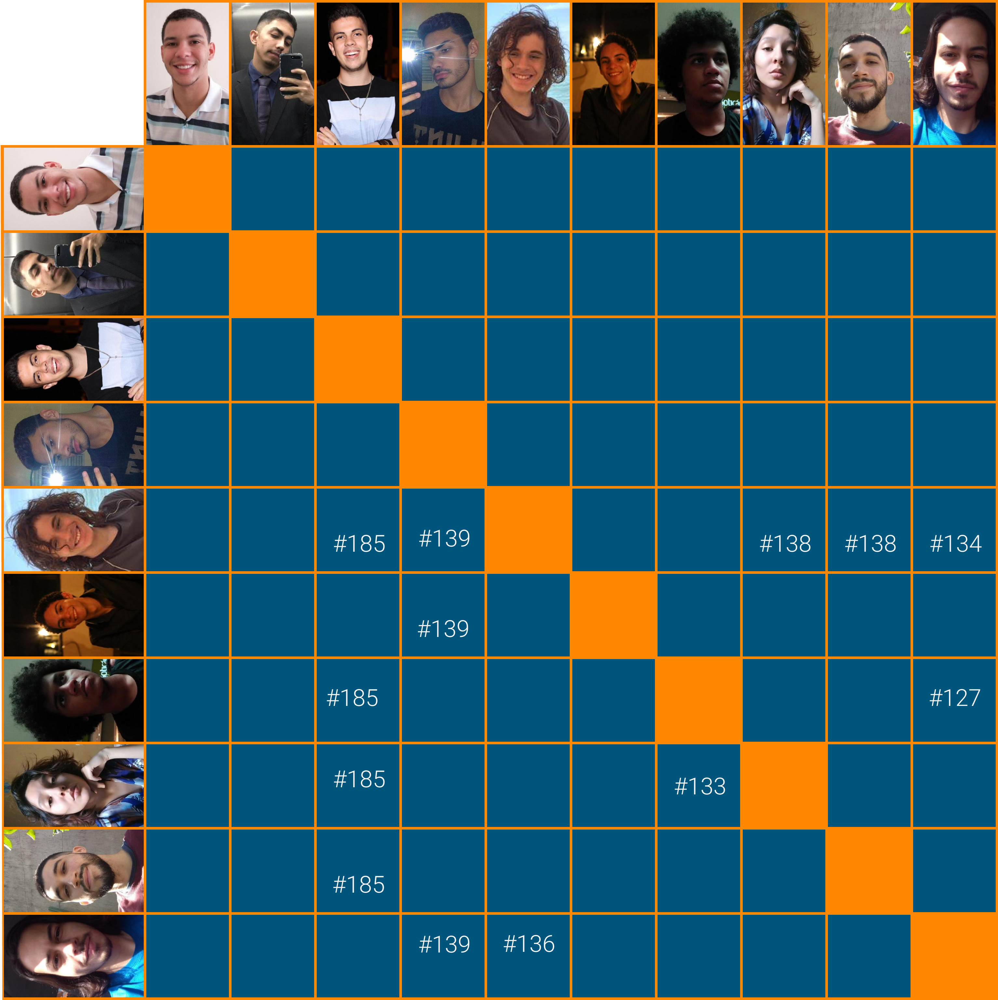

# Planejamento Sprint 11

_Sprint_ focada no gerenciamento de empréstimo (_lend_), em especial nas histórias de usuários ligadas a solicitação de empréstimo (_lend's_), vale ressaltar que nessa _sprint_ foi iniciado o _Analytics_.

## Tamanho da Sprint 11

**Início:** 18/04/2021

**Término:** 24/04/2021

**Duração:** Sete dias

## Objetivos

|                             _Issue_                              |                             Titulo                              | Pontos |                                                                                                                          _Assign_                                                                                                                           |
| :--------------------------------------------------------------: | :-------------------------------------------------------------: | :----: | :---------------------------------------------------------------------------------------------------------------------------------------------------------------------------------------------------------------------------------------------------------: |
| [#138](https://github.com/fga-eps-mds/2020.2-Lend.it/issues/138) |                      [US15] Deletar ajuda                       |   5    |                                                      [Thais Rebouças](https://github.com/Thais-ra), [Mateus Maia](https://github.com/mateusmaiamaia) e [Thiago Mesquita](https://github.com/thiagompc)                                                      |
| [#139](https://github.com/fga-eps-mds/2020.2-Lend.it/issues/139) | [US14] - Notificar os usuários de uma solicitação de empréstimo |   8    |                                            [Youssef Muhamad](https://github.com/youssef-md), [Matheus Afonso](https://github.com/Matheusafonsouza) e [Vinícius Saturnino](https://github.com/viniciussaturnino)                                             |
| [#185](https://github.com/fga-eps-mds/2020.2-Lend.it/issues/185) |                     Documentação Sprint 11                      |   5    | [Thais Rebouças](https://github.com/Thais-ra), [Rogério Júnior](https://github.com/rogerioo), [Mateus Maia](https://github.com/mateusmaiamaia), [Matheus Monteiro](https://github.com/matheusyanmonteiro) e [Thiago Mesquita](https://github.com/thiagompc) |

<b>Total de pontos planejados: 18</b>

### Dívida

|                             _Issue_                              |            Titulo             | Pontos |                                                        _Assign_                                                        |
| :--------------------------------------------------------------: | :---------------------------: | :----: | :--------------------------------------------------------------------------------------------------------------------: |
| [#126](https://github.com/fga-eps-mds/2020.2-Lend.it/issues/126) |        [FIX] LendCard         |   3    |                                    [Youssef Muhamad](https://github.com/youssef-md)                                    |
| [#127](https://github.com/fga-eps-mds/2020.2-Lend.it/issues/127) |   [US04] - Recuperar senha    |   5    | [Vinícius Saturnino](https://github.com/viniciussaturnino) e [Matheus Monteiro](https://github.com/matheusyanmonteiro) |
| [#130](https://github.com/fga-eps-mds/2020.2-Lend.it/issues/130) |           Firebase            |   8    |                                    [Youssef Muhamad](https://github.com/youssef-md)                                    |
| [#133](https://github.com/fga-eps-mds/2020.2-Lend.it/issues/133) | [US19] - sistema deletar lend |   2    |       [Thais Rebouças](https://github.com/Thais-ra) e [Matheus Monteiro](https://github.com/matheusyanmonteiro)        |
| [#134](https://github.com/fga-eps-mds/2020.2-Lend.it/issues/134) |  [US25] - feedback numerico   |   5    |     [Mateus Maia](https://github.com/mateusmaiamaia) e [Vinícius Saturnino](https://github.com/viniciussaturnino)      |
| [#136](https://github.com/fga-eps-mds/2020.2-Lend.it/issues/136) |    [US29] - Fazer denuncia    |   5    |     [Mateus Maia](https://github.com/mateusmaiamaia) e [Vinícius Saturnino](https://github.com/viniciussaturnino)      |

<b>Total: 28</b>

---

 Total de pontos da <i>sprint</i>: 46 -
  

<!---Colocar no link abaixo as issues alocadas no milestone da Sprint--->

> [_Sprint_ _Backlog_](https://github.com/fga-eps-mds/2020.2-Lend.it/milestone/12?closed=1)

## Pareamentos

## Papeis

**_Scrum Master | Analista de Dados_:** [Rogério Júnior](https://github.com/rogerioo)

**_Product Manager_:** [Esio Gustavo](https://github.com/EsioFreitas)

**_Arquiteto:_** [Youssef Muhamad](https://github.com/youssef-md)

**_DevOps | Analista de Dados_:** [Lucas Dutra](https://github.com/lucasdutraf)

**Equipe de Desenvolvimento:**

- [Mateus Maia](https://github.com/mateusmaiamaia)
- [Matheus Afonso](https://github.com/Matheusafonsouza)
- [Matheus Monteiro](https://github.com/matheusyanmonteiro)
- [Thais Rebouças](https://github.com/Thais-ra)
- [Thiago Mesquita](https://github.com/thiagompc)
- [Vinícius Saturnino](https://github.com/viniciussaturnino)

**Autor:** [Rogério Júnior](https://github.com/rogerioo), [Thais Rebouças](https://github.com/Thais-ra), [Mateus Maia](https://github.com/mateusmaiamaia), [Thiago Mesquita](https://github.com/thiagompc) e [Matheus Monteiro](https://github.com/matheusyanmonteiro)
