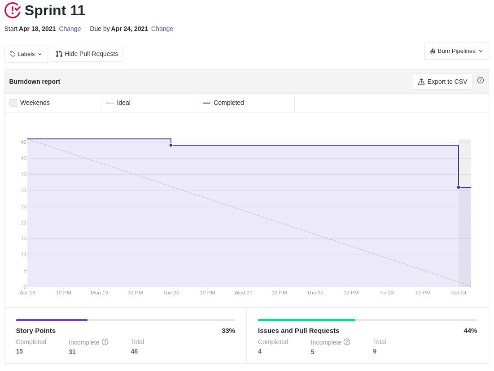
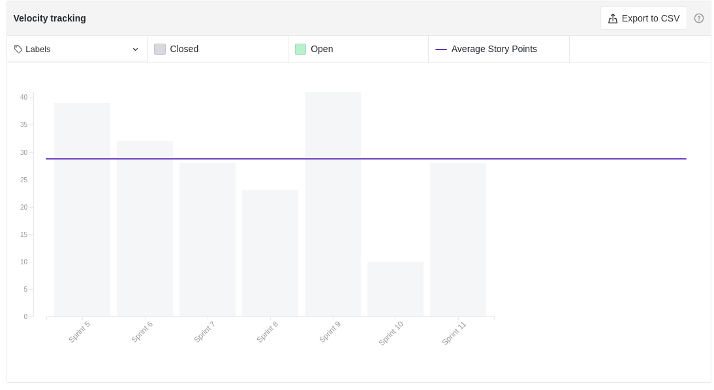

# Resultados Sprint 11

Por conta das dividas da _sprint_ anterior, o time focou muito mais em arrumar essas dívidas do que concluir os pontos dessa _sprint_, por conta disso as entregas dessa _sprint_ foram bem reduzidas.

## Fechamento da Sprint

|                             _Issue_                              |                             Título                              |    _Status_     | Pontos |
| :--------------------------------------------------------------: | :-------------------------------------------------------------: | :-------------: | :----: |
| [#138](https://github.com/fga-eps-mds/2020.2-Lend.it/issues/138) |                      [US15] Deletar ajuda                       | _Não concluído_ |   5    |
| [#139](https://github.com/fga-eps-mds/2020.2-Lend.it/issues/139) | [US14] - Notificar os usuários de uma solicitação de empréstimo | _Não concluído_ |   8    |
| [#185](https://github.com/fga-eps-mds/2020.2-Lend.it/issues/185) |                     Documentação Sprint 11                      |   _Concluído_   |   5    |
| [#126](https://github.com/fga-eps-mds/2020.2-Lend.it/issues/126) |                         [FIX] LendCard                          |   _Concluído_   |   3    |
| [#127](https://github.com/fga-eps-mds/2020.2-Lend.it/issues/127) |                    [US04] - Recuperar senha                     | _Não concluído_ |   5    |
| [#130](https://github.com/fga-eps-mds/2020.2-Lend.it/issues/130) |                            Firebase                             | _Não concluído_ |   8    |
| [#133](https://github.com/fga-eps-mds/2020.2-Lend.it/issues/133) |                  [US19] - sistema deletar lend                  |   _Concluído_   |   2    |
| [#134](https://github.com/fga-eps-mds/2020.2-Lend.it/issues/134) |                   [US25] - feedback numerico                    |   _Concluído_   |   5    |
| [#136](https://github.com/fga-eps-mds/2020.2-Lend.it/issues/136) |                     [US29] - Fazer denuncia                     |   _Concluído_   |   5    |

Pontos Planejados Concluídos: 05

Pontos de Dívida Concluídos: 15

Pontos Não Agregados: 26

> [_Sprint_ _Backlog_](https://github.com/fga-eps-mds/2020.2-Lend.it/milestone/12?closed=1)

## Burndown

Semana muito corrida para todo mundo do time, com muitas tarefas de outras matérias, fazendo com que as entregas nessa _sprint_ começassem de forma bem tardia em comparação com as outras _sprints_.

## Velocity

Por estarmos nos aproximando do fim do projeto, a quantidade de pontos planejado para a _sprint_ foi diminuindo, como esta evidenciado no gráfico, o que é esperado, ja que o processo de desenvolvimento do time foi iniciado bem cedo.

## Riscos

Pode-se notar um leve aumento em vários dos riscos, que se deu por conta de um aumento na complexidade das issues e cansaço devido a tarefas de outras matérias.

<iframe height="1100" src="https://docs.google.com/spreadsheets/d/e/2PACX-1vSGve6AsoRvxahK_yskgryTE1aQStxGh6_ls8RDjuH0DrdupIi26AptTJj64YT4vspgkpsoBKA2MZTd/pubchart?oid=434720403&format=interactive"></iframe>

## Retrospectiva

O quadro de empatia mostrou que o time estava com semana bastante apertada, que acabou desmotivando muitos membros do time nesta semana, principalmente por conta da presença nas _dailys_ e na _review_.

<iframe height="1100" src="https://docs.google.com/spreadsheets/d/e/2PACX-1vTj1IyAJxxw19_Cq4hQ_79XLBX_i0j7eiWpLziOrktPOOr_dLWtZRZQcGtoepJl8LQeekhC2erEvBuL/pubhtml?gid=362444446&single=true"></iframe>

## Quadro de Conhecimento

Como o acompanhamento da evolução do conhecimento é feito a cada 15 dias, não houveram alterações com relação a sprint anterior.

<iframe height="600" src="https://docs.google.com/spreadsheets/d/e/2PACX-1vQt9zLphgqw_af_Kz6vaOhzGt4M4xnPEfbVTrtfh-CvbbsX1HziKhaXO5_nenI8iGToZQJNdfrqNvoJ/pubhtml?gid=1911557590&single=true"></iframe>

## Quadro de Sentimentos

Nessa _sprint_ o time mostrou a maior média dos sentimentos entre todas as _sprints_, mesmo com os sentimentos estando bem acima do esperado.

<iframe height="627" seamless frameborder="0" scrolling="no" src="https://docs.google.com/spreadsheets/d/e/2PACX-1vQfmC1hXrOlqXL8ZBsKvi7WktZEdpPOwa5KIKgUKkee2U96ua7g0-bkQL0XZRrCYFGCVWSukZ8ActfD/pubchart?oid=435567583&format=interactive"></iframe>
<iframe height="509" seamless frameborder="0" scrolling="no" src="https://docs.google.com/spreadsheets/d/e/2PACX-1vQYTAqkgguUNHq1_L4lwKSwU04oXAoBtm2tj4GrTBb9ND0mj0pBrldy-VPLaeM5fp0KIPX7SbWDH9ia/pubchart?oid=1051030331&format=interactive"></iframe>
<iframe height="371" seamless frameborder="0" scrolling="no" src="https://docs.google.com/spreadsheets/d/e/2PACX-1vR7kDZjRAC-EVBplLf7K6B9FQOQW3As3S17ffv4DMo6_dn0-c43DWpxoylg1mpDB41mPCOX0Dcp34bB/pubchart?oid=974129038&format=interactive"></iframe>

## Registro de Presença nas _Dailies_

|    Nome     | Segunda Feira | Terça Feira | Quarta Feira | Quinta Feira | Sexta Feira |
| :---------: | :-----------: | :---------: | :----------: | :----------: | :---------: |
|    Ésio     |       ✘       |      ✘      |      ✔       |      ✘       |      ✘      |
|    Lucas    |       ✘       |      ✘      |      ✔       |      ✔       |      ✔      |
|   M. Maia   |       ✔       |      ✘      |      ✔       |      ✔       |      ✔      |
|  M. Afonso  |       ✔       |      ✔      |      ✔       |      ✔       |      ✔      |
| M. Monteiro |       ✔       |      ✔      |      ✔       |      ✔       |      ✔      |
|   Rogério   |       ✔       |      ✔      |      ✔       |      ✘       |      ✘      |
|    Thaís    |       ✔       |      ✔      |      ✔       |      ✔       |      ✔      |
|   Thiago    |       ✔       |      ✔      |      ✔       |      ✔       |      ✘      |
|  Vinicius   |       ✔       |      ✔      |      ✔       |      ✔       |      ✔      |
|   Youssef   |       ✔       |      ✔      |      ✔       |      ✔       |      ✘      |

## Avaliação do Scrum Master

Como a semana foi bem atarefada, as entregas dessa semana começaram bem tarde. Dessa forma terminamos a _sprint_ com várias dívidas. Acredito que devemos aproveitar o final de semana para descansar e voltarmos ao trabalho com energia e começar as tarefas o mais cedo possível.

**Autor:** [Rogério Júnior](https://github.com/rogerioo), [Thais Rebouças](https://github.com/Thais-ra), [Mateus Maia](https://github.com/mateusmaiamaia), [Thiago Mesquita](https://github.com/thiagompc) e [Matheus Monteiro](https://github.com/matheusyanmonteiro)
