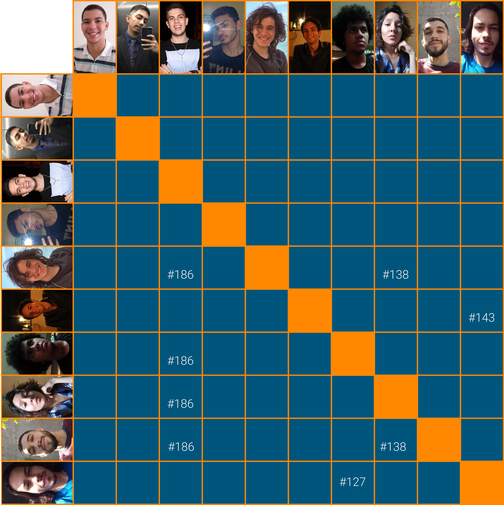

# Planejamento Sprint 12

_Sprint_ focada nas notificações dos usuários, especificamente do tempo limite do empréstimo e no caso do usuário ter sido reportado.

## Tamanho da Sprint 12

**Início:** 25/04/2021

**Término:** 01/05/2021

**Duração:** Sete dias

## Objetivos

|                             _Issue_                              |          Titulo           | Pontos |                                                                                                                          _Assign_                                                                                                                           |
| :--------------------------------------------------------------: | :-----------------------: | :----: | :---------------------------------------------------------------------------------------------------------------------------------------------------------------------------------------------------------------------------------------------------------: |
| [#143](https://github.com/fga-eps-mds/2020.2-Lend.it/issues/143) |  Verificar fluxo do app   |   5    |                                                                     [Matheus Afonso](https://github.com/Matheusafonsouza) e [Vinícius Saturnino](https://github.com/viniciussaturnino)                                                                      |
| [#186](https://github.com/fga-eps-mds/2020.2-Lend.it/issues/186) | Documentação da Sprint 12 |   5    | [Thais Rebouças](https://github.com/Thais-ra), [Rogério Júnior](https://github.com/rogerioo), [Mateus Maia](https://github.com/mateusmaiamaia), [Matheus Monteiro](https://github.com/matheusyanmonteiro) e [Thiago Mesquita](https://github.com/thiagompc) |

<b>Total de pontos planejados: 10</b>

### Dívida

|                             _Issue_                              |          Titulo          | Pontos |                                                                     _Assign_                                                                      |
| :--------------------------------------------------------------: | :----------------------: | :----: | :-----------------------------------------------------------------------------------------------------------------------------------------------: |
| [#127](https://github.com/fga-eps-mds/2020.2-Lend.it/issues/127) | [US04] - Recuperar senha |   5    |              [Vinícius Saturnino](https://github.com/viniciussaturnino) e [Matheus Monteiro](https://github.com/matheusyanmonteiro)               |
| [#130](https://github.com/fga-eps-mds/2020.2-Lend.it/issues/130) |         Firebase         |   8    |                                                 [Youssef Muhamad](https://github.com/youssef-md)                                                  |
| [#138](https://github.com/fga-eps-mds/2020.2-Lend.it/issues/138) |   [US15] Deletar ajuda   |   5    | [Thais Rebouças](https://github.com/Thais-ra), [Mateus Maia](https://github.com/mateusmaiamaia) e [Thiago Mesquita](https://github.com/thiagompc) |

<b>Total: 18</b>

---

 Total de pontos da <i>sprint</i>: 28 
  

<!---Colocar no link abaixo as issues alocadas no milestone da Sprint--->

> [_Sprint_ _Backlog_](https://github.com/fga-eps-mds/2020.2-Lend.it/milestone/13?closed=1)

## Pareamentos

## Papeis

**_Scrum Master | Analista de Dados_:** [Rogério Júnior](https://github.com/rogerioo)

**_Product Manager_:** [Esio Gustavo](https://github.com/EsioFreitas)

**_Arquiteto:_** [Youssef Muhamad](https://github.com/youssef-md)

**_DevOps | Analista de Dados_:** [Lucas Dutra](https://github.com/lucasdutraf)

**Equipe de Desenvolvimento:**

- [Mateus Maia](https://github.com/mateusmaiamaia)
- [Matheus Afonso](https://github.com/Matheusafonsouza)
- [Matheus Monteiro](https://github.com/matheusyanmonteiro)
- [Thais Rebouças](https://github.com/Thais-ra)
- [Thiago Mesquita](https://github.com/thiagompc)
- [Vinícius Saturnino](https://github.com/viniciussaturnino)

**Autor:** [Rogério Júnior](https://github.com/rogerioo), [Thais Rebouças](https://github.com/Thais-ra), [Mateus Maia](https://github.com/mateusmaiamaia), [Thiago Mesquita](https://github.com/thiagompc) e [Matheus Monteiro](https://github.com/matheusyanmonteiro)
