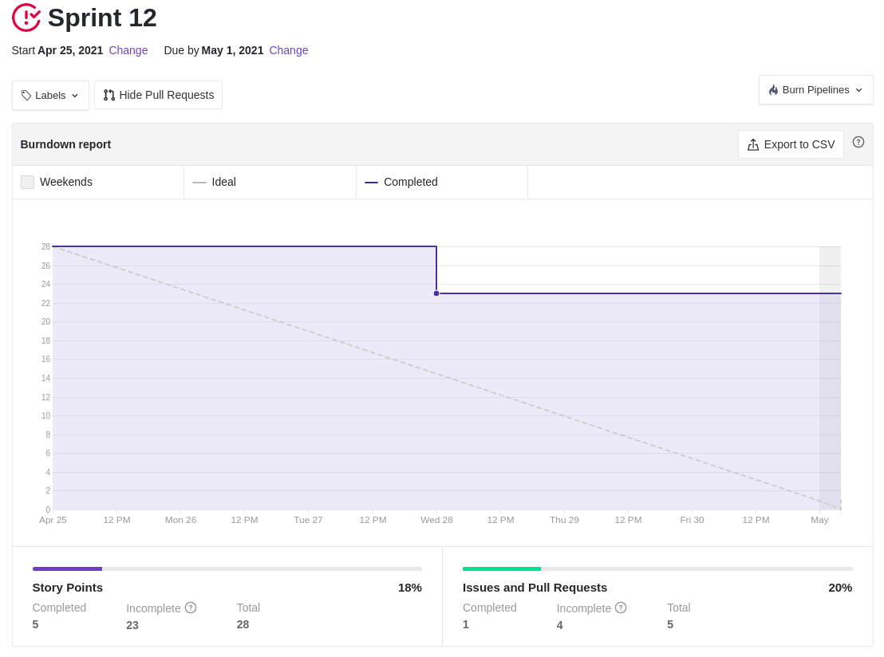
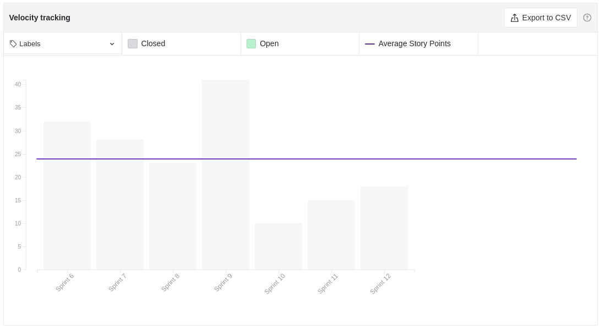

# Resultados Sprint 12

Apesar dos pontos a serem entregues nessa _sprint_ serem menores do que nas anteriores, o time preferiu por não adicionar novas tarefas pois possuía algumas dívidas técnicas acumuladas de outras semanas.

## Fechamento da Sprint 12

|                             _Issue_                              |          Título           |    _Status_     | Pontos |
| :--------------------------------------------------------------: | :-----------------------: | :-------------: | :----: |
| [#143](https://github.com/fga-eps-mds/2020.2-Lend.it/issues/143) |  Verificar fluxo do app   | _Não Concluído_ |   5    |
| [#186](https://github.com/fga-eps-mds/2020.2-Lend.it/issues/186) | Documentação da Sprint 12 | _Não Concluído_ |   5    |
| [#127](https://github.com/fga-eps-mds/2020.2-Lend.it/issues/127) | [US04] - Recuperar senha  | _Não Concluído_ |   5    |
| [#130](https://github.com/fga-eps-mds/2020.2-Lend.it/issues/130) |         Firebase          | _Não Concluído_ |   8    |
| [#138](https://github.com/fga-eps-mds/2020.2-Lend.it/issues/138) |   [US15] Deletar ajuda    |   _Concluído_   |   5    |

Pontos Planejados Concluídos: 00

Pontos de Dívida Concluídos: 05

Pontos Não Agregados: 23

> [_Sprint_ _Backlog_](https://github.com/fga-eps-mds/2020.2-Lend.it/milestone/13?closed=1)

## Burndown

Semana menos corrida do que nas anteriores, porem ainda muito atarefada, mostrando no gráfico abaixo que, o time começou as _issues_ tardiamente e que os pontos não foram entregues, em sua totalidade, novamente, por conta das dívidas.

## Velocity

Assim como observado nas _sprints_ anteriores, a quantidade de ponto planejado para essa _sprint_ continua reduzindo cada vez mais, como podemos observar no gráfico abaixo.

## Riscos

Pode-se notar uma redução nos riscos que tiveram aumento na sprint passa, o que se deu por conta dos desenvolvedores estarem menos sobrecarregados.

<iframe height="1100" src="https://docs.google.com/spreadsheets/d/e/2PACX-1vSGve6AsoRvxahK_yskgryTE1aQStxGh6_ls8RDjuH0DrdupIi26AptTJj64YT4vspgkpsoBKA2MZTd/pubchart?oid=1887590437&format=interactive"></iframe>

## Retrospectiva

Por conta do feriado do dia 1º não foi realizado a review nessa semana.

## Quadro de Conhecimento

Por conta do feriado do dia 1º não foi realizado o quadro de conhecimento nessa semana.

<iframe height="600" src="https://docs.google.com/spreadsheets/d/e/2PACX-1vQt9zLphgqw_af_Kz6vaOhzGt4M4xnPEfbVTrtfh-CvbbsX1HziKhaXO5_nenI8iGToZQJNdfrqNvoJ/pubhtml?gid=1911557590&single=true"></iframe>

## Quadro de Sentimentos

Acredito que por conta do desempenho em outras matérias, o time mostrou pontos elevados de sentimentos nessa _sprint_, alem da expectativa de ver o projeto finalizado o que deixo o time com essa pontuação elevada.

<iframe height="627" seamless frameborder="0" scrolling="no" src="https://docs.google.com/spreadsheets/d/e/2PACX-1vQfmC1hXrOlqXL8ZBsKvi7WktZEdpPOwa5KIKgUKkee2U96ua7g0-bkQL0XZRrCYFGCVWSukZ8ActfD/pubchart?oid=1288925033&format=interactive"></iframe>
<iframe height="509" seamless frameborder="0" scrolling="no" src="https://docs.google.com/spreadsheets/d/e/2PACX-1vQYTAqkgguUNHq1_L4lwKSwU04oXAoBtm2tj4GrTBb9ND0mj0pBrldy-VPLaeM5fp0KIPX7SbWDH9ia/pubchart?oid=148779536&format=interactive"></iframe>
<iframe height="371" seamless frameborder="0" scrolling="no" src="https://docs.google.com/spreadsheets/d/e/2PACX-1vR7kDZjRAC-EVBplLf7K6B9FQOQW3As3S17ffv4DMo6_dn0-c43DWpxoylg1mpDB41mPCOX0Dcp34bB/pubchart?oid=80038508&format=interactive"></iframe>

## Registro de Presença nas _Dailies_

|    Nome     | Segunda Feira | Terça Feira | Quarta Feira | Quinta Feira | Sexta Feira |
| :---------: | :-----------: | :---------: | :----------: | :----------: | :---------: |
|    Ésio     |       ✔       |      ✔      |      ✔       |      ✔       |      ✔      |
|    Lucas    |       ✔       |      ✔      |      ✔       |      ✔       |      ✔      |
|   M. Maia   |       ✔       |      ✔      |      ✔       |      ✔       |      ✔      |
|  M. Afonso  |       ✔       |      ✔      |      ✔       |      ✔       |      ✔      |
| M. Monteiro |       ✔       |      ✔      |      ✔       |      ✔       |      ✔      |
|   Rogério   |       ✔       |      ✔      |      ✔       |      ✔       |      ✔      |
|    Thaís    |       ✔       |      ✔      |      ✔       |      ✔       |      ✔      |
|   Thiago    |       ✔       |      ✔      |      ✔       |      ✔       |      ✔      |
|  Vinicius   |       ✔       |      ✔      |      ✔       |      ✔       |      ✔      |
|   Youssef   |       ✔       |      ✔      |      ✔       |      ✔       |      ✔      |

## Avaliação do Scrum Master

Nessa _sprint_ o time focou na entrega das dívidas das semanas anteriores, além disso também tivemos um feriado. Como não conseguimos entregar as tarefas planejadas para essa _sprint_ e ficaram como dívidas.

**Autor:** [Rogério Júnior](https://github.com/rogerioo), [Thais Rebouças](https://github.com/Thais-ra), [Mateus Maia](https://github.com/mateusmaiamaia), [Thiago Mesquita](https://github.com/thiagompc) e [Matheus Monteiro](https://github.com/matheusyanmonteiro)
i
