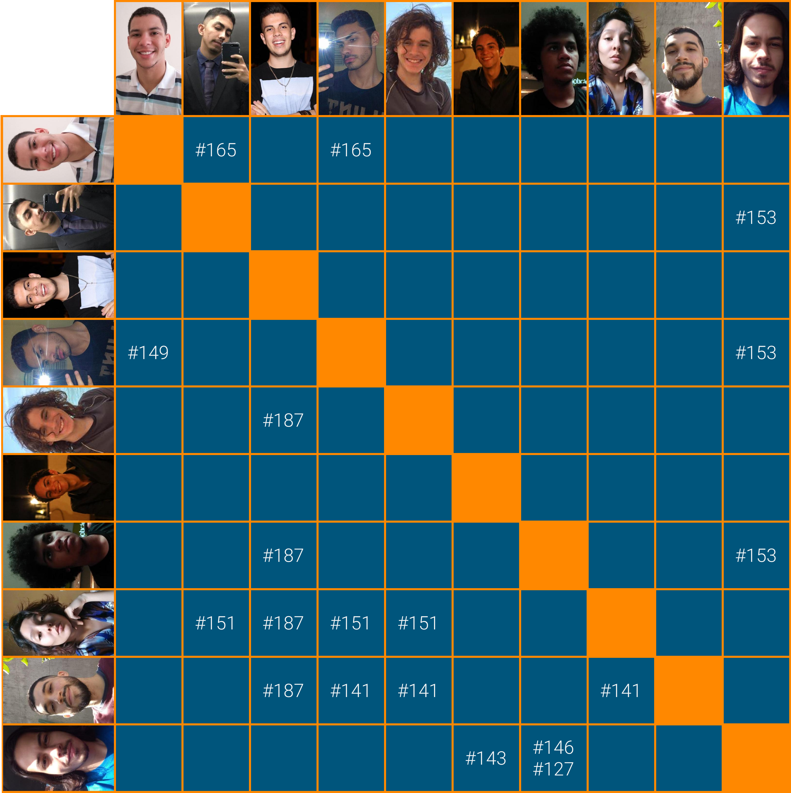

# Planejamento Sprint 13

_Sprint_ que marca o início das atividades do _analytics_ e que trouxe uma maior demanda de atividades para o time, dado o _roadmap_ de tarefas do grupo. Essa semana foi mais dedicada em consertar alguns fluxos e _bugs_ que foram encontrados no _frontend_ .

## Tamanho da Sprint 13

**Início:** 02/05/2021

**Término:** 08/05/2021

**Duração:** Sete dias

## Objetivos

|                             _Issue_                              |            Titulo             | Pontos |                                                                                                                          _Assign_                                                                                                                           |
| :--------------------------------------------------------------: | :---------------------------: | :----: | :---------------------------------------------------------------------------------------------------------------------------------------------------------------------------------------------------------------------------------------------------------: |
| [#141](https://github.com/fga-eps-mds/2020.2-Lend.it/issues/141) |   [US30] - Notificar report   |   5    |                             [Youssef Muhamad](https://github.com/youssef-md), [Thais Rebouças](https://github.com/Thais-ra), [Mateus Maia](https://github.com/mateusmaiamaia) e [Thiago Mesquita](https://github.com/thiagompc)                             |
| [#146](https://github.com/fga-eps-mds/2020.2-Lend.it/issues/146) |     [BUG] - Listagem Home     |   5    |                                                                   [Vinícius Saturnino](https://github.com/viniciussaturnino) e [Matheus Monteiro](https://github.com/matheusyanmonteiro)                                                                    |
| [#149](https://github.com/fga-eps-mds/2020.2-Lend.it/issues/149) |     [BUG] - Error perfil      |   5    |                                                                              [Youssef Muhamad](https://github.com/youssef-md) e [Esio Gustavo](https://github.com/EsioFreitas)                                                                              |
| [#151](https://github.com/fga-eps-mds/2020.2-Lend.it/issues/151) | Organizar os assets do sonar  |   8    |                              [Youssef Muhamad](https://github.com/youssef-md), [Lucas Dutra](https://github.com/lucasdutraf), [Thais Rebouças](https://github.com/Thais-ra) e [Mateus Maia](https://github.com/mateusmaiamaia)                              |
| [#152](https://github.com/fga-eps-mds/2020.2-Lend.it/issues/152) | Espelhamento dos repositorios |   5    |                                                                                                        [Lucas Dutra](https://github.com/lucasdutraf)                                                                                                        |
| [#153](https://github.com/fga-eps-mds/2020.2-Lend.it/issues/153) |    Agrupar jsons do Sonar     |   5    |                   [Youssef Muhamad](https://github.com/youssef-md), [Lucas Dutra](https://github.com/lucasdutraf), [Vinícius Saturnino](https://github.com/viniciussaturnino) e [Matheus Monteiro](https://github.com/matheusyanmonteiro)                   |
| [#165](https://github.com/fga-eps-mds/2020.2-Lend.it/issues/165) |      Criação de CD Front      |   8    |                                                      [Youssef Muhamad](https://github.com/youssef-md), [Lucas Dutra](https://github.com/lucasdutraf) e [Esio Gustavo](https://github.com/EsioFreitas)                                                       |
| [#187](https://github.com/fga-eps-mds/2020.2-Lend.it/issues/187) |   Documentação da Sprint 13   |   5    | [Thais Rebouças](https://github.com/Thais-ra), [Rogério Júnior](https://github.com/rogerioo), [Mateus Maia](https://github.com/mateusmaiamaia), [Matheus Monteiro](https://github.com/matheusyanmonteiro) e [Thiago Mesquita](https://github.com/thiagompc) |

<b>Total de pontos planejados: 46</b>

### Dívida

|                             _Issue_                              |          Titulo          | Pontos |                                                        _Assign_                                                        |
| :--------------------------------------------------------------: | :----------------------: | :----: | :--------------------------------------------------------------------------------------------------------------------: |
| [#127](https://github.com/fga-eps-mds/2020.2-Lend.it/issues/127) | [US04] - Recuperar senha |   5    | [Vinícius Saturnino](https://github.com/viniciussaturnino) e [Matheus Monteiro](https://github.com/matheusyanmonteiro) |
| [#130](https://github.com/fga-eps-mds/2020.2-Lend.it/issues/130) |         Firebase         |   8    |                                    [Youssef Muhamad](https://github.com/youssef-md)                                    |
| [#143](https://github.com/fga-eps-mds/2020.2-Lend.it/issues/143) |  Verificar fluxo do app  |   5    |   [Matheus Afonso](https://github.com/Matheusafonsouza) e [Vinícius Saturnino](https://github.com/viniciussaturnino)   |

<b>Total: 18</b>

---

 Total de pontos da <i>sprint</i>: 64 
  

<!---Colocar no link abaixo as issues alocadas no milestone da Sprint--->

> [_Sprint_ _Backlog_](https://github.com/fga-eps-mds/2020.2-Lend.it/milestone/14?closed=1)

## Pareamentos

## Papeis

**_Scrum Master_:** [Rogério Júnior](https://github.com/rogerioo)

**_Product Manager_:** [Esio Gustavo](https://github.com/EsioFreitas)

**_Arquiteto:_** [Youssef Muhamad](https://github.com/youssef-md)

**_DevOps_:** [Lucas Dutra](https://github.com/lucasdutraf)

**Equipe de Desenvolvimento:**

- [Mateus Maia](https://github.com/mateusmaiamaia)
- [Matheus Afonso](https://github.com/Matheusafonsouza)
- [Matheus Monteiro](https://github.com/matheusyanmonteiro)
- [Thais Rebouças](https://github.com/Thais-ra)
- [Thiago Mesquita](https://github.com/thiagompc)
- [Vinícius Saturnino](https://github.com/viniciussaturnino)

**Autor:** [Rogério Júnior](https://github.com/rogerioo), [Thais Rebouças](https://github.com/Thais-ra), [Mateus Maia](https://github.com/mateusmaiamaia), [Thiago Mesquita](https://github.com/thiagompc) e [Matheus Monteiro](https://github.com/matheusyanmonteiro)
