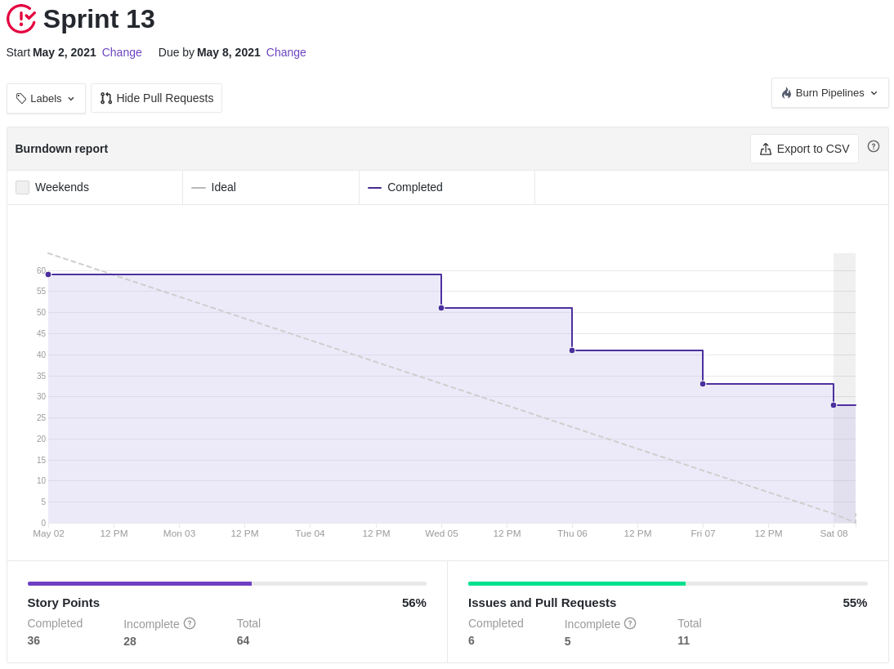
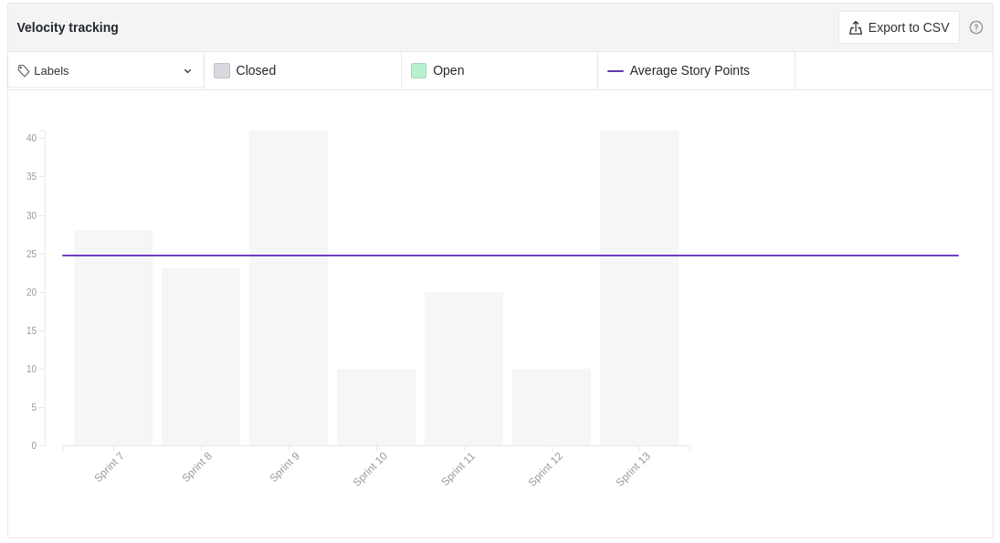

# Resultados Sprint 13

Semana agitada, por ser fim do semestre, acabou atrapalhando um pouco as entregas, além de que, as _issues_ do _Analytics_ não terem sido planejadas no inicio do semestre, fez com que o time tivesse uma carga de trabalho bem maior do que o esperado.

## Fechamento da Sprint

|                             _Issue_                              |            Título             |    _Status_     | Pontos |
| :--------------------------------------------------------------: | :---------------------------: | :-------------: | :----: |
| [#127](https://github.com/fga-eps-mds/2020.2-Lend.it/issues/127) |   [US04] - Recuperar senha    | _Não concluído_ |   5    |
| [#130](https://github.com/fga-eps-mds/2020.2-Lend.it/issues/130) |           Firebase            |   _Concluído_   |   8    |
| [#141](https://github.com/fga-eps-mds/2020.2-Lend.it/issues/141) |   [US30] - Notificar report   | _Não concluído_ |   5    |
| [#143](https://github.com/fga-eps-mds/2020.2-Lend.it/issues/143) |    Verificar fluxo do app     |   _Concluído_   |   5    |
| [#146](https://github.com/fga-eps-mds/2020.2-Lend.it/issues/146) |     [BUG] - Listagem Home     |   _Concluído_   |   5    |
| [#149](https://github.com/fga-eps-mds/2020.2-Lend.it/issues/149) |     [BUG] - Error perfil      | _Não concluído_ |   5    |
| [#151](https://github.com/fga-eps-mds/2020.2-Lend.it/issues/151) | Organizar os assets do sonar  |   _Concluído_   |   8    |
| [#152](https://github.com/fga-eps-mds/2020.2-Lend.it/issues/152) | Espelhamento dos repositorios |   _Concluído_   |   5    |
| [#153](https://github.com/fga-eps-mds/2020.2-Lend.it/issues/153) |   Agrupar _jsons_ do Sonar    |   _Concluído_   |   5    |
| [#165](https://github.com/fga-eps-mds/2020.2-Lend.it/issues/165) |      Criação de CD Front      | _Não concluído_ |   8    |
| [#187](https://github.com/fga-eps-mds/2020.2-Lend.it/issues/187) |   Documentação da Sprint 13   |   _Concluído_   |   5    |

Pontos Planejados Concluídos: 23

Pontos de Dívida Concluídos: 13

Pontos Não Agregados: 28

> [_Sprint_ _Backlog_](https://github.com/fga-eps-mds/2020.2-Lend.it/milestone/14?closed=1)

## Burndown

Como observado no gráfico abaixo, o time começou a entregar as _issues_ na metade da semana e manteve um bom ritmo de entrega, em comparação as _sprints_ anteriores.

## Velocity

Por conta do _Analytics_ e de algumas dívidas, os pontos planejados para essa semana foram os maiores do semestre.

## Riscos

Como é de se esperar, os riscos vem diminuindo a cada _sprint_ que passa, entretanto alguns riscos, como o de pegar COVID-19, ainda mantém uma pontuação elevada.

<iframe height="1100" src="https://docs.google.com/spreadsheets/d/e/2PACX-1vSGve6AsoRvxahK_yskgryTE1aQStxGh6_ls8RDjuH0DrdupIi26AptTJj64YT4vspgkpsoBKA2MZTd/pubchart?oid=558956060&format=interactive"></iframe>

## Retrospectiva

Como observado no quadro de empatia, o time está cansado com o fim do semestre e ansioso também, porém mesmo com esses sentimentos, o time tem disposição para encerrar o projeto.

<iframe height="1100" src="https://docs.google.com/spreadsheets/d/e/2PACX-1vTj1IyAJxxw19_Cq4hQ_79XLBX_i0j7eiWpLziOrktPOOr_dLWtZRZQcGtoepJl8LQeekhC2erEvBuL/pubhtml?gid=1820210916&single=true"></iframe>

## Quadro de Conhecimento

Como o acompanhamento da evolução do conhecimento é feito a cada 15 dias, não houveram alterações no quadro de conhecimento e por conta do feriado, não foi realizado a _review_ na semana anterior.

<iframe height="600" src="https://docs.google.com/spreadsheets/d/e/2PACX-1vQt9zLphgqw_af_Kz6vaOhzGt4M4xnPEfbVTrtfh-CvbbsX1HziKhaXO5_nenI8iGToZQJNdfrqNvoJ/pubhtml?gid=1911557590&single=true"></iframe>

## Quadro de Sentimentos

Pode-se observar que nesta _sprint_ o time estava bem positivo, com algumas poucas em exceções. Acredito que isso é resultado da motivação em terminar o projeto, podemos ver também que os pontos entregues também aumentaram em comparação com as últimas _sprints_.

<iframe height="627" seamless frameborder="0" scrolling="no" src="https://docs.google.com/spreadsheets/d/e/2PACX-1vQfmC1hXrOlqXL8ZBsKvi7WktZEdpPOwa5KIKgUKkee2U96ua7g0-bkQL0XZRrCYFGCVWSukZ8ActfD/pubchart?oid=163900350&format=interactive"></iframe>
<iframe height="509" seamless frameborder="0" scrolling="no" src="https://docs.google.com/spreadsheets/d/e/2PACX-1vQYTAqkgguUNHq1_L4lwKSwU04oXAoBtm2tj4GrTBb9ND0mj0pBrldy-VPLaeM5fp0KIPX7SbWDH9ia/pubchart?oid=2141003046&format=interactive"></iframe>
<iframe height="371" seamless frameborder="0" scrolling="no" src="https://docs.google.com/spreadsheets/d/e/2PACX-1vR7kDZjRAC-EVBplLf7K6B9FQOQW3As3S17ffv4DMo6_dn0-c43DWpxoylg1mpDB41mPCOX0Dcp34bB/pubchart?oid=54112288&format=interactive"></iframe>

## Registro de Presença nas _Dailies_

|    Nome     | Segunda Feira | Terça Feira | Quarta Feira | Quinta Feira | Sexta Feira |
| :---------: | :-----------: | :---------: | :----------: | :----------: | :---------: |
|    Ésio     |       ✔       |      ✔      |      ✘       |      ✔       |      ✔      |
|    Lucas    |       ✔       |      ✔      |      ✔       |      ✔       |      ✔      |
|   M. Maia   |       ✔       |      ✔      |      ✔       |      ✔       |      ✔      |
|  M. Afonso  |       ✔       |      ✔      |      ✔       |      ✔       |      ✔      |
| M. Monteiro |       ✔       |      ✔      |      ✘       |      ✔       |      ✔      |
|   Rogério   |       ✔       |      ✔      |      ✔       |      ✔       |      ✘      |
|    Thaís    |       ✔       |      ✘      |      ✔       |      ✔       |      ✔      |
|   Thiago    |       ✔       |      ✔      |      ✔       |      ✔       |      ✔      |
|  Vinicius   |       ✔       |      ✔      |      ✔       |      ✔       |      ✔      |
|   Youssef   |       ✘       |      ✔      |      ✔       |      ✔       |      ✔      |

## Avaliação do Scrum Master

Começamos a semana com por volta de 40 pontos planejados, porém, como surgiu a demanda do analytics, a _sprint_ foi focada na análise de dados. Além disso a issue #165 foi descontinuada pois surgiram problemas que iriam afetar a experiência do usuário. Apesar disso conseguímos boa parte das issues e ficamos com algumas poucas dívidas.

**Autor:** [Rogério Júnior](https://github.com/rogerioo), [Mateus Maia](https://github.com/mateusmaiamaia) e [Thiago Mesquita](https://github.com/thiagompc)
