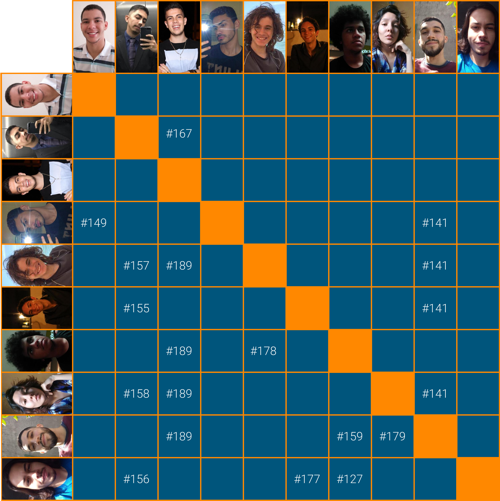

# Planejamento Sprint 14

Ultima _sprint_ do projeto, focada principalmente nas atividades finais de _analytics_ e em estruturar os últimos pontos da aplicação que estão em aberto, especialmente em fechar as dívidas que vem se arrastando ao decorrer das últimas semanas. Foi optado por um maior período pelo fato de não haver novas _tarefas_ de desenvolvimento e por se tratar se uma _sprint_ de finalização do projeto.

## Tamanho da Sprint 14

**Início:** 09/05/2021

**Término:** 22/05/2021

**Duração:** Quatorze dias

## Objetivos

|                             _Issue_                              |           Titulo           | Pontos |                                                                                                   _Assign_                                                                                                   |
| :--------------------------------------------------------------: | :------------------------: | :----: | :----------------------------------------------------------------------------------------------------------------------------------------------------------------------------------------------------------: |
| [#154](https://github.com/fga-eps-mds/2020.2-Lend.it/issues/154) |     Publicar aplicação     |   8    |                                                                                [Esio Gustavo](https://github.com/EsioFreitas)                                                                                |
| [#155](https://github.com/fga-eps-mds/2020.2-Lend.it/issues/155) |  Análise de dados Nunito   |   5    |                                                    [Lucas Dutra](https://github.com/lucasdutraf) e [Matheus Afonso](https://github.com/Matheusafonsouza)                                                     |
| [#156](https://github.com/fga-eps-mds/2020.2-Lend.it/issues/156) |  Análise de dados Raleway  |   5    |                                                  [Lucas Dutra](https://github.com/lucasdutraf) e [Vinícius Saturnino](https://github.com/viniciussaturnino)                                                  |
| [#157](https://github.com/fga-eps-mds/2020.2-Lend.it/issues/157) |  Análise de dados ZenDots  |   5    |                                                       [Lucas Dutra](https://github.com/lucasdutraf) e [Mateus Maia](https://github.com/mateusmaiamaia)                                                       |
| [#158](https://github.com/fga-eps-mds/2020.2-Lend.it/issues/158) |   Análise de dados Rubik   |   5    |                                                        [Lucas Dutra](https://github.com/lucasdutraf) e [Thais Rebouças](https://github.com/Thais-ra)                                                         |
| [#159](https://github.com/fga-eps-mds/2020.2-Lend.it/issues/159) | Análise de dados Quicksand |   5    |                                                 [Matheus Monteiro](https://github.com/matheusyanmonteiro) e [Thiago Mesquita](https://github.com/thiagompc)                                                  |
| [#189](https://github.com/fga-eps-mds/2020.2-Lend.it/issues/189) | Documentação da Sprint 14  |   5    | [Thais Rebouças](https://github.com/Thais-ra), [Mateus Maia](https://github.com/mateusmaiamaia), [Matheus Monteiro](https://github.com/matheusyanmonteiro) e [Thiago Mesquita](https://github.com/thiagompc) |

<b>Total de pontos planejados: 38</b>

### Dívida

|                             _Issue_                              |          Titulo           | Pontos |                                                                                              _Assign_                                                                                               |
| :--------------------------------------------------------------: | :-----------------------: | :----: | :-------------------------------------------------------------------------------------------------------------------------------------------------------------------------------------------------: |
| [#127](https://github.com/fga-eps-mds/2020.2-Lend.it/issues/127) | [US04] - Recuperar senha  |   5    |                                       [Vinícius Saturnino](https://github.com/viniciussaturnino) e [Matheus Monteiro](https://github.com/matheusyanmonteiro)                                        |
| [#141](https://github.com/fga-eps-mds/2020.2-Lend.it/issues/141) | [US30] - Notificar report |   5    | [Youssef Muhamad](https://github.com/youssef-md), [Thais Rebouças](https://github.com/Thais-ra), [Mateus Maia](https://github.com/mateusmaiamaia) e [Thiago Mesquita](https://github.com/thiagompc) |
| [#149](https://github.com/fga-eps-mds/2020.2-Lend.it/issues/149) |   [BUG] - Error perfil    |   5    |                                                  [Youssef Muhamad](https://github.com/youssef-md) e [Esio Gustavo](https://github.com/EsioFreitas)                                                  |

<b>Total: 15</b>

### Issues Acrescentadas Durante a Sprint

|                             _Issue_                              |                 Titulo                 | Pontos |                                                      _Assign_                                                      |
| :--------------------------------------------------------------: | :------------------------------------: | :----: | :----------------------------------------------------------------------------------------------------------------: |
| [#167](https://github.com/fga-eps-mds/2020.2-Lend.it/issues/167) | Atualizar notebook de análise de dados |   13   |           [Lucas Dutra](https://github.com/lucasdutraf) e [Rogério Júnior](https://github.com/rogerioo)            |
| [#177](https://github.com/fga-eps-mds/2020.2-Lend.it/issues/177) |    [TEST] Testes do servico de User    |   3    | [Matheus Afonso](https://github.com/Matheusafonsouza) e [Vinícius Saturnino](https://github.com/viniciussaturnino) |
| [#178](https://github.com/fga-eps-mds/2020.2-Lend.it/issues/178) |        Estruturar apresentacão         |   3    |    [Mateus Maia](https://github.com/mateusmaiamaia) e [Matheus Monteiro](https://github.com/matheusyanmonteiro)    |
| [#179](https://github.com/fga-eps-mds/2020.2-Lend.it/issues/179) |         Atualização do backlog         |   3    |          [Thais Rebouças](https://github.com/Thais-ra) e [Thiago Mesquita](https://github.com/thiagompc)           |

<b>Total: 22</b>

---

 Total de pontos da <i>sprint</i>: ## 
  

<!---Colocar no link abaixo as issues alocadas no milestone da Sprint--->

> [_Sprint_ _Backlog_](https://github.com/fga-eps-mds/2020.2-Lend.it/milestone/15?closed=1)

## Pareamentos

## Papeis

**_Scrum Master | Analista de Dados_:** [Rogério Júnior](https://github.com/rogerioo)

**_Product Manager_:** [Esio Gustavo](https://github.com/EsioFreitas)

**_Arquiteto:_** [Youssef Muhamad](https://github.com/youssef-md)

**_DevOps | Analista de Dados_:** [Lucas Dutra](https://github.com/lucasdutraf)

**Equipe de Desenvolvimento:**

- [Mateus Maia](https://github.com/mateusmaiamaia)
- [Matheus Afonso](https://github.com/Matheusafonsouza)
- [Matheus Monteiro](https://github.com/matheusyanmonteiro)
- [Thais Rebouças](https://github.com/Thais-ra)
- [Thiago Mesquita](https://github.com/thiagompc)
- [Vinícius Saturnino](https://github.com/viniciussaturnino)

**Autor:** [Rogério Júnior](https://github.com/rogerioo), [Mateus Maia](https://github.com/mateusmaiamaia) e [Thiago Mesquita](https://github.com/thiagompc)
