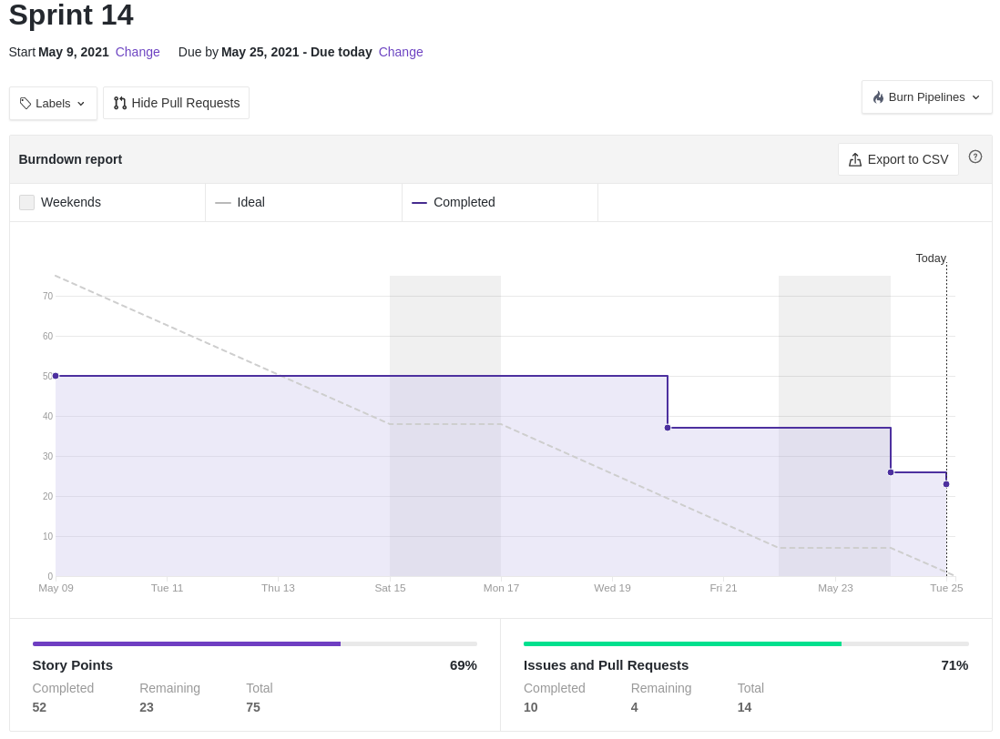
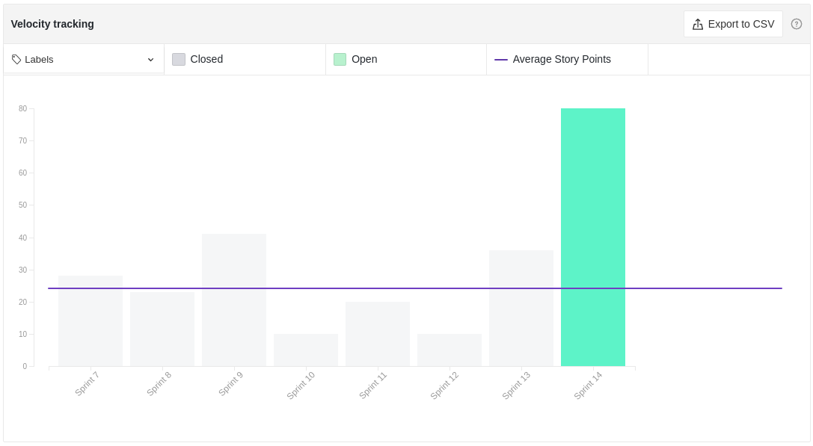

# Resultados Sprint 14

Essa foi a última _sprint_ do projeto, nela foram realizadas todos os problemas e todas as dívidas do projeto, com exceção das histórias de usuário relacionadas as notificações (US14, US20, US24 e US30) que, por conta do _Analytics_ e por ser a última _sprint_ do projeto, foi decidido pelo time abortar essas histórias.

## Fechamento da Sprint

|                             _Issue_                              |                 Título                 |    _Status_     | Pontos |
| :--------------------------------------------------------------: | :------------------------------------: | :-------------: | :----: |
| [#127](https://github.com/fga-eps-mds/2020.2-Lend.it/issues/127) |        [US04] - Recuperar senha        |   _Concluído_   |   5    |
| [#141](https://github.com/fga-eps-mds/2020.2-Lend.it/issues/141) |       [US30] - Notificar report        | _Não concluído_ |   5    |
| [#149](https://github.com/fga-eps-mds/2020.2-Lend.it/issues/149) |          [BUG] - Error perfil          | _Não concluído_ |   5    |
| [#154](https://github.com/fga-eps-mds/2020.2-Lend.it/issues/154) |           Publicar aplicação           | _Não concluído_ |   8    |
| [#155](https://github.com/fga-eps-mds/2020.2-Lend.it/issues/155) |        Análise de dados Nunito         |   _Concluído_   |   5    |
| [#156](https://github.com/fga-eps-mds/2020.2-Lend.it/issues/156) |        Análise de dados Raleway        |   _Concluído_   |   5    |
| [#157](https://github.com/fga-eps-mds/2020.2-Lend.it/issues/157) |        Análise de dados ZenDots        |   _Concluído_   |   5    |
| [#158](https://github.com/fga-eps-mds/2020.2-Lend.it/issues/158) |         Análise de dados Rubik         |   _Concluído_   |   5    |
| [#159](https://github.com/fga-eps-mds/2020.2-Lend.it/issues/159) |       Análise de dados Quicksand       |   _Concluído_   |   5    |
| [#167](https://github.com/fga-eps-mds/2020.2-Lend.it/issues/167) | Atualizar notebook de análise de dados |   _Concluído_   |   13   |
| [#177](https://github.com/fga-eps-mds/2020.2-Lend.it/issues/177) |    [TEST] Testes do servico de User    |   _Concluído_   |   3    |
| [#178](https://github.com/fga-eps-mds/2020.2-Lend.it/issues/178) |        Estruturar apresentacão         |   _Concluído_   |   3    |
| [#179](https://github.com/fga-eps-mds/2020.2-Lend.it/issues/179) |         Atualização do backlog         |   _Concluído_   |   3    |
| [#189](https://github.com/fga-eps-mds/2020.2-Lend.it/issues/189) |       Documentação da Sprint 14        |   _Concluído_   |   5    |

Pontos Planejados Concluídos: 52

Pontos de Dívida Concluídos: 05

Pontos Não Agregados: 18

> [_Sprint_ _Backlog_](https://github.com/fga-eps-mds/2020.2-Lend.it/milestone/15?closed=1/)

## Burndown

Pelo que foi mostrado nesse gráfico podemos concluir que as entregas só foram completadas no final da segunda semana, porém como podemos observar no quadro de produtividade, as _issues_ foram iniciadas no início da primeira semana.

## Velocity

Para poder fechar o projeto, foi necessário atribuir muitos pontos para essa sprint, entretanto essa foi uma _sprint_ de duas semanas, justificando essa grande quantidade de pontos.

## Riscos

Como é de se esperar, os riscos vem diminuindo a cada _sprint_ que passa. Nessa _sprint_, em específico, todos os ricos diminuíram, pois como estamos na reta final do projeto, pouco impacto seria causado pelos mesmos.

<iframe height="1100" src="https://docs.google.com/spreadsheets/d/e/2PACX-1vSGve6AsoRvxahK_yskgryTE1aQStxGh6_ls8RDjuH0DrdupIi26AptTJj64YT4vspgkpsoBKA2MZTd/pubchart?oid=2124963117&format=interactive"></iframe>

## Retrospectiva

Pode-se observar pelo quadro de empatia que o time está muito cansado por conta do final de semestre e também muito ansioso para o fim do projeto. O cansaço em excesso causou uma certa desmotivação no time em geral.

<iframe height="1100" src="https://docs.google.com/spreadsheets/d/e/2PACX-1vTj1IyAJxxw19_Cq4hQ_79XLBX_i0j7eiWpLziOrktPOOr_dLWtZRZQcGtoepJl8LQeekhC2erEvBuL/pubhtml?gid=1766332453&single=true"></iframe>

## Quadro de Conhecimento

Último quadro de conhecimento do semestre deixando evidente a evolução do time como um todo, principalmente na parte de tecnologia, onde ficou mais perceptível esse aumento.

<iframe height="600" src="https://docs.google.com/spreadsheets/d/e/2PACX-1vQt9zLphgqw_af_Kz6vaOhzGt4M4xnPEfbVTrtfh-CvbbsX1HziKhaXO5_nenI8iGToZQJNdfrqNvoJ/pubhtml?gid=2019740123&single=true"></iframe>

## Quadro de Sentimentos

Pode-se observar pelo quadro de sentimentos que houveram sentimentos altos e também baixos, o que ocorre pelo alívio do final de semestre e pela apreensão em entregar os últimos projetos e provas.

<iframe height="627" seamless frameborder="0" scrolling="no" src="https://docs.google.com/spreadsheets/d/e/2PACX-1vQfmC1hXrOlqXL8ZBsKvi7WktZEdpPOwa5KIKgUKkee2U96ua7g0-bkQL0XZRrCYFGCVWSukZ8ActfD/pubchart?oid=1562887879&format=interactive"></iframe>
<iframe height="509" seamless frameborder="0" scrolling="no" src="https://docs.google.com/spreadsheets/d/e/2PACX-1vQYTAqkgguUNHq1_L4lwKSwU04oXAoBtm2tj4GrTBb9ND0mj0pBrldy-VPLaeM5fp0KIPX7SbWDH9ia/pubchart?oid=753219909&format=interactive"></iframe>
<iframe height="371" seamless frameborder="0" scrolling="no" src="https://docs.google.com/spreadsheets/d/e/2PACX-1vR7kDZjRAC-EVBplLf7K6B9FQOQW3As3S17ffv4DMo6_dn0-c43DWpxoylg1mpDB41mPCOX0Dcp34bB/pubchart?oid=1678695458&format=interactive"></iframe>

<iframe height="627" seamless frameborder="0" scrolling="no" src="https://docs.google.com/spreadsheets/d/e/2PACX-1vQfmC1hXrOlqXL8ZBsKvi7WktZEdpPOwa5KIKgUKkee2U96ua7g0-bkQL0XZRrCYFGCVWSukZ8ActfD/pubchart?oid=1968593554&format=interactive"></iframe>
<iframe height="509" seamless frameborder="0" scrolling="no" src="https://docs.google.com/spreadsheets/d/e/2PACX-1vQYTAqkgguUNHq1_L4lwKSwU04oXAoBtm2tj4GrTBb9ND0mj0pBrldy-VPLaeM5fp0KIPX7SbWDH9ia/pubchart?oid=787008663&format=interactive"></iframe>
<iframe height="371" seamless frameborder="0" scrolling="no" src="https://docs.google.com/spreadsheets/d/e/2PACX-1vR7kDZjRAC-EVBplLf7K6B9FQOQW3As3S17ffv4DMo6_dn0-c43DWpxoylg1mpDB41mPCOX0Dcp34bB/pubchart?oid=1923148468&format=interactive"></iframe>

## Registro de Presença nas _Dailies_

### Semana 01

|    Nome     | Segunda Feira | Terça Feira | Quarta Feira | Quinta Feira | Sexta Feira |
| :---------: | :-----------: | :---------: | :----------: | :----------: | :---------: |
|    Ésio     |       ✔       |      ✘      |      ✘       |      ✘       |      ✘      |
|    Lucas    |       ✔       |      ✘      |      ✘       |      ✘       |      ✘      |
|   M. Maia   |       ✔       |      ✔      |      ✘       |      ✘       |      ✔      |
|  M. Afonso  |       ✔       |      ✔      |      ✔       |      ✔       |      ✔      |
| M. Monteiro |       ✔       |      ✔      |      ✔       |      ✔       |      ✔      |
|   Rogério   |       ✔       |      ✔      |      ✔       |      ✔       |      ✘      |
|    Thaís    |       ✔       |      ✔      |      ✔       |      ✔       |      ✘      |
|   Thiago    |       ✔       |      ✔      |      ✔       |      ✔       |      ✔      |
|  Vinicius   |       ✔       |      ✔      |      ✔       |      ✔       |      ✔      |
|   Youssef   |       ✔       |      ✔      |      ✔       |      ✔       |      ✘      |

### Semana 02

|    Nome     | Segunda Feira | Terça Feira | Quarta Feira | Quinta Feira | Sexta Feira |
| :---------: | :-----------: | :---------: | :----------: | :----------: | :---------: |
|    Ésio     |       ✘       |      ✘      |      ✘       |      ✘       |      ✘      |
|    Lucas    |       ✔       |      ✔      |      ✔       |      ✘       |      ✘      |
|   M. Maia   |       ✔       |      ✔      |      ✔       |      ✘       |      ✘      |
|  M. Afonso  |       ✔       |      ✔      |      ✘       |      ✘       |      ✘      |
| M. Monteiro |       ✔       |      ✔      |      ✘       |      ✘       |      ✘      |
|   Rogério   |       ✔       |      ✔      |      ✔       |      ✘       |      ✘      |
|    Thaís    |       ✔       |      ✘      |      ✘       |      ✘       |      ✘      |
|   Thiago    |       ✔       |      ✔      |      ✔       |      ✘       |      ✘      |
|  Vinicius   |       ✔       |      ✔      |      ✔       |      ✘       |      ✘      |
|   Youssef   |       ✘       |      ✔      |      ✔       |      ✘       |      ✘      |

## Avaliação do Scrum Master

A _sprint_ 14 teve um período de 2 semanas, pois não houve novas _tarefas_ de desenvolvimento e por ser a _sprint_ de finalização do projeto. Com isso o time focou em terminar as atividades do analytics e também dívidas. O time estava, na maior parte da sprint, com o sentimento positivo, motivados e ansiosos para finalizar o projeto. Com isso, conseguimos grande parte dos pontos planejados e também alguns de dívida. No fim, acredito que entregamos um bom projeto e pode-se notar a sensação do time de dever cumprido.

**Autor:** [Rogério Júnior](https://github.com/rogerioo), [Mateus Maia](https://github.com/mateusmaiamaia) e [Thiago Mesquita](https://github.com/thiagompc)
