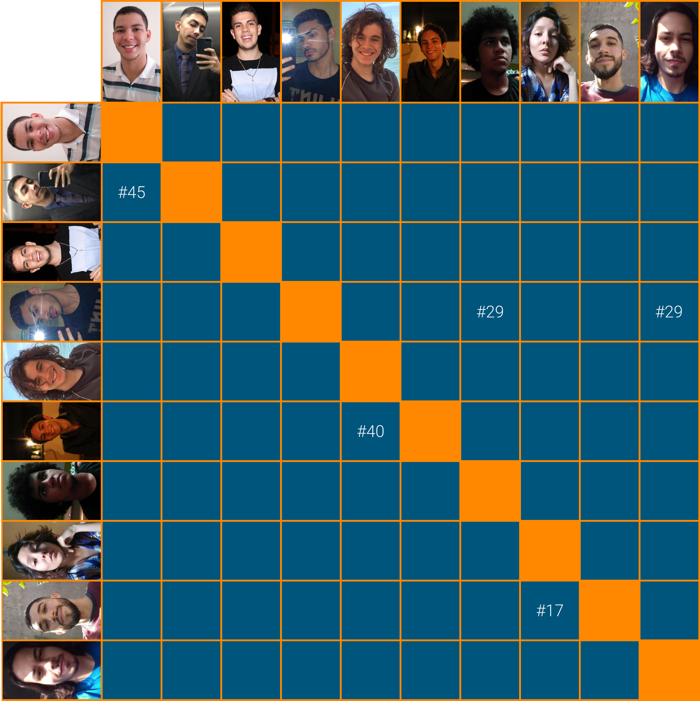

# Planejamento Sprint 02

Sprint focada no levantamento e modelagem dos requisitos funcionais da aplicação e na definição da visão de produto do projeto. Com os protótipos de baixa fidelidade feitos pelos membros do time, foi feito a condensação das ideias e evolução da interface da aplicação.

Com as funcionalidades levantadas foram definidas as tecnologias a serem usadas e com isso dojo de *Flutter* foi feito com o time de MDS para inicia-los na tecnologia.

## Tamanho da Sprint 02

**Início:** 14/02/2021

**Término:** 20/02/2021

**Duração:** Sete dias

## Objetivos

|     *Issue*      | Titulo |    Pontos   |     *Assign*     |
|:----------------:|:------:|:-----------:|:----------------:|
| [#17](https://github.com/fga-eps-mds/2020.2-Lend.it/issues/17) | Documento de visão | 5 | [Thais Rebouças](https://github.com/Thais-ra) e [Thiago Mesquita](https://github.com/thiagompc) |
| [#29](https://github.com/fga-eps-mds/2020.2-Lend.it/issues/29) | Protótipo de Média Fidelidade | 8 | [Matheus Monteiro](https://github.com/matheusyanmonteiro), [Vinícius Saturnino](https://github.com/viniciussaturnino) e [Youssef Muhamad](https://github.com/youssef-md) |
| [#30](https://github.com/fga-eps-mds/2020.2-Lend.it/issues/30) | Dojo Flutter | 2 | [Youssef Muhamad](https://github.com/youssef-md) |
| [#32](https://github.com/fga-eps-mds/2020.2-Lend.it/issues/32) | Documento de conclusão de sprint 2 | 3 | [Rogério Júnior](https://github.com/rogerioo) |
| [#34](https://github.com/fga-eps-mds/2020.2-Lend.it/issues/34) | Documento de planejamento da sprint 2 | 3 | [Rogério Júnior](https://github.com/rogerioo) |
| [#35](https://github.com/fga-eps-mds/2020.2-Lend.it/issues/35) | Configurar Zenhub | 1 | [Rogério Júnior](https://github.com/rogerioo) |
| [#36](https://github.com/fga-eps-mds/2020.2-Lend.it/issues/36) | Configuração do Frontend | 3 | [Esio Gustavo](https://github.com/EsioFreitas) |
| [#37](https://github.com/fga-eps-mds/2020.2-Lend.it/issues/37) | Criar Organização do time  | 1 | [Esio Gustavo](https://github.com/EsioFreitas) |
| [#40](https://github.com/fga-eps-mds/2020.2-Lend.it/issues/40) | Rich Picture | 5 | [Mateus Maia](https://github.com/mateuscunhamaia) e [Matheus Afonso](https://github.com/Matheusafonsouza) |
| [#43](https://github.com/fga-eps-mds/2020.2-Lend.it/issues/43) | Backlog | 8 | [Esio Gustavo](https://github.com/EsioFreitas) |
| [#44](https://github.com/fga-eps-mds/2020.2-Lend.it/issues/44) | Priorização | 5 | [Esio Gustavo](https://github.com/EsioFreitas) |
| [#45](https://github.com/fga-eps-mds/2020.2-Lend.it/issues/45) | Lean Inception | 8 | [Esio Gustavo](https://github.com/EsioFreitas) e [Lucas Dutra](https://github.com/lucasdutraf) |

<b>Total de pontos planejados: 52</b>  

<!---Colocar no link abaixo as issues alocadas no milestone da Sprint--->
> [_Sprint_ _Backlog_](https://github.com/fga-eps-mds/2020.2-Lend.it/milestone/3?closed=1)  

## Pareamentos

## Papeis

***Scrum Master*:** [Rogério Júnior](https://github.com/rogerioo)

***Product Manager*:** [Esio Gustavo](https://github.com/EsioFreitas)

***Arquiteto:*** [Youssef Muhamad](https://github.com/youssef-md)

***DevOps*:** [Lucas Dutra](https://github.com/lucasdutraf)

**Equipe de Desenvolvimento:**

- [Mateus Maia](https://github.com/mateuscunhamaia)
- [Matheus Afonso](https://github.com/Matheusafonsouza)
- [Matheus Monteiro](https://github.com/matheusyanmonteiro)
- [Thais Rebouças](https://github.com/Thais-ra)
- [Thiago Mesquita](https://github.com/thiagompc)
- [Vinícius Saturnino](https://github.com/viniciussaturnino)

**Autor:** [Rogério Júnior](https://github.com/rogerioo)
