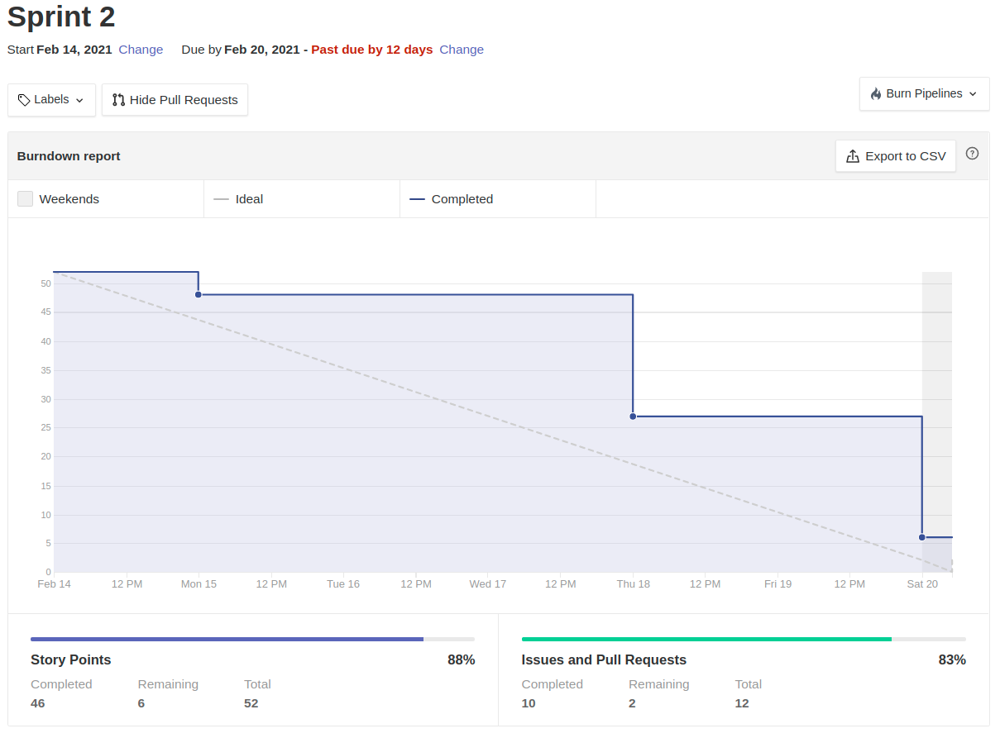
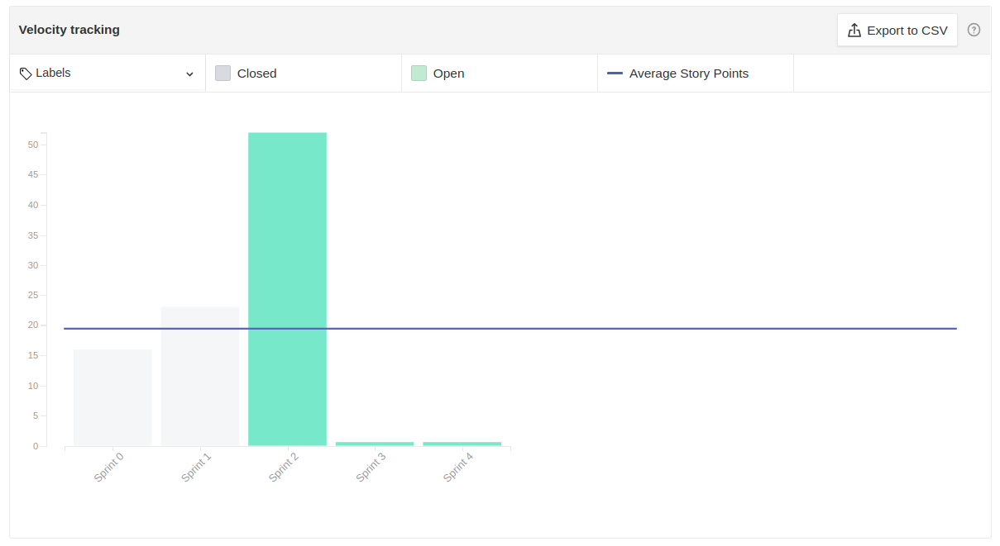

# Resultados Sprint 02

Sprint que marca o levantamento de funcionalidades, do primeiro esboço da interface da aplicação e da modelagem de requisitos.

## Fechamento da Sprint

|                            _Issue_                             |                Título                 |  _Status_   | Pontos |
| :------------------------------------------------------------: | :-----------------------------------: | :---------: | :----: |
| [#17](https://github.com/fga-eps-mds/2020.2-Lend.it/issues/17) |          Documento de visão           | _Concluído_ |   5    |
| [#29](https://github.com/fga-eps-mds/2020.2-Lend.it/issues/29) |     Protótipo de Média Fidelidade     | _Concluído_ |   8    |
| [#30](https://github.com/fga-eps-mds/2020.2-Lend.it/issues/30) |             Dojo Flutter              | _Concluído_ |   2    |
| [#32](https://github.com/fga-eps-mds/2020.2-Lend.it/issues/32) |  Documento de conclusão de sprint 2   | _Concluído_ |   3    |
| [#34](https://github.com/fga-eps-mds/2020.2-Lend.it/issues/34) | Documento de planejamento da sprint 2 | _Concluído_ |   3    |
| [#35](https://github.com/fga-eps-mds/2020.2-Lend.it/issues/35) |           Configurar Zenhub           | _Concluído_ |   1    |
| [#36](https://github.com/fga-eps-mds/2020.2-Lend.it/issues/36) |       Configuração do Frontend        | _Concluído_ |   3    |
| [#37](https://github.com/fga-eps-mds/2020.2-Lend.it/issues/37) |       Criar Organização do time       | _Concluído_ |   1    |
| [#40](https://github.com/fga-eps-mds/2020.2-Lend.it/issues/40) |             Rich Picture              | _Concluído_ |   5    |
| [#43](https://github.com/fga-eps-mds/2020.2-Lend.it/issues/43) |                Backlog                | _Concluído_ |   8    |
| [#44](https://github.com/fga-eps-mds/2020.2-Lend.it/issues/44) |              Priorização              | _Concluído_ |   5    |
| [#45](https://github.com/fga-eps-mds/2020.2-Lend.it/issues/45) |            Lean Inception             | _Concluído_ |   8    |

Pontos Planejados Concluídos: 52

Pontos de Dívida Concluídos: 0

Pontos Não Agregados: 0

> [_Sprint_ _Backlog_](https://github.com/fga-eps-mds/2020.2-Lend.it/milestone/3?closed=1)

## Burndown

Comparativamente a _sprint_ anterior, pode-se ver que o time conseguiu melhorar seu trabalho durante a semana de forma que quase foi atingida a expectativa de trabalho proposto pela metodologia ágil. Isso se deu a uma semana mais tranquila de faculdade e trabalho para os membros do time dada pelo **Carnaval**, feriado nacional.

## Velocity

É evidenciado pelo gráfico o grande aumento de pontos feito pelo time durante essa sprint, que dobrou em comparação ao período anterior. Isso se deu por dois grandes fatores:

- A definição de escopo do projeto, que desbloqueou várias tarefas que dependiam dessa atividade
- Cada vez mais o time vem entrando no ritmo da matéria e conseguindo entregar artefatos mais complexos e que agregam mais valor

## Retrospectiva

Nessa _sprint_ foi iniciada a retrospectiva usando o quadro de empatia e o de ações de melhoria para levantar pontos importantes, tanto individuais quanto coletivos,e a visão dos membros do decorrer da semana.

A partir dos _feedbacks_ é possível ver que a definição de escopo, feita na reunião de planejamento da _sprint_, foi um fator muito reconfortante para muitos, pois é possível ver que a maioria do time elencou a definição da base como um dos pontos sendo feitos no projeto e sentem que o time está se desenvolvendo bem. Ainda que, como foi evidenciado pela pontuação do _velocity_ dessa sprint, alguns membros pontuaram que o time poderia ainda não está no ritmo da matéria e poderia entregar mais tarefas.

Vale destacar, o medo que um membro de _MDS_ sinalizou de não conseguir acompanhar o resto do time. Para mitigar esse risco, os dojos vão continuar sendo uma prioridade para o time de _EPS_ e os pareamentos sendo feitos sempre de forma distribuir o conhecimento, e se necessário, com um membro do time de _EPS_ que tenha domínio da tecnologia.

Por fim, gostaria de destacar que um ponto central, levantado no quadro de ações de melhoria, levantado foi a união e dedicação do time o que se mostra muito positivo, pois assim o trabalho flui melhor. As ações de melhoria levantadas são pontos de definição necessários a todo inicio de projeto, e a partir das soluções levantadas espera-se que possam ser solucionados durante a próxima _sprint_.

<iframe src="https://docs.google.com/spreadsheets/d/e/2PACX-1vTj1IyAJxxw19_Cq4hQ_79XLBX_i0j7eiWpLziOrktPOOr_dLWtZRZQcGtoepJl8LQeekhC2erEvBuL/pubhtml?gid=1931803189&amp;single=true&amp;widget=true&amp;headers=false" height="1100"></iframe>

## Quadro de Conhecimento

O quadro mostra pouca evolução em relação a _sprint 0_ e isso se dá pelas tecnologias terem sido definidas durante essa semana, o que não permitia um direcionamento claro dos estudo dos _MDS_ e dos dojos ministrados.

<iframe src="https://docs.google.com/spreadsheets/d/e/2PACX-1vQt9zLphgqw_af_Kz6vaOhzGt4M4xnPEfbVTrtfh-CvbbsX1HziKhaXO5_nenI8iGToZQJNdfrqNvoJ/pubhtml?gid=304213891&amp;single=true&amp;widget=true&amp;headers=false" height="600"></iframe>

## Avaliação do Scrum Master

Em minha visão o time já está em um bom ritmo de trabalho e nas próximas _sprints_ o encaminhamento será de conseguir realizar mais tarefas e agregar mais valor ao produto. O time se mostra bem unido, apesar de nem todos se conhecerem anteriormente, e isso é essencial para o bom desenvolvimento das tarefas, pois um bom relacionamento ajuda bastante na comunicação do time.

O acompanhamento do time de _MDS_ é feito de perto para que os medos e problemas pessoais possam, na medida do possível, solucionados para que os mesmos possam estar produzindo de forma a não ficar sobrecarregado e poder ter um bom aproveitamento do que a matéria se propõe.

**Autor:** [Rogério Júnior](https://github.com/rogerioo)
