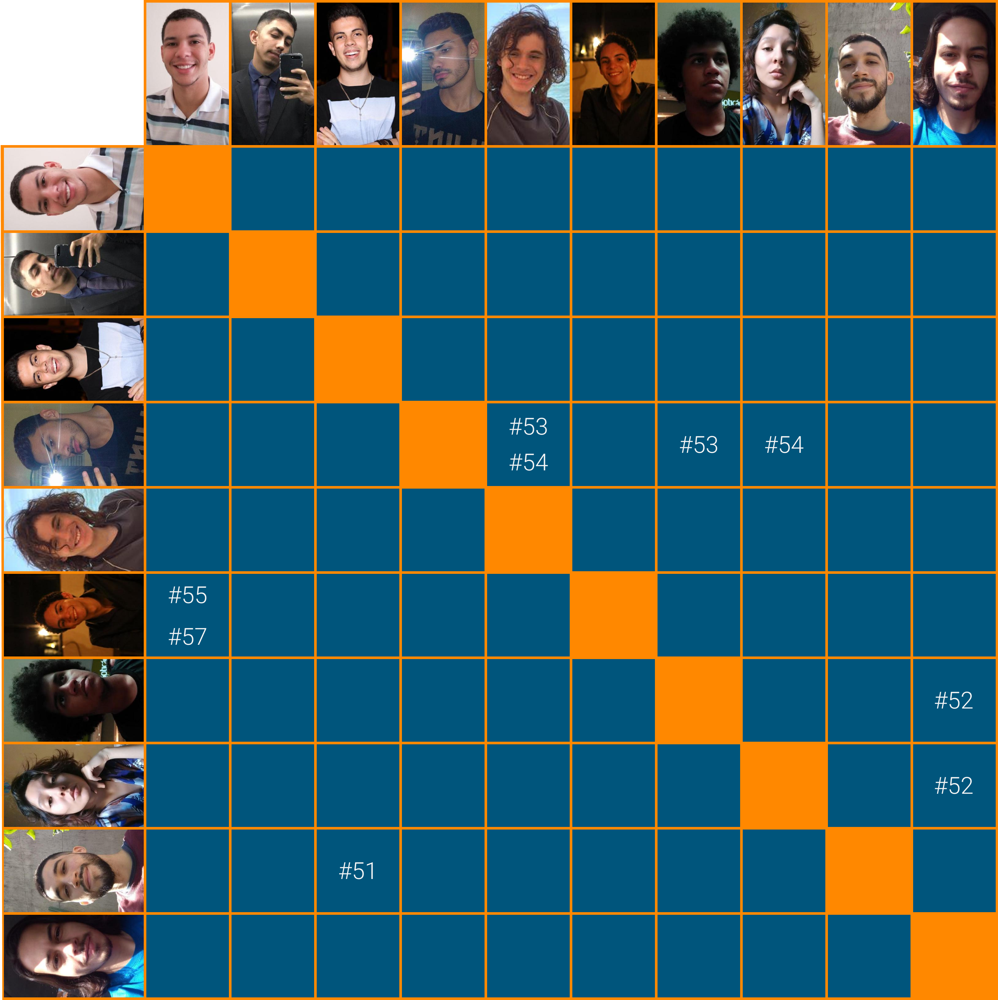

# Planejamento Sprint 03

Confecção da primeira versão do documento de arquitetura e a modelagem do banco de dados. Refinamento da visão de produto do projeto com a criação de novos artefatos. Momento de definição e validação de aspectos visuais da aplicação: nome, identidade visual e testes de usabilidade. Ambientação para os serviços que vão usar flask e node do projeto.

## Tamanho da Sprint 03

**Início:** 21/02/2021

**Término:** 27/02/2021

**Duração:** Sete dias

## Objetivos

|                            _Issue_                             |               Titulo                | Pontos |                                                                               _Assign_                                                                                |
| :------------------------------------------------------------: | :---------------------------------: | :----: | :-------------------------------------------------------------------------------------------------------------------------------------------------------------------: |
| [#38](https://github.com/fga-eps-mds/2020.2-Lend.it/issues/38) |            Questionário             |   5    |                                                             [Lucas Dutra](https://github.com/lucasdutraf)                                                             |
| [#51](https://github.com/fga-eps-mds/2020.2-Lend.it/issues/51) |     Modelagem do banco de dados     |   8    |                                    [Rogério Júnior](https://github.com/rogerioo) e [Thiago Mesquita](https://github.com/thiagompc)                                    |
| [#52](https://github.com/fga-eps-mds/2020.2-Lend.it/issues/52) |      Documento de arquitetura       |   8    | [Matheus Monteiro](https://github.com/matheusyanmonteiro), [Thais Rebouças](https://github.com/Thais-ra) e [Vinícius Saturnino](https://github.com/viniciussaturnino) |
| [#53](https://github.com/fga-eps-mds/2020.2-Lend.it/issues/53) |        Teste de usabilidade         |   5    |    [Mateus Maia](https://github.com/mateuscunhamaia), [Matheus Monteiro](https://github.com/matheusyanmonteiro) e [Youssef Muhamad](https://github.com/youssef-md)    |
| [#54](https://github.com/fga-eps-mds/2020.2-Lend.it/issues/54) |          Identidade visual          |   2    |          [Mateus Maia](https://github.com/mateuscunhamaia), [Thais Rebouças](https://github.com/Thais-ra) e [Youssef Muhamad](https://github.com/youssef-md)          |
| [#55](https://github.com/fga-eps-mds/2020.2-Lend.it/issues/55) |            Benchmarking             |   3    |                                [Esio Gustavo](https://github.com/EsioFreitas) e [Matheus Afonso](https://github.com/Matheusafonsouza)                                 |
| [#56](https://github.com/fga-eps-mds/2020.2-Lend.it/issues/56) |           Escolha do Nome           |   1    |                                                             [Rogério Júnior](https://github.com/rogerioo)                                                             |
| [#57](https://github.com/fga-eps-mds/2020.2-Lend.it/issues/57) |           Curva de valor            |   3    |                                [Esio Gustavo](https://github.com/EsioFreitas) e [Matheus Afonso](https://github.com/Matheusafonsouza)                                 |
| [#58](https://github.com/fga-eps-mds/2020.2-Lend.it/issues/58) |      Estruturar ambiente flask      |   2    |                                                             [Lucas Dutra](https://github.com/lucasdutraf)                                                             |
| [#59](https://github.com/fga-eps-mds/2020.2-Lend.it/issues/59) |      Estruturar ambiente Node       |   2    |                                                             [Lucas Dutra](https://github.com/lucasdutraf)                                                             |
| [#75](https://github.com/fga-eps-mds/2020.2-Lend.it/issues/75) | Documento de Planejamento Sprint 03 |   3    |                                                             [Rogério Júnior](https://github.com/rogerioo)                                                             |
| [#76](https://github.com/fga-eps-mds/2020.2-Lend.it/issues/76) |  Documento de Conclusão Sprint 03   |   3    |                                                             [Rogério Júnior](https://github.com/rogerioo)                                                             |

<b>Total de pontos planejados: 45</b>

---

 Total de pontos da <i>sprint</i>: 45 
  

<!---Colocar no link abaixo as issues alocadas no milestone da Sprint--->

> [_Sprint_ _Backlog_](https://github.com/fga-eps-mds/2020.2-Lend.it/milestone/4?closed=1)

## Pareamentos

## Papeis

**_Scrum Master_:** [Rogério Júnior](https://github.com/rogerioo)

**_Product Manager_:** [Esio Gustavo](https://github.com/EsioFreitas)

**_Arquiteto:_** [Youssef Muhamad](https://github.com/youssef-md)

**_DevOps_:** [Lucas Dutra](https://github.com/lucasdutraf)

**Equipe de Desenvolvimento:**

- [Mateus Maia](https://github.com/mateuscunhamaia)
- [Matheus Afonso](https://github.com/Matheusafonsouza)
- [Matheus Monteiro](https://github.com/matheusyanmonteiro)
- [Thais Rebouças](https://github.com/Thais-ra)
- [Thiago Mesquita](https://github.com/thiagompc)
- [Vinícius Saturnino](https://github.com/viniciussaturnino)

**Autor:** [Rogério Júnior](https://github.com/rogerioo)
