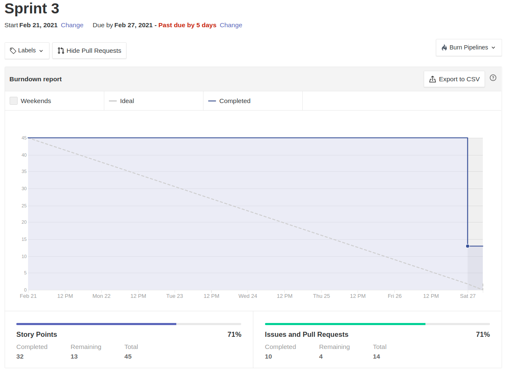

# Resultados Sprint 03

_Sprint_ marcada pela início do processo de definição da identidade visual da aplicação, da estruturação dos _templates_ dos serviços de Flask e Node e definições arquiteturais do _software_. Foram feitas tarefas no sentido de melhora na visão de produto da aplicação e a modelagem do banco de dados.

## Fechamento da Sprint

|                            _Issue_                             |               Título                | _Status_  | Pontos |
| :------------------------------------------------------------: | :---------------------------------: | :-------: | :----: |
| [#38](https://github.com/fga-eps-mds/2020.2-Lend.it/issues/38) |            Questionário             | Concluído |   5    |
| [#51](https://github.com/fga-eps-mds/2020.2-Lend.it/issues/51) |     Modelagem do banco de dados     | Concluído |   8    |
| [#52](https://github.com/fga-eps-mds/2020.2-Lend.it/issues/52) |      Documento de arquitetura       | Concluído |   8    |
| [#53](https://github.com/fga-eps-mds/2020.2-Lend.it/issues/53) |        Teste de usabilidade         | Concluído |   5    |
| [#54](https://github.com/fga-eps-mds/2020.2-Lend.it/issues/54) |          Identidade visual          | Concluído |   2    |
| [#55](https://github.com/fga-eps-mds/2020.2-Lend.it/issues/55) |            Benchmarking             | Concluído |   3    |
| [#56](https://github.com/fga-eps-mds/2020.2-Lend.it/issues/56) |           Escolha do Nome           | Concluído |   1    |
| [#57](https://github.com/fga-eps-mds/2020.2-Lend.it/issues/57) |           Curva de valor            | Concluído |   3    |
| [#58](https://github.com/fga-eps-mds/2020.2-Lend.it/issues/58) |      Estruturar ambiente flask      | Concluído |   2    |
| [#59](https://github.com/fga-eps-mds/2020.2-Lend.it/issues/59) |      Estruturar ambiente Node       | Concluído |   2    |
| [#75](https://github.com/fga-eps-mds/2020.2-Lend.it/issues/75) | Documento de Planejamento Sprint 03 | Concluído |   3    |
| [#76](https://github.com/fga-eps-mds/2020.2-Lend.it/issues/76) |  Documento de Conclusão Sprint 03   | Concluído |   3    |

Pontos Planejados Concluídos: 45

Pontos de Dívida Concluídos: 0

Pontos Não Agregados: 0

> [_Sprint_ _Backlog_](https://github.com/fga-eps-mds/2020.2-Lend.it/milestone/4?closed=1)

## Burndown

Como está evidenciado no gráfico de produtividade do time, os tarefas foram iniciadas tardiamente devido as provas que os membros tiveram de suas matérias da faculdade. No final da sprint todas as tarefas foram entregues, faltando apenas a [#53](https://github.com/fga-eps-mds/2020.2-Lend.it/issues/53) e [#54](https://github.com/fga-eps-mds/2020.2-Lend.it/issues/54) serem documentadas na Wiki e as documentações de _sprint_ ([#75](https://github.com/fga-eps-mds/2020.2-Lend.it/issues/75) e [#76](https://github.com/fga-eps-mds/2020.2-Lend.it/issues/76)).

## Velocity

Pode-se ver que a quantidade de pontos entregues na sprint se manteve igual a última sprint.

## Riscos

Primeira sprint onde foram levantados alguns riscos considerados relevantes pelos membros do time e visto qual seria a importância do problema, baseado no seu impacto e na sua probabilidade de acontecer. Por se tratar da primeira vez que esse mapeamento foi feito, não foram propostas medidas para mitigar esses riscos, ficando a critério do _SM_ analisar o desenvolvimento das atividades durante a _sprint_ e juntamente com o time de _EPS_ propor soluções que acharem relevantes.

<iframe height="909" seamless frameborder="0" scrolling="yes" src="https://docs.google.com/spreadsheets/d/e/2PACX-1vSGve6AsoRvxahK_yskgryTE1aQStxGh6_ls8RDjuH0DrdupIi26AptTJj64YT4vspgkpsoBKA2MZTd/pubchart?oid=1784859995&amp;format=interactive"></iframe>

## Retrospectiva

Como um bom ponto sobre o quadro de empatia vale ressaltar que a visão do time está alinhada ao desenvolvimento do projeto e que as ações tomadas reafirmar as intenções da gerência do projeto. O sentimento do time se mostra bem positivo a consolidação do projeto e em como os trabalhos tem sido feitos.

Em relação as fortalezas o time consegue ver com o empenho bem evidênciado e a documentação bem feita. Para mitigação das fraquezas do time foi levantado a necessidade de melhora do uso do ZenHub para acompanhamento das tarefas.

<iframe height="1100" src="https://docs.google.com/spreadsheets/d/e/2PACX-1vTj1IyAJxxw19_Cq4hQ_79XLBX_i0j7eiWpLziOrktPOOr_dLWtZRZQcGtoepJl8LQeekhC2erEvBuL/pubhtml?gid=1742166148&amp;single=true&amp;widget=true&amp;headers=false"></iframe>

## Quadro de Conhecimento

Como o acompanhamento da evolução do conhecimento é feito a cada 15 dias, não houveram alterações com relação a s print anterior.

<iframe src="https://docs.google.com/spreadsheets/d/e/2PACX-1vQt9zLphgqw_af_Kz6vaOhzGt4M4xnPEfbVTrtfh-CvbbsX1HziKhaXO5_nenI8iGToZQJNdfrqNvoJ/pubhtml?gid=304213891&amp;single=true&amp;widget=true&amp;headers=false" height="600"></iframe>

## Quadro de Sentimentos

O mapeamento evidência que ainda com muito membros com o nível de sentimento baixo, por conta das provas e atividades pessoais da semana, o tive manteve uma boa produtividade.

O começo tardio das atividades se deu por conta do motivo mencionado anteriormente.

<iframe height="627" seamless frameborder="0" scrolling="no" src="https://docs.google.com/spreadsheets/d/e/2PACX-1vQfmC1hXrOlqXL8ZBsKvi7WktZEdpPOwa5KIKgUKkee2U96ua7g0-bkQL0XZRrCYFGCVWSukZ8ActfD/pubchart?oid=398813935&amp;format=interactive"></iframe>

<iframe height="509" seamless frameborder="0" scrolling="no" src="https://docs.google.com/spreadsheets/d/e/2PACX-1vQYTAqkgguUNHq1_L4lwKSwU04oXAoBtm2tj4GrTBb9ND0mj0pBrldy-VPLaeM5fp0KIPX7SbWDH9ia/pubchart?oid=1935748383&amp;format=interactive"></iframe>

<iframe height="371" seamless frameborder="0" scrolling="no" src="https://docs.google.com/spreadsheets/d/e/2PACX-1vR7kDZjRAC-EVBplLf7K6B9FQOQW3As3S17ffv4DMo6_dn0-c43DWpxoylg1mpDB41mPCOX0Dcp34bB/pubchart?oid=1244284395&amp;format=interactive"></iframe>

## Registro de Presença nas _Dailies_

|        Nome        | Segunda | Terça | Quarta | Quinta | Sexta |
| :----------------: | :-----: | :---: | :----: | :----: | :---: |
|    Ésio Freitas    |    ✔    |   ✔   |   ✔    |   ✘    |   ✔   |
|    Lucas Dutra     |    ✔    |   ✔   |   ✔    |   ✔    |   ✔   |
|    Mateus Maia     |    ✔    |   ✔   |   ✔    |   ✔    |   ✔   |
|   Matheus Afonso   |    ✔    |   ✔   |   ✔    |   ✔    |   ✔   |
|  Matheus Monteiro  |    ✔    |   ✔   |   ✔    |   ✔    |   ✘   |
|   Rogério Júnior   |    ✔    |   ✔   |   ✔    |   ✔    |   ✔   |
|   Thaís Rebouças   |    ✔    |   ✘   |   ✔    |   ✔    |   ✘   |
|  Thiago Mesquita   |    ✔    |   ✔   |   ✘    |   ✔    |   ✔   |
| Vinícius Saturnino |    ✔    |   ✔   |   ✔    |   ✔    |   ✔   |
|  Youssef Muhamad   |    ✔    |   ✔   |   ✔    |   ✔    |   ✔   |

## Avaliação do Scrum Master

O time se mostrou bem produtivo e conseguiu realizar um bom trabalho durante a _sprint_. As atividades propostas foram concluídas e nenhuma das métricas que evidênciaram pontos negativos não possuem proposta de solução. O time está bem unido e empenhado e, mantendo esse ritmo, nos encaminhamos bem para as _sprints_ de desenvolvimentos, juntamente com as documentações produzidas.

**Autor:** [Rogério Júnior](https://github.com/rogerioo)
