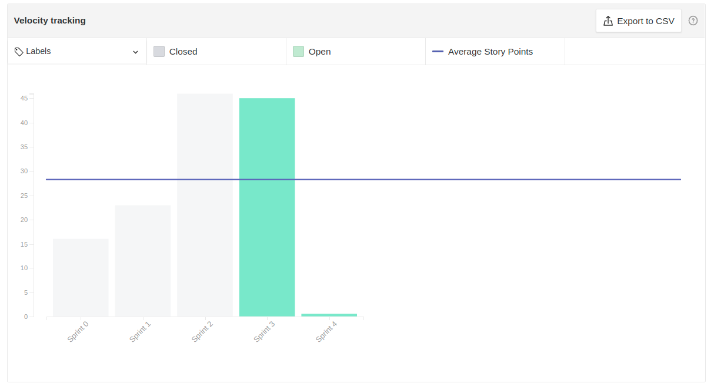

# Resultados Sprint 03

Fazer a restrospectiva da *sprint* explicando de forma detalhada qual foi o resultado e buscar sempre linkar com aquilo que seja relevante às explicações.

## Fechamento da Sprint

| *Issue* | Título | *Status* | Pontos |
| :-----: | :----: | :------: | :----: |
| [#38](https://github.com/fga-eps-mds/2020.2-Lend.it/issues/38) | Questionário | Concluído | 5 |
| [#51](https://github.com/fga-eps-mds/2020.2-Lend.it/issues/51) | Modelagem do banco de dados | Concluído | 8 |
| [#52](https://github.com/fga-eps-mds/2020.2-Lend.it/issues/52) | Documento de arquitetura | Concluído | 8 |
| [#53](https://github.com/fga-eps-mds/2020.2-Lend.it/issues/53) | Teste de usabilidade  | Concluído | 5 |
| [#54](https://github.com/fga-eps-mds/2020.2-Lend.it/issues/54) | Identidade visual  | Concluído | 2 |
| [#55](https://github.com/fga-eps-mds/2020.2-Lend.it/issues/55) | Benchmarking | Concluído | 3 |
| [#56](https://github.com/fga-eps-mds/2020.2-Lend.it/issues/56) | Escolha do Nome | Concluído | 1 |
| [#57](https://github.com/fga-eps-mds/2020.2-Lend.it/issues/57) | Curva de valor  | Concluído | 3 |
| [#58](https://github.com/fga-eps-mds/2020.2-Lend.it/issues/58) | Estruturar ambiente flask | Concluído | 2 |
| [#59](https://github.com/fga-eps-mds/2020.2-Lend.it/issues/59) | Estruturar ambiente Node | Concluído | 2 |
| [#75](https://github.com/fga-eps-mds/2020.2-Lend.it/issues/75) | Documento de Planejamento Sprint 03 | Concluído | 3 |
| [#76](https://github.com/fga-eps-mds/2020.2-Lend.it/issues/76) | Documento de Conclusão Sprint 03 | Concluído | 3 |

Pontos Planejados Concluídos: 45

Pontos de Dívida Concluídos:  0

Pontos Não Agregados: 0

> [_Sprint_ _Backlog_](https://github.com/fga-eps-mds/2020.2-Lend.it/milestone/4?closed=1)

## Burndown

Explicação em cima dos dados.

## Velocity

Explicação em cima dos dados.

## Riscos

Explicação sobre os riscos.

<iframe height="909" seamless frameborder="0" scrolling="yes" src="https://docs.google.com/spreadsheets/d/e/2PACX-1vSGve6AsoRvxahK_yskgryTE1aQStxGh6_ls8RDjuH0DrdupIi26AptTJj64YT4vspgkpsoBKA2MZTd/pubchart?oid=1784859995&amp;format=interactive"></iframe>

## Retrospectiva

Breve resumo sobre a retrospectiva.

<iframe height="1100" src="https://docs.google.com/spreadsheets/d/e/2PACX-1vTj1IyAJxxw19_Cq4hQ_79XLBX_i0j7eiWpLziOrktPOOr_dLWtZRZQcGtoepJl8LQeekhC2erEvBuL/pubhtml?gid=1742166148&amp;single=true&amp;widget=true&amp;headers=false"></iframe>

## Quadro de Conhecimento

Breve aval sobre o quadro de conhecimento.

<iframe src="https://docs.google.com/spreadsheets/d/e/2PACX-1vQt9zLphgqw_af_Kz6vaOhzGt4M4xnPEfbVTrtfh-CvbbsX1HziKhaXO5_nenI8iGToZQJNdfrqNvoJ/pubhtml?gid=304213891&amp;single=true&amp;widget=true&amp;headers=false" height="600"></iframe>

## Quadro de Sentimentos

Breve explicação dos dados

<iframe height="627" seamless frameborder="0" scrolling="no" src="https://docs.google.com/spreadsheets/d/e/2PACX-1vQfmC1hXrOlqXL8ZBsKvi7WktZEdpPOwa5KIKgUKkee2U96ua7g0-bkQL0XZRrCYFGCVWSukZ8ActfD/pubchart?oid=398813935&amp;format=interactive"></iframe>

<iframe height="509" seamless frameborder="0" scrolling="no" src="https://docs.google.com/spreadsheets/d/e/2PACX-1vQYTAqkgguUNHq1_L4lwKSwU04oXAoBtm2tj4GrTBb9ND0mj0pBrldy-VPLaeM5fp0KIPX7SbWDH9ia/pubchart?oid=1935748383&amp;format=interactive"></iframe>

<iframe height="371" seamless frameborder="0" scrolling="no" src="https://docs.google.com/spreadsheets/d/e/2PACX-1vR7kDZjRAC-EVBplLf7K6B9FQOQW3As3S17ffv4DMo6_dn0-c43DWpxoylg1mpDB41mPCOX0Dcp34bB/pubchart?oid=1244284395&amp;format=interactive"></iframe>

## Registro de Presença nas *Dailies*

|     Nome    |   Segunda Feira   | Terça Feira      | Quarta Feira     | Quinta Feira      | Sexta Feira      |
| :---------: |:-----------------:|:----------------:|:----------------:|:-----------------:|:----------------:|
| Ésio        |         ✔         |         ✔        |         ✔        |         ✘         |         ✔      |
| Lucas       |         ✔         |         ✔        |         ✔        |         ✔         |         ✔      |
| M. Maia     |         ✔         |         ✔        |         ✔        |         ✔         |         ✔      |
| M. Afonso   |         ✔         |         ✔        |         ✔        |         ✔         |         ✔      |
| M. Monteiro |         ✔         |         ✔        |         ✔        |         ✔         |         ✘      |
| Rogério     |         ✔         |         ✔        |         ✔        |         ✔         |         ✔      |
| Thaís       |         ✔         |         ✘        |         ✔        |         ✔         |         ✘      |
| Thiago      |         ✔         |         ✔        |         ✘        |         ✔         |         ✔      |
| Vinicius    |         ✔         |         ✔        |         ✔        |         ✔         |         ✔      |
| Youssef     |         ✔         |         ✔        |         ✔        |         ✔         |         ✔      |

## Avaliação do Scrum Master

**Autor:** [Rogério Júnior](https://github.com/rogerioo)
