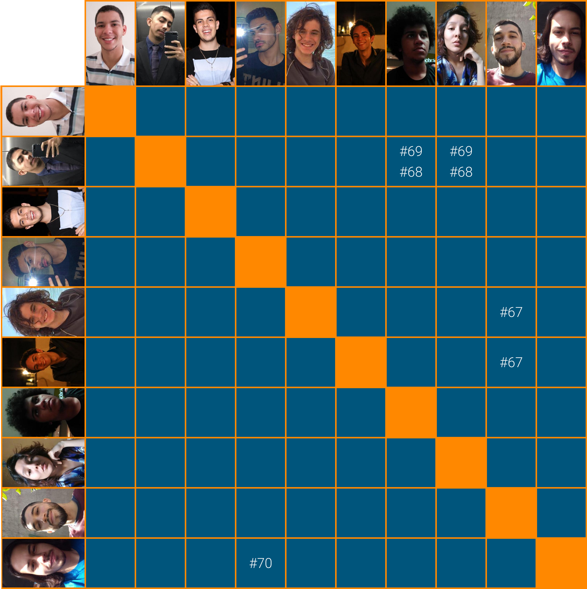

# Planejamento Sprint 04

O foco dessa _sprint_ foi deixar tudo redondo para a próxima _sprint_ que será começado o desenvolvimento, de acordo com o planejamento do time e dessa forma: no setup dos CI e do banco, consolidação da arquitetura, definição do _roadmap_ de desenvolvimento e o protótipo de alta finalidade.

## Tamanho da Sprint 04

**Início:** 28/02/2021

**Término:** 06/03/2021

**Duração:** Sete dias

## Objetivos

|                             _Issue_                              |               Titulo                | Pontos |                                                                         _Assign_                                                                          |
| :--------------------------------------------------------------: | :---------------------------------: | :----: | :-------------------------------------------------------------------------------------------------------------------------------------------------------: |
|  [#39](https://github.com/fga-eps-mds/2020.2-Lend.it/issues/39)  |         Dojo Flask Backend          |   3    |                                                       [Lucas Dutra](https://github.com/lucasdutraf)                                                       |
|  [#60](https://github.com/fga-eps-mds/2020.2-Lend.it/issues/60)  |    Estruturar ambiente de banco     |   5    |                                                       [Lucas Dutra](https://github.com/lucasdutraf)                                                       |
|  [#67](https://github.com/fga-eps-mds/2020.2-Lend.it/issues/67)  | Documento de arquitetura (Evolução) |   8    | [Matheus Afonso](https://github.com/Matheusafonsouza), [Mateus Maia](https://github.com/mateusmaiamaia) e [Thiago Mesquita](https://github.com/thiagompc) |
|  [#68](https://github.com/fga-eps-mds/2020.2-Lend.it/issues/68)  |         Configurar CI back          |   5    | [Lucas Dutra](https://github.com/lucasdutraf), [Thais Rebouças](https://github.com/Thais-ra) e [Matheus Monteiro](https://github.com/matheusyanmonteiro)  |
|  [#69](https://github.com/fga-eps-mds/2020.2-Lend.it/issues/69)  |         Configurar CI front         |   5    | [Lucas Dutra](https://github.com/lucasdutraf), [Thais Rebouças](https://github.com/Thais-ra) e [Matheus Monteiro](https://github.com/matheusyanmonteiro)  |
|  [#70](https://github.com/fga-eps-mds/2020.2-Lend.it/issues/70)  |    Prototipo de Alta fidelidade     |   8    |                       [Vinícius Saturnino](https://github.com/viniciussaturnino) e [Youssef Muhamad](https://github.com/youssef-md)                       |
|  [#72](https://github.com/fga-eps-mds/2020.2-Lend.it/issues/72)  |   Definir arquitetura do projeto    |   8    |                                                     [Youssef Muhamad](https://github.com/youssef-md)                                                      |
|  [#73](https://github.com/fga-eps-mds/2020.2-Lend.it/issues/73)  |         Roadmap do produto          |   5    |                                                      [Esio Gustavo](https://github.com/EsioFreitas)                                                       |
| [#105](https://github.com/fga-eps-mds/2020.2-Lend.it/issues/105) |      Documentação da Sprint 4       |   5    |                                                       [Rogério Júnior](https://github.com/rogerioo)                                                       |

<b>Total de pontos planejados: 49</b>

---

 Total de pontos da <i>sprint</i>: 49 
  

<!---Colocar no link abaixo as issues alocadas no milestone da Sprint--->

> [_Sprint_ _Backlog_](https://github.com/fga-eps-mds/2020.2-Lend.it/milestone/5?closed=1)

## Pareamentos

## Papeis

**_Scrum Master_:** [Rogério Júnior](https://github.com/rogerioo)

**_Product Manager_:** [Esio Gustavo](https://github.com/EsioFreitas)

**_Arquiteto:_** [Youssef Muhamad](https://github.com/youssef-md)

**_DevOps_:** [Lucas Dutra](https://github.com/lucasdutraf)

**Equipe de Desenvolvimento:**

- [Mateus Maia](https://github.com/mateusmaiamaia)
- [Matheus Afonso](https://github.com/Matheusafonsouza)
- [Matheus Monteiro](https://github.com/matheusyanmonteiro)
- [Thais Rebouças](https://github.com/Thais-ra)
- [Thiago Mesquita](https://github.com/thiagompc)
- [Vinícius Saturnino](https://github.com/viniciussaturnino)

**Autor:** [Rogério Júnior](https://github.com/rogerioo)
