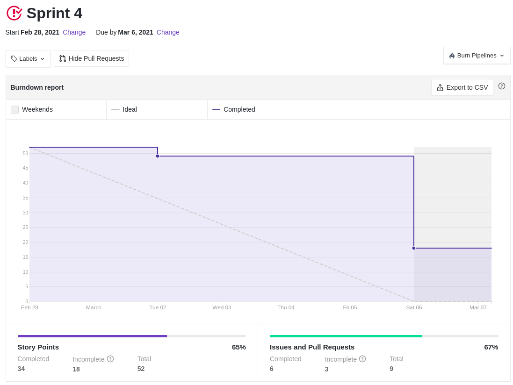
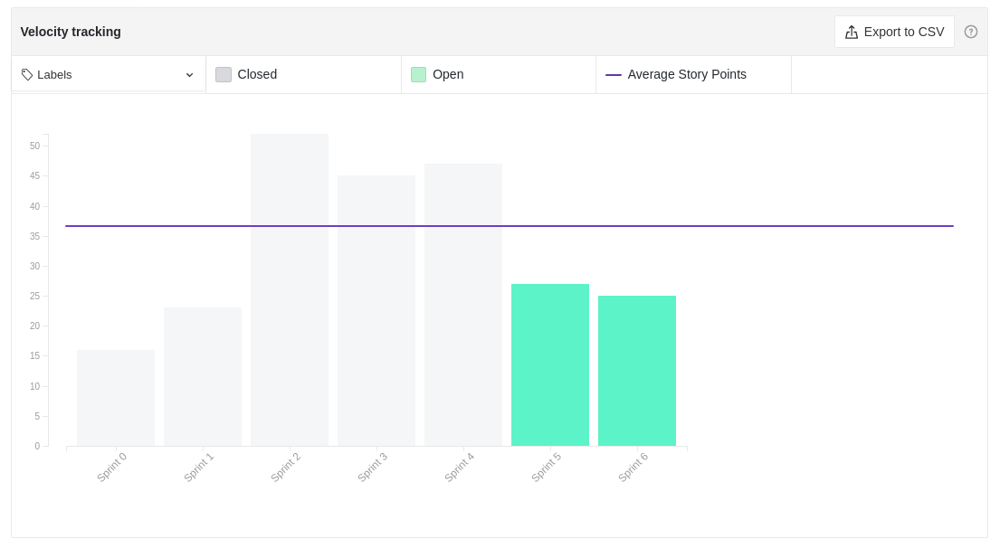

# Resultados Sprint 04

Primeira sprint do time em que houveram dívidas técnicas, sendo:

- [Protótipo de alta fidelidade](https://github.com/fga-eps-mds/2020.2-Lend.it/issues/70) que já era esperado dado sua complexidade e importância para o projeto
- [Roadmap](https://github.com/fga-eps-mds/2020.2-Lend.it/issues/#73) devido a alterações solicitadas pelo professor no **Lean Inception** do time que interferiram diretamente neste artefato

Os ambientes foram configurados e a arquitetura foi definida e documentada.

## Fechamento da Sprint

|                             _Issue_                              |               Título                |    _Status_     | Pontos |
| :--------------------------------------------------------------: | :---------------------------------: | :-------------: | :----: |
|  [#39](https://github.com/fga-eps-mds/2020.2-Lend.it/issues/39)  |         Dojo Flask Backend          |   _Concluído_   |   3    |
|  [#60](https://github.com/fga-eps-mds/2020.2-Lend.it/issues/60)  |    Estruturar ambiente de banco     |   _Concluído_   |   5    |
|  [#67](https://github.com/fga-eps-mds/2020.2-Lend.it/issues/67)  | Documento de arquitetura (Evolução) |   _Concluído_   |   8    |
|  [#68](https://github.com/fga-eps-mds/2020.2-Lend.it/issues/68)  |         Configurar CI back          |   _Concluído_   |   5    |
|  [#69](https://github.com/fga-eps-mds/2020.2-Lend.it/issues/69)  |         Configurar CI front         |   _Concluído_   |   5    |
|  [#70](https://github.com/fga-eps-mds/2020.2-Lend.it/issues/70)  |    Prototipo de Alta fidelidade     | _Não Concluído_ |   8    |
|  [#72](https://github.com/fga-eps-mds/2020.2-Lend.it/issues/72)  |   Definir arquitetura do projeto    |   _Concluído_   |   8    |
|  [#73](https://github.com/fga-eps-mds/2020.2-Lend.it/issues/73)  |         Roadmap do produto          | _Não Concluído_ |   5    |
| [#105](https://github.com/fga-eps-mds/2020.2-Lend.it/issues/105) |      Documentação da Sprint 4       |   _Concluído_   |   5    |

Pontos Planejados Concluídos: 34

Pontos de Dívida Concluídos: 0

Pontos Não Agregados: 13

> [_Sprint_ _Backlog_](https://github.com/fga-eps-mds/2020.2-Lend.it/milestone/5?closed=1)

## Burndown

o gráfico evidencia, como nas _sprints_ anteriores o padrão do time de finalizar as issues somente no sábado. Vale ressaltar que elas são feitas ao decorrer da semana, como evidencia o gráfico de produtividade.

## Velocity

Olhando para as _sprints_ em cinza pode-se ver que neste período de documentação a quantidade de pontos se manteve bem estável.

## Riscos

Conforme a situação do _Covid-19_ se agravou no Distrito Federal os riscos relacionados se mostram mais perigosos, uma vez que entramos novamente em _lockdown_. Riscos relacionado as tarefas de desenvolvimento se mostram ainda elevados uma vez que a próxima _sprint_ terão atividades voltadas a essa tecnologia.

<iframe height="909" seamless frameborder="0" scrolling="yes" src="https://docs.google.com/spreadsheets/d/e/2PACX-1vSGve6AsoRvxahK_yskgryTE1aQStxGh6_ls8RDjuH0DrdupIi26AptTJj64YT4vspgkpsoBKA2MZTd/pubchart?oid=981573756&amp;format=interactive"></iframe>

## Retrospectiva

Como evidenciado pelo quadro de empatia pode-se ver que o time continua animado empenhado com andamento do projeto e em poderem começar a mexer com o código. Durante a semana o time se reuniu com o professor que validou a ideia de projeto do time, o que deixou os bem animados.

Como fortaleza do time vale ressaltar o trabalho em equipe e a união que possibilitam um trabalho mais fluido das tarefas.

<iframe height="1100" src="https://docs.google.com/spreadsheets/d/e/2PACX-1vTj1IyAJxxw19_Cq4hQ_79XLBX_i0j7eiWpLziOrktPOOr_dLWtZRZQcGtoepJl8LQeekhC2erEvBuL/pubhtml?gid=1698546628&amp;single=true&amp;widget=true&amp;headers=false"></iframe>

## Quadro de Conhecimento

O quadro mostra uma leve melhora em relação a ultima medição realizada na _sprint 02_ e evidencia que os membros do time estiveram se preparando para a próxima _sprint_ de desenvolvimento.

<iframe height="600" src="https://docs.google.com/spreadsheets/d/e/2PACX-1vQt9zLphgqw_af_Kz6vaOhzGt4M4xnPEfbVTrtfh-CvbbsX1HziKhaXO5_nenI8iGToZQJNdfrqNvoJ/pubhtml?gid=922808640&amp;single=true&amp;widget=true&amp;headers=false"></iframe>

## Quadro de Sentimentos

O humor do time se manteve majoritariamente positivo durante essa _sprint_ e as atividades começaram a ser desenvolvidas em boa parte após a quarta-feira. Analisando os dados em conjunto, vale ressaltar que ainda que os sentimentos do time não estejam positivos o comprometimento com a entrega é o mesmo.

<iframe height="627" seamless frameborder="0" scrolling="no" src="https://docs.google.com/spreadsheets/d/e/2PACX-1vQfmC1hXrOlqXL8ZBsKvi7WktZEdpPOwa5KIKgUKkee2U96ua7g0-bkQL0XZRrCYFGCVWSukZ8ActfD/pubchart?oid=445962465&amp;format=interactive"></iframe>
<iframe height="509" seamless frameborder="0" scrolling="no" src="https://docs.google.com/spreadsheets/d/e/2PACX-1vQYTAqkgguUNHq1_L4lwKSwU04oXAoBtm2tj4GrTBb9ND0mj0pBrldy-VPLaeM5fp0KIPX7SbWDH9ia/pubchart?oid=772064677&amp;format=interactive"></iframe>
<iframe height="371" seamless frameborder="0" scrolling="no" src="https://docs.google.com/spreadsheets/d/e/2PACX-1vR7kDZjRAC-EVBplLf7K6B9FQOQW3As3S17ffv4DMo6_dn0-c43DWpxoylg1mpDB41mPCOX0Dcp34bB/pubchart?oid=1377867105&amp;format=interactive"></iframe>

## Registro de Presença nas _Dailies_

|    Nome     | Segunda Feira | Terça Feira | Quarta Feira | Quinta Feira | Sexta Feira |
| :---------: | :-----------: | :---------: | :----------: | :----------: | :---------: |
|    Ésio     |       ✔       |      ✔      |      ✔       |      ✘       |      ✔      |
|    Lucas    |       ✔       |      ✔      |      ✔       |      ✔       |      ✔      |
|   M. Maia   |       ✔       |      ✘      |      ✔       |      ✔       |      ✔      |
|  M. Afonso  |       ✔       |      ✔      |      ✘       |      ✔       |      ✘      |
| M. Monteiro |       ✔       |      ✔      |      ✔       |      ✔       |      ✔      |
|   Rogério   |       ✔       |      ✔      |      ✔       |      ✔       |      ✔      |
|    Thaís    |       ✔       |      ✔      |      ✔       |      ✔       |      ✔      |
|   Thiago    |       ✔       |      ✔      |      ✔       |      ✔       |      ✘      |
|  Vinicius   |       ✔       |      ✔      |      ✔       |      ✔       |      ✔      |
|   Youssef   |       ✔       |      ✔      |      ✔       |      ✔       |      ✔      |

## Avaliação do Scrum Master

Vejo que o time tem um ritmo de trabalho próprio e está sempre comprometido com as entregas. O fato de haver uma boa comunicação e união são essenciais para os resultados das _sprints_. Ainda que o time tenda a começar as tarefas mais tardiamente, as tarefas são sempre entregues. Vale pontuar que, os débitos dessa _sprint_ se deram a complexidade e importância das tarefas e o planejamento da próxima _sprint_ já previa esses problemas.

**Autor:** [Rogério Júnior](https://github.com/rogerioo)
