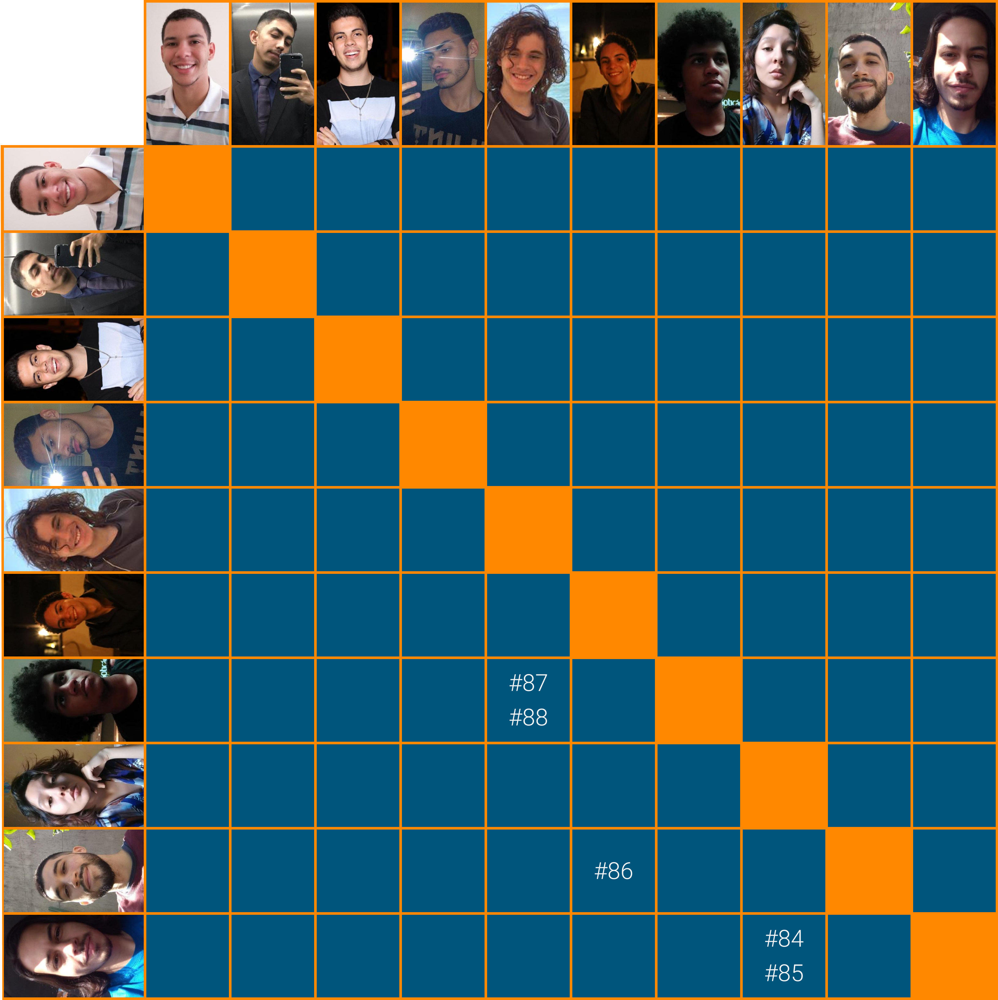

# Planejamento Sprint 05

Sprint com foco na criação dos componentes básicos que serão usados posteriormente nas páginas do aplicativo. Finalização das definições visuais e das definições de CD que serão necessárias para a _sprint_ seguinte. Levantamento dos requisitos não funcionais da aplicação e adição de dados _mockados_ para o desenvolvimento.

## Tamanho da Sprint 05

**Início:** 07/03/2021

**Término:** 13/03/2021

**Duração:** Sete dias

## Objetivos

|                             _Issue_                              |          Titulo          | Pontos |                                                   _Assign_                                                   |
| :--------------------------------------------------------------: | :----------------------: | :----: | :----------------------------------------------------------------------------------------------------------: |
|  [#41](https://github.com/fga-eps-mds/2020.2-Lend.it/issues/41)  | Documentar Prática Ágil  |   1    |                                [Rogério Júnior](https://github.com/rogerioo)                                 |
|  [#79](https://github.com/fga-eps-mds/2020.2-Lend.it/issues/79)  | Colocar theme no projeto |   2    |                               [Youssef Muhamad](https://github.com/youssef-md)                               |
|  [#80](https://github.com/fga-eps-mds/2020.2-Lend.it/issues/80)  | Criação de design system |   2    |                               [Youssef Muhamad](https://github.com/youssef-md)                               |
|  [#81](https://github.com/fga-eps-mds/2020.2-Lend.it/issues/81)  |   Configurar CD Flask    |   5    |                                [Lucas Dutra](https://github.com/lucasdutraf)                                 |
|  [#82](https://github.com/fga-eps-mds/2020.2-Lend.it/issues/82)  |     Seeds (populate)     |   1    |                                [Rogério Júnior](https://github.com/rogerioo)                                 |
|  [#83](https://github.com/fga-eps-mds/2020.2-Lend.it/issues/83)  |      Criação do NFR      |   5    |                                [Rogério Júnior](https://github.com/rogerioo)                                 |
|  [#84](https://github.com/fga-eps-mds/2020.2-Lend.it/issues/84)  |          Button          |   1    |  [Thais Rebouças](https://github.com/Thais-ra) e [Vinícius Saturnino](https://github.com/viniciussaturnino)  |
|  [#85](https://github.com/fga-eps-mds/2020.2-Lend.it/issues/85)  |          Input           |   1    |  [Thais Rebouças](https://github.com/Thais-ra) e [Vinícius Saturnino](https://github.com/viniciussaturnino)  |
|  [#86](https://github.com/fga-eps-mds/2020.2-Lend.it/issues/86)  |         LendCard         |   1    |   [Matheus Afonso](https://github.com/Matheusafonsouza) e [Thiago Mesquita](https://github.com/thiagompc)    |
|  [#87](https://github.com/fga-eps-mds/2020.2-Lend.it/issues/87)  |           Tile           |   1    | [Mateus Maia](https://github.com/mateusmaiamaia) e [Matheus Monteiro](https://github.com/matheusyanmonteiro) |
|  [#88](https://github.com/fga-eps-mds/2020.2-Lend.it/issues/88)  |       CategoryChip       |   1    | [Mateus Maia](https://github.com/mateusmaiamaia) e [Matheus Monteiro](https://github.com/matheusyanmonteiro) |
|  [#89](https://github.com/fga-eps-mds/2020.2-Lend.it/issues/89)  |        Navigation        |   3    |                                [Esio Gustavo](https://github.com/EsioFreitas)                                |
|  [#91](https://github.com/fga-eps-mds/2020.2-Lend.it/issues/91)  | Configurar CD Express.js |   5    |                                [Lucas Dutra](https://github.com/lucasdutraf)                                 |
| [#113](https://github.com/fga-eps-mds/2020.2-Lend.it/issues/113) | Documentação da Sprint 5 |   5    |                                [Rogério Júnior](https://github.com/rogerioo)                                 |

<b>Total de pontos planejados: 34</b>

### Dívidas

|                            _Issue_                             |            Titulo            | Pontos |                     _Assign_                     |
| :------------------------------------------------------------: | :--------------------------: | :----: | :----------------------------------------------: |
| [#70](https://github.com/fga-eps-mds/2020.2-Lend.it/issues/70) | Prototipo de Alta fidelidade |   8    | [Youssef Muhamad](https://github.com/youssef-md) |
| [#73](https://github.com/fga-eps-mds/2020.2-Lend.it/issues/73) |      Roadmap do produto      |   5    |  [Esio Gustavo](https://github.com/EsioFreitas)  |

<b>Total: 13</b>

---

 Total de pontos da <i>sprint</i>: 47 
  

<!---Colocar no link abaixo as issues alocadas no milestone da Sprint--->

> [_Sprint_ _Backlog_](https://github.com/fga-eps-mds/2020.2-Lend.it/milestone/6?closed=1)

## Pareamentos

## Papeis

**_Scrum Master | Analista de Dados_:** [Rogério Júnior](https://github.com/rogerioo)

**_Product Manager_:** [Esio Gustavo](https://github.com/EsioFreitas)

**_Arquiteto:_** [Youssef Muhamad](https://github.com/youssef-md)

**_DevOps | Analista de Dados_:** [Lucas Dutra](https://github.com/lucasdutraf)

**Equipe de Desenvolvimento:**

- [Mateus Maia](https://github.com/mateusmaiamaia)
- [Matheus Afonso](https://github.com/Matheusafonsouza)
- [Matheus Monteiro](https://github.com/matheusyanmonteiro)
- [Thais Rebouças](https://github.com/Thais-ra)
- [Thiago Mesquita](https://github.com/thiagompc)
- [Vinícius Saturnino](https://github.com/viniciussaturnino)

**Autor:** [Rogério Júnior](https://github.com/rogerioo)
