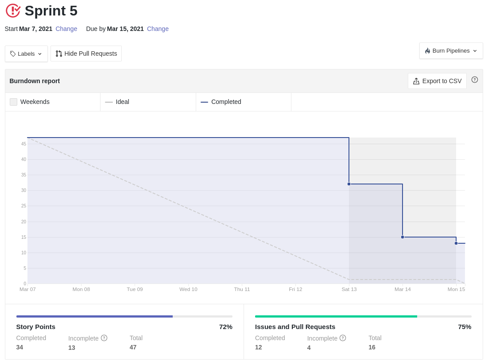
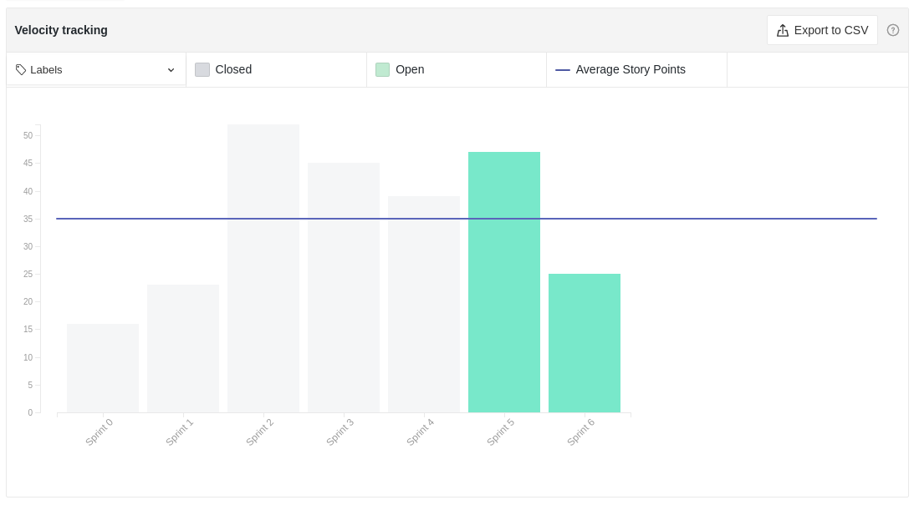

# Resultados Sprint 05

Fazer a restrospectiva da _sprint_ explicando de forma detalhada qual foi o resultado e buscar sempre linkar com aquilo que seja relevante às explicações.

## Fechamento da Sprint

|                             _Issue_                              |          Título          |    _Status_     | Pontos |
| :--------------------------------------------------------------: | :----------------------: | :-------------: | :----: |
|  [#42](https://github.com/fga-eps-mds/2020.2-Lend.it/issues/42)  | Documentar Prática Ágil  | _Não Concluído_ |   1    |
|  [#79](https://github.com/fga-eps-mds/2020.2-Lend.it/issues/79)  | Colocar theme no projeto | _Não Concluído_ |   2    |
|  [#80](https://github.com/fga-eps-mds/2020.2-Lend.it/issues/80)  | Criação de design system |   _Concluído_   |   2    |
|  [#81](https://github.com/fga-eps-mds/2020.2-Lend.it/issues/81)  |   Configurar CD Flask    |   _Concluído_   |   5    |
|  [#82](https://github.com/fga-eps-mds/2020.2-Lend.it/issues/82)  |    Seeds (populate1)     |   _Concluído_   |   1    |
|  [#83](https://github.com/fga-eps-mds/2020.2-Lend.it/issues/83)  |      Criação do NFR      | _Não Concluído_ |   5    |
|  [#84](https://github.com/fga-eps-mds/2020.2-Lend.it/issues/84)  |          Button          |   _Concluído_   |   1    |
|  [#85](https://github.com/fga-eps-mds/2020.2-Lend.it/issues/85)  |          Input           |   _Concluído_   |   1    |
|  [#86](https://github.com/fga-eps-mds/2020.2-Lend.it/issues/86)  |         LendCard         |   _Concluído_   |   1    |
|  [#87](https://github.com/fga-eps-mds/2020.2-Lend.it/issues/87)  |           Tile           |   _Concluído_   |   1    |
|  [#88](https://github.com/fga-eps-mds/2020.2-Lend.it/issues/88)  |       CategoryChip       |   _Concluído_   |   1    |
|  [#89](https://github.com/fga-eps-mds/2020.2-Lend.it/issues/89)  |        Navigation        |   _Concluído_   |   3    |
|  [#91](https://github.com/fga-eps-mds/2020.2-Lend.it/issues/91)  | Configurar CD Express.js |   _Concluído_   |   5    |
| [#113](https://github.com/fga-eps-mds/2020.2-Lend.it/issues/113) | Documentação da Sprint 5 |   _Concluído_   |   5    |

Pontos Planejados Concluídos: 26

Pontos de Dívida Concluídos: 13

Pontos Não Agregados: 8

> [_Sprint_ _Backlog_](https://github.com/fga-eps-mds/2020.2-Lend.it/milestone/6?closed=1)

## Burndown

Explicação em cima dos dados.

## Velocity

Explicação em cima dos dados.

## Riscos

Explicação sobre os riscos.

<iframe height="909" seamless frameborder="0" scrolling="no" src="https://docs.google.com/spreadsheets/d/e/2PACX-1vSGve6AsoRvxahK_yskgryTE1aQStxGh6_ls8RDjuH0DrdupIi26AptTJj64YT4vspgkpsoBKA2MZTd/pubchart?oid=457258149&amp;format=interactive"></iframe>

## Retrospectiva

Breve resumo sobre a retrospectiva.

<iframe height="1100" src="https://docs.google.com/spreadsheets/d/e/2PACX-1vTj1IyAJxxw19_Cq4hQ_79XLBX_i0j7eiWpLziOrktPOOr_dLWtZRZQcGtoepJl8LQeekhC2erEvBuL/pubhtml?gid=1880381156&amp;single=true&amp;widget=true&amp;headers=false"></iframe>

## Quadro de Conhecimento

Breve aval sobre o quadro de conhecimento.

<iframe height="600" src="https://docs.google.com/spreadsheets/d/e/2PACX-1vQt9zLphgqw_af_Kz6vaOhzGt4M4xnPEfbVTrtfh-CvbbsX1HziKhaXO5_nenI8iGToZQJNdfrqNvoJ/pubhtml?gid=922808640&amp;single=true&amp;widget=true&amp;headers=false"></iframe>

## Quadro de Sentimentos

Breve explicação dos dados

<iframe height="627" seamless frameborder="0" scrolling="no" src="https://docs.google.com/spreadsheets/d/e/2PACX-1vQfmC1hXrOlqXL8ZBsKvi7WktZEdpPOwa5KIKgUKkee2U96ua7g0-bkQL0XZRrCYFGCVWSukZ8ActfD/pubchart?oid=1393611799&amp;format=interactive"></iframe>
<iframe height="509" seamless frameborder="0" scrolling="no" src="https://docs.google.com/spreadsheets/d/e/2PACX-1vQYTAqkgguUNHq1_L4lwKSwU04oXAoBtm2tj4GrTBb9ND0mj0pBrldy-VPLaeM5fp0KIPX7SbWDH9ia/pubchart?oid=1678108460&amp;format=interactive"></iframe>
<iframe height="371" seamless frameborder="0" scrolling="no" src="https://docs.google.com/spreadsheets/d/e/2PACX-1vR7kDZjRAC-EVBplLf7K6B9FQOQW3As3S17ffv4DMo6_dn0-c43DWpxoylg1mpDB41mPCOX0Dcp34bB/pubchart?oid=1025894176&amp;format=interactive"></iframe>

## Registro de Presença nas _Dailies_

|    Nome     | Segunda Feira | Terça Feira | Quarta Feira | Quinta Feira | Sexta Feira |
| :---------: | :-----------: | :---------: | :----------: | :----------: | :---------: |
|    Ésio     |       ✔       |      ✔      |      ✔       |      ✘       |      ✔      |
|    Lucas    |       ✔       |      ✔      |      ✔       |      ✔       |      ✔      |
|   M. Maia   |       ✔       |      ✔      |      ✔       |      ✔       |      ✔      |
|  M. Afonso  |       ✔       |      ✔      |      ✔       |      ✘       |      ✔      |
| M. Monteiro |       ✔       |      ✔      |      ✘       |      ✔       |      ✔      |
|   Rogério   |       ✔       |      ✔      |      ✔       |      ✔       |      ✔      |
|    Thaís    |       ✘       |      ✘      |      ✔       |      ✔       |      ✔      |
|   Thiago    |       ✔       |      ✔      |      ✔       |      ✔       |      ✔      |
|  Vinicius   |       ✔       |      ✔      |      ✔       |      ✔       |      ✔      |
|   Youssef   |       ✔       |      ✔      |      ✔       |      ✔       |      ✘      |

## Avaliação do Scrum Master

**Autor:** [Rogério Júnior](https://github.com/rogerioo)
