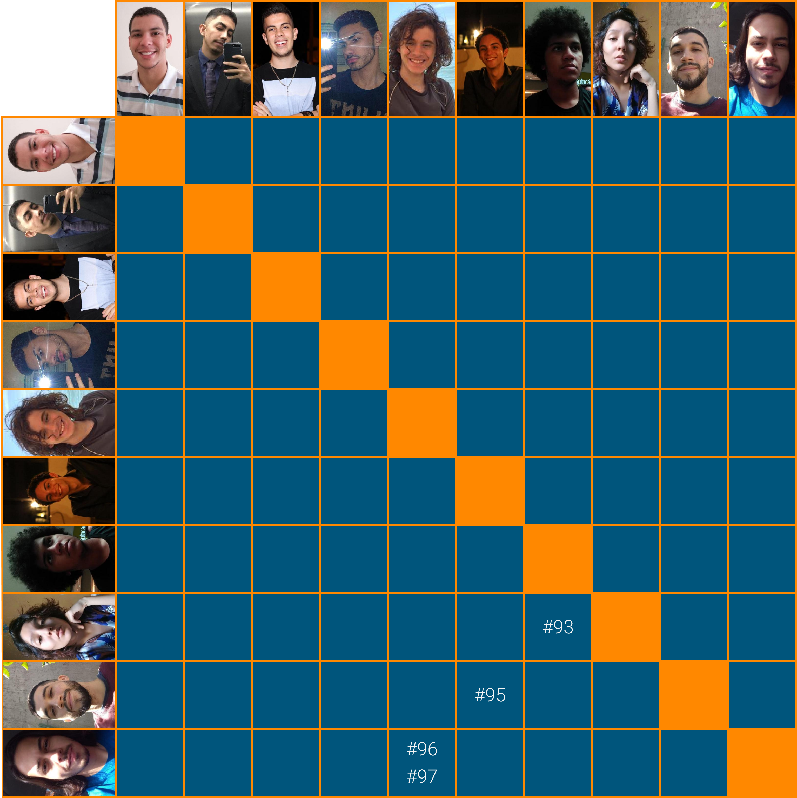

# Planejamento Sprint 06

Primeira _sprint_ que entra dentro fluxo de desenvolvimento definido no [backlog](_docs/projeto/backlog.md) e tem como objetivo começar a implementar a regra de negócio e começar a desenvolver telas mais complexas. As _issues_ foram definidas por não ter dependência com outras e que mais agregam valor ao produto nesse momento. Momento oportuno para a criação do [lendmmit](https://github.com/fga-eps-mds/2020.2-Lend.it/blob/main/lendmmit) para automatizar e padronizar os commits em todos os repositórios da organização.

Outras tarefas adicionadas foram no sentido de preparar a _gateway_ para o uso dos MDS's na próxima _sprint_ e adição do coverage nos repositórios.

## Tamanho da Sprint 06

**Início:** 14/03/2021

**Término:** 20/03/2021

**Duração:** Sete dias

## Objetivos

|                             _Issue_                              |                  Titulo                  | Pontos |                                                   _Assign_                                                    |
| :--------------------------------------------------------------: | :--------------------------------------: | :----: | :-----------------------------------------------------------------------------------------------------------: |
|  [#93](https://github.com/fga-eps-mds/2020.2-Lend.it/issues/93)  |      [US22] - Visualizar categorias      |   3    |   [Matheus Monteiro](https://github.com/matheusyanmonteiro) e [Thais Rebouças](https://github.com/Thais-ra)   |
|  [#94](https://github.com/fga-eps-mds/2020.2-Lend.it/issues/94)  |            Configurar gateway            |   3    |                               [Youssef Muhamad](https://github.com/youssef-md)                                |
|  [#95](https://github.com/fga-eps-mds/2020.2-Lend.it/issues/95)  |      [US09] - Solicitar empréstimo       |   5    |    [Matheus Afonso](https://github.com/Matheusafonsouza) e [Thiago Mesquita](https://github.com/thiagompc)    |
|  [#96](https://github.com/fga-eps-mds/2020.2-Lend.it/issues/96)  |           [US01] - Criar conta           |   5    | [Mateus Maia](https://github.com/mateusmaiamaia) e [Vinícius Saturnino](https://github.com/viniciussaturnino) |
|  [#97](https://github.com/fga-eps-mds/2020.2-Lend.it/issues/97)  |    [US07] - Cadastrar geolocalização     |   3    | [Mateus Maia](https://github.com/mateusmaiamaia) e [Vinícius Saturnino](https://github.com/viniciussaturnino) |
|  [#98](https://github.com/fga-eps-mds/2020.2-Lend.it/issues/98)  |      Script de Automação de Commits      |   3    |                                 [Rogério Júnior](https://github.com/rogerioo)                                 |
| [#101](https://github.com/fga-eps-mds/2020.2-Lend.it/issues/101) | Adicionar test coverage aos repositórios |   3    |                                 [Lucas Dutra](https://github.com/lucasdutraf)                                 |
| [#115](https://github.com/fga-eps-mds/2020.2-Lend.it/issues/115) |          Documentação Sprint 06          |   5    |                                 [Rogério Júnior](https://github.com/rogerioo)                                 |

<b>Total de pontos planejados: 30</b>

### Dívidas

|                            _Issue_                             |          Titulo          | Pontos |                     _Assign_                     |
| :------------------------------------------------------------: | :----------------------: | :----: | :----------------------------------------------: |
| [#79](https://github.com/fga-eps-mds/2020.2-Lend.it/issues/79) | Colocar theme no projeto |   2    | [Youssef Muhamad](https://github.com/youssef-md) |
| [#41](https://github.com/fga-eps-mds/2020.2-Lend.it/issues/41) | Documentar Prática Ágil  |   1    |  [Rogério Júnior](https://github.com/rogerioo)   |
| [#83](https://github.com/fga-eps-mds/2020.2-Lend.it/issues/83) |      Criação do NFR      |   5    |  [Rogério Júnior](https://github.com/rogerioo)   |

<b>Total: 8</b>

---

 Total de pontos da <i>sprint</i>: 38 
  

<!---Colocar no link abaixo as issues alocadas no milestone da Sprint--->

> [_Sprint_ _Backlog_](https://github.com/fga-eps-mds/2020.2-Lend.it/milestone/7?closed=1)

## Pareamentos

## Papeis

**_Scrum Master_:** [Rogério Júnior](https://github.com/rogerioo)

**_Product Manager_:** [Esio Gustavo](https://github.com/EsioFreitas)

**_Arquiteto:_** [Youssef Muhamad](https://github.com/youssef-md)

**_DevOps_:** [Lucas Dutra](https://github.com/lucasdutraf)

**Equipe de Desenvolvimento:**

- [Mateus Maia](https://github.com/mateusmaiamaia)
- [Matheus Afonso](https://github.com/Matheusafonsouza)
- [Matheus Monteiro](https://github.com/matheusyanmonteiro)
- [Thais Rebouças](https://github.com/Thais-ra)
- [Thiago Mesquita](https://github.com/thiagompc)
- [Vinícius Saturnino](https://github.com/viniciussaturnino)

**Autor:** [Rogério Júnior](https://github.com/rogerioo)
