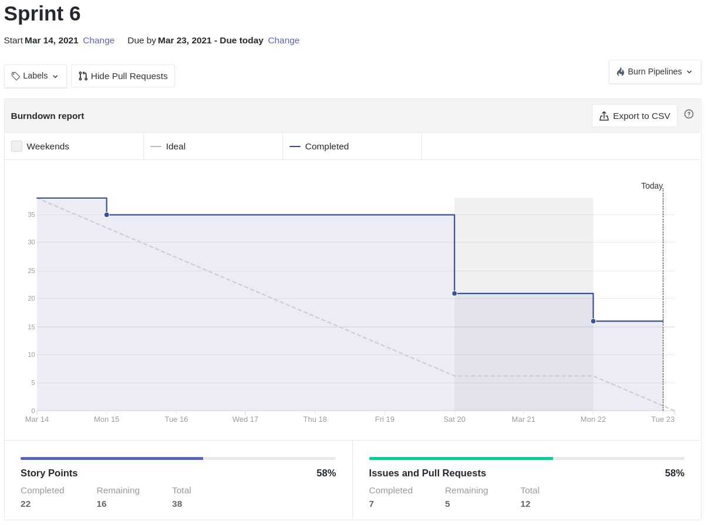
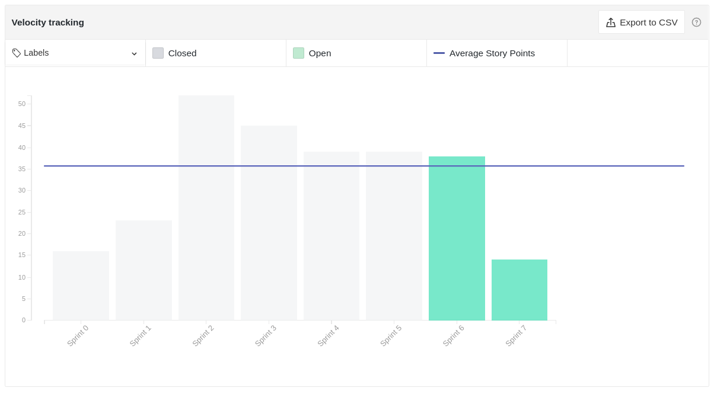

# Resultados Sprint 06

Fazer a restrospectiva da _sprint_ explicando de forma detalhada qual foi o resultado e buscar sempre linkar com aquilo que seja relevante às explicações.

## Fechamento da Sprint

|                             _Issue_                              |                  Título                  |    _Status_     | Pontos |
| :--------------------------------------------------------------: | :--------------------------------------: | :-------------: | :----: |
|  [#93](https://github.com/fga-eps-mds/2020.2-Lend.it/issues/93)  |      [US22] - Visualizar categorias      |   _Concluído_   |   3    |
|  [#94](https://github.com/fga-eps-mds/2020.2-Lend.it/issues/94)  |            Configurar gateway            |   _Concluído_   |   3    |
|  [#95](https://github.com/fga-eps-mds/2020.2-Lend.it/issues/95)  |      [US09] - Solicitar empréstimo       |   _Concluído_   |   5    |
|  [#96](https://github.com/fga-eps-mds/2020.2-Lend.it/issues/96)  |           [US01] - Criar conta           |   _Concluído_   |   5    |
|  [#97](https://github.com/fga-eps-mds/2020.2-Lend.it/issues/97)  |    [US07] - Cadastrar geolocalização     | _Não Concluído_ |   3    |
|  [#98](https://github.com/fga-eps-mds/2020.2-Lend.it/issues/98)  |      Script de Automação de Commits      |   _Concluído_   |   3    |
| [#101](https://github.com/fga-eps-mds/2020.2-Lend.it/issues/101) | Adicionar test coverage aos repositórios |   _Concluído_   |   3    |
| [#115](https://github.com/fga-eps-mds/2020.2-Lend.it/issues/115) |          Documentação Sprint 06          |   _Concluído_   |   5    |
|  [#79](https://github.com/fga-eps-mds/2020.2-Lend.it/issues/79)  |         Colocar theme no projeto         | _Não Concluído_ |   2    |
|  [#41](https://github.com/fga-eps-mds/2020.2-Lend.it/issues/41)  |         Documentar Prática Ágil          | _Não Concluído_ |   1    |
|  [#83](https://github.com/fga-eps-mds/2020.2-Lend.it/issues/83)  |              Criação do NFR              | _Não Concluído_ |   5    |

Pontos Planejados Concluídos: 27

Pontos de Dívida Concluídos: 0

Pontos Não Agregados: 11

> [_Sprint_ _Backlog_](https://github.com/fga-eps-mds/2020.2-Lend.it/milestone/7?closed=1)

## Burndown

Explicação em cima dos dados.

## Velocity

Explicação em cima dos dados.

## Riscos

Explicação sobre os riscos.

<iframe height="909" seamless frameborder="0" scrolling="yes" src="https://docs.google.com/spreadsheets/d/e/2PACX-1vSGve6AsoRvxahK_yskgryTE1aQStxGh6_ls8RDjuH0DrdupIi26AptTJj64YT4vspgkpsoBKA2MZTd/pubchart?oid=734485408&amp;format=interactive"></iframe>

## Retrospectiva

Breve resumo sobre a retrospectiva.

<iframe height="1100" src="https://docs.google.com/spreadsheets/d/e/2PACX-1vTj1IyAJxxw19_Cq4hQ_79XLBX_i0j7eiWpLziOrktPOOr_dLWtZRZQcGtoepJl8LQeekhC2erEvBuL/pubhtml?gid=1903841489&amp;single=true&amp;widget=true&amp;headers=false"></iframe>

## Quadro de Conhecimento

<iframe height="600" src="https://docs.google.com/spreadsheets/d/e/2PACX-1vQt9zLphgqw_af_Kz6vaOhzGt4M4xnPEfbVTrtfh-CvbbsX1HziKhaXO5_nenI8iGToZQJNdfrqNvoJ/pubhtml?gid=1220753955&amp;single=true&amp;widget=true&amp;headers=false"></iframe>

## Quadro de Sentimentos

<iframe height="627" seamless frameborder="0" scrolling="no" src="https://docs.google.com/spreadsheets/d/e/2PACX-1vQfmC1hXrOlqXL8ZBsKvi7WktZEdpPOwa5KIKgUKkee2U96ua7g0-bkQL0XZRrCYFGCVWSukZ8ActfD/pubchart?oid=1434344963&amp;format=interactive"></iframe>
<iframe height="509" seamless frameborder="0" scrolling="no" src="https://docs.google.com/spreadsheets/d/e/2PACX-1vQYTAqkgguUNHq1_L4lwKSwU04oXAoBtm2tj4GrTBb9ND0mj0pBrldy-VPLaeM5fp0KIPX7SbWDH9ia/pubchart?oid=1484251232&amp;format=interactive"></iframe>
<iframe height="371" seamless frameborder="0" scrolling="no" src="https://docs.google.com/spreadsheets/d/e/2PACX-1vR7kDZjRAC-EVBplLf7K6B9FQOQW3As3S17ffv4DMo6_dn0-c43DWpxoylg1mpDB41mPCOX0Dcp34bB/pubchart?oid=419403688&amp;format=interactive"></iframe>

## Registro de Presença nas _Dailies_

|    Nome     | Segunda Feira | Terça Feira | Quarta Feira | Quinta Feira | Sexta Feira |
| :---------: | :-----------: | :---------: | :----------: | :----------: | :---------: |
|    Ésio     |       ✘       |      ✘      |      ✔       |      ✔       |      ✔      |
|    Lucas    |       ✔       |      ✔      |      ✔       |      ✔       |      ✔      |
|   M. Maia   |       ✔       |      ✔      |      ✔       |      ✔       |      ✔      |
|  M. Afonso  |       ✔       |      ✔      |      ✔       |      ✔       |      ✔      |
| M. Monteiro |       ✔       |      ✔      |      ✔       |      ✔       |      ✘      |
|   Rogério   |       ✔       |      ✔      |      ✔       |      ✘       |      ✘      |
|    Thaís    |       ✔       |      ✔      |      ✔       |      ✔       |      ✔      |
|   Thiago    |       ✔       |      ✔      |      ✘       |      ✘       |      ✔      |
|  Vinicius   |       ✔       |      ✔      |      ✔       |      ✔       |      ✔      |
|   Youssef   |       ✘       |      ✔      |      ✔       |      ✔       |      ✔      |

## Avaliação do Scrum Master

**Autor:** [Rogério Júnior](https://github.com/rogerioo)
