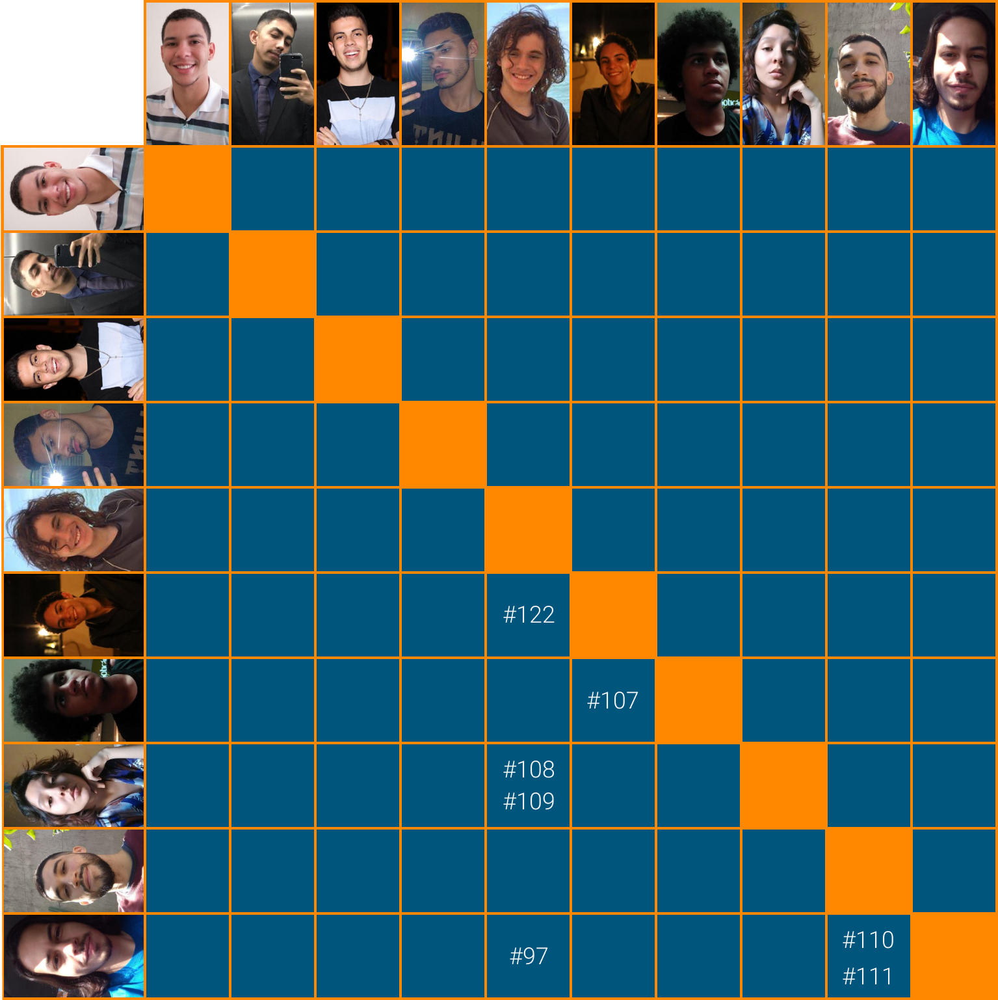

# Planejamento Sprint 07

_Sprint_ dedicada ao desenvolvimento do _CRUD_ relacionado ao empréstimo(_lend_) e começo do desenvolvimento do sistema de usuários. É definida pelo marco da **R1** definida pela _matéria_ como a primeira grande entrega do projeto.

Ultima _sprint_ que foi usada para finalização da parte de documentação com o **NFR** e a **Documentação da Prática Ágil**.

## Tamanho da Sprint 07

**Início:** 21/03/2021

**Término:** 27/03/2021

**Duração:** Sete dias

## Objetivos

|                             _Issue_                              |            Titulo             | Pontos |                                                     _Assign_                                                      |
| :--------------------------------------------------------------: | :---------------------------: | :----: | :---------------------------------------------------------------------------------------------------------------: |
| [#107](https://github.com/fga-eps-mds/2020.2-Lend.it/issues/107) |       [US13] - ver lend       |   5    | [Matheus Afonso](https://github.com/Matheusafonsouza) e [Matheus Monteiro](https://github.com/matheusyanmonteiro) |
| [#108](https://github.com/fga-eps-mds/2020.2-Lend.it/issues/108) |     [US11] - Editar lend      |   5    |         [Thais Rebouças](https://github.com/Thais-ra) e [Mateus Maia](https://github.com/mateusmaiamaia)          |
| [#109](https://github.com/fga-eps-mds/2020.2-Lend.it/issues/109) |     [US12] - deletar lend     |   2    |         [Thais Rebouças](https://github.com/Thais-ra) e [Mateus Maia](https://github.com/mateusmaiamaia)          |
| [#110](https://github.com/fga-eps-mds/2020.2-Lend.it/issues/110) |        [US02] - Login         |   5    |   [Vinícius Saturnino](https://github.com/viniciussaturnino) e [Thiago Mesquita](https://github.com/thiagompc)    |
| [#111](https://github.com/fga-eps-mds/2020.2-Lend.it/issues/111) |        [US03] - Logout        |   2    |   [Vinícius Saturnino](https://github.com/viniciussaturnino) e [Thiago Mesquita](https://github.com/thiagompc)    |
| [#122](https://github.com/fga-eps-mds/2020.2-Lend.it/issues/122) | [US21] - confirmar emprestimo |   5    |     [Matheus Afonso](https://github.com/Matheusafonsouza) e [Mateus Maia](https://github.com/mateusmaiamaia)      |
| [#150](https://github.com/fga-eps-mds/2020.2-Lend.it/issues/150) |    Documentação Sprint 07     |   5    |                                   [Rogério Júnior](https://github.com/rogerioo)                                   |

<b>Total de pontos planejados: 29</b>

### Dívida

|                            _Issue_                             |              Titulo               | Pontos |                                                   _Assign_                                                    |
| :------------------------------------------------------------: | :-------------------------------: | :----: | :-----------------------------------------------------------------------------------------------------------: |
| [#41](https://github.com/fga-eps-mds/2020.2-Lend.it/issues/41) |      Documentar Prática Ágil      |   1    |                                 [Rogério Júnior](https://github.com/rogerioo)                                 |
| [#83](https://github.com/fga-eps-mds/2020.2-Lend.it/issues/83) |          Criação de NFR           |   5    |                                 [Rogério Júnior](https://github.com/rogerioo)                                 |
| [#79](https://github.com/fga-eps-mds/2020.2-Lend.it/issues/79) |     Colocar theme no projeto      |   2    |                               [Youssef Muhamad](https://github.com/youssef-md)                                |
| [#97](https://github.com/fga-eps-mds/2020.2-Lend.it/issues/97) | [US07] - Cadastrar geolocalização |   3    | [Mateus Maia](https://github.com/mateusmaiamaia) e [Vinícius Saturnino](https://github.com/viniciussaturnino) |

<b>Total: 11</b>

---

 Total de pontos da <i>sprint</i>: 40 
  

<!---Colocar no link abaixo as issues alocadas no milestone da Sprint--->

> [_Sprint_ _Backlog_](https://github.com/fga-eps-mds/2020.2-Lend.it/milestone/8?closed=1)

## Pareamentos

## Papeis

**_Scrum Master | Analista de Dados_:** [Rogério Júnior](https://github.com/rogerioo)

**_Product Manager_:** [Esio Gustavo](https://github.com/EsioFreitas)

**_Arquiteto:_** [Youssef Muhamad](https://github.com/youssef-md)

**_DevOps | Analista de Dados_:** [Lucas Dutra](https://github.com/lucasdutraf)

**Equipe de Desenvolvimento:**

- [Mateus Maia](https://github.com/mateusmaiamaia)
- [Matheus Afonso](https://github.com/Matheusafonsouza)
- [Matheus Monteiro](https://github.com/matheusyanmonteiro)
- [Thais Rebouças](https://github.com/Thais-ra)
- [Thiago Mesquita](https://github.com/thiagompc)
- [Vinícius Saturnino](https://github.com/viniciussaturnino)

**Autor:** [Rogério Júnior](https://github.com/rogerioo)
