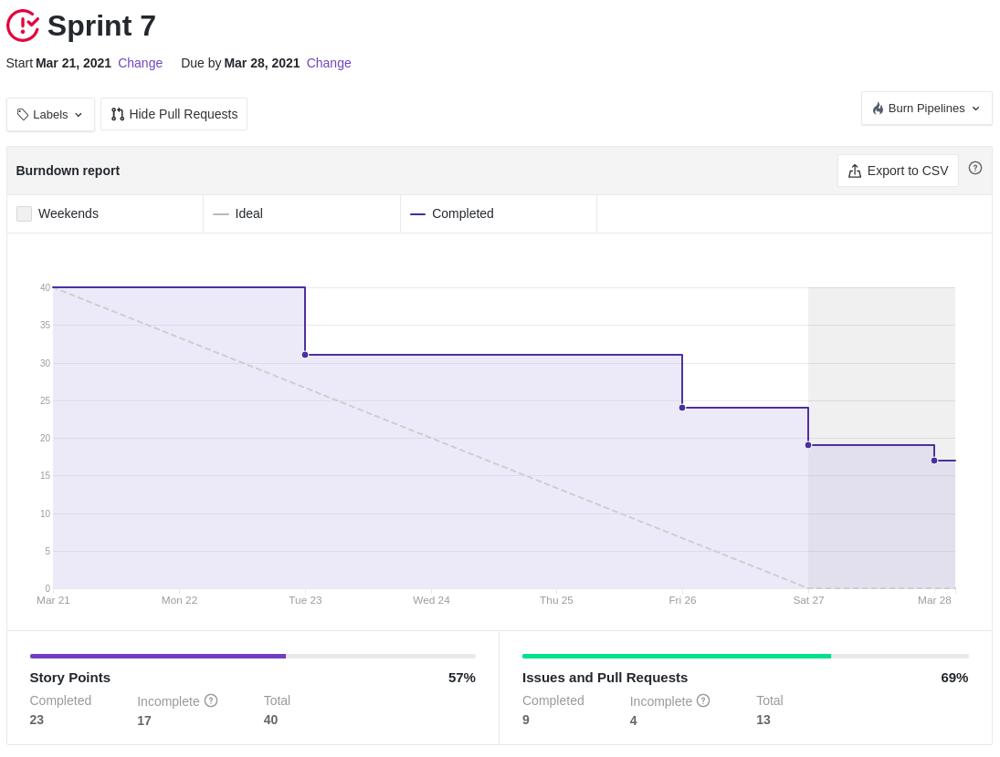
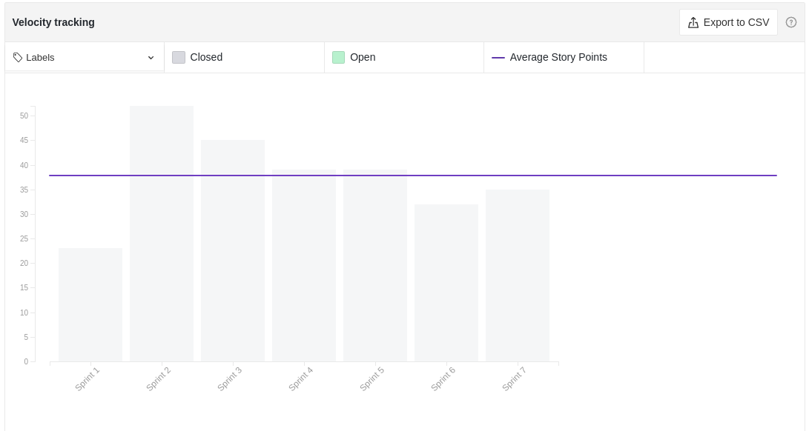

# Resultados Sprint 07

_Sprint_ reservada para a definição da estrutura básica de manipulação dos empréstimos(_lend_) e definição final da documentação do projeto. É também o primeiro marco da disciplina (**R1**) de entrega.

## Fechamento da Sprint

|                             _Issue_                              |              Título               |    _Status_     | Pontos |
| :--------------------------------------------------------------: | :-------------------------------: | :-------------: | :----: |
|  [#41](https://github.com/fga-eps-mds/2020.2-Lend.it/issues/41)  |      Documentar Prática Ágil      |   _Concluído_   |   1    |
|  [#83](https://github.com/fga-eps-mds/2020.2-Lend.it/issues/83)  |          Criação de NFR           |   _Concluído_   |   5    |
|  [#79](https://github.com/fga-eps-mds/2020.2-Lend.it/issues/79)  |     Colocar theme no projeto      | _Não Concluído_ |   2    |
|  [#97](https://github.com/fga-eps-mds/2020.2-Lend.it/issues/97)  | [US07] - Cadastrar geolocalização |   _Concluído_   |   3    |
| [#107](https://github.com/fga-eps-mds/2020.2-Lend.it/issues/107) |         [US13] - Ver lend         |   _Concluído_   |   5    |
| [#108](https://github.com/fga-eps-mds/2020.2-Lend.it/issues/108) |       [US11] - Editar lend        | _Não Concluído_ |   5    |
| [#109](https://github.com/fga-eps-mds/2020.2-Lend.it/issues/109) |       [US12] - deletar lend       |   _Concluído_   |   2    |
| [#110](https://github.com/fga-eps-mds/2020.2-Lend.it/issues/110) |          [US02] - Login           |   _Concluído_   |   5    |
| [#111](https://github.com/fga-eps-mds/2020.2-Lend.it/issues/111) |          [US03] - Logout          |   _Concluído_   |   2    |
| [#122](https://github.com/fga-eps-mds/2020.2-Lend.it/issues/122) |   [US21] - Confirmar emprestimo   | _Não Concluído_ |   5    |
| [#150](https://github.com/fga-eps-mds/2020.2-Lend.it/issues/150) |      Documentação Sprint 07       |   _Concluído_   |   5    |

Pontos Planejados Concluídos: 19

Pontos de Dívida Concluídos: 9

Pontos Não Agregados: 12

> [_Sprint_ _Backlog_](https://github.com/fga-eps-mds/2020.2-Lend.it/milestone/8?closed=1)

## Burndown

O gráfico evidencia uma um bom ritmo de trabalho e boa entrega das _issues_ uma vez que os trabalhos foram começados antecipadamente em conta da **R1**

## Velocity

É possível ver que a entrega do time continua se mantendo em torno dos 40 pontos.

## Riscos

É possível ver que, por conta da **R1**, vários riscos diminuíram, uma vez que os direcionamentos do projeto estavam bem definidos e a sensação de entrega estava em voga no grupo.

<iframe height="909" seamless frameborder="0" scrolling="yes" src="https://docs.google.com/spreadsheets/d/e/2PACX-1vSGve6AsoRvxahK_yskgryTE1aQStxGh6_ls8RDjuH0DrdupIi26AptTJj64YT4vspgkpsoBKA2MZTd/pubchart?oid=503602102&amp;format=interactive"></iframe>

## Retrospectiva

O quadro de empatia revela a visão do grupo em relação aos bom direcionamento do projeto, a um forte senso de coletividade e o bom trabalho que vem sendo executado.

De forma unânime o grupo não viu _fraquezas_ a serem melhoradas e vê que a grande _fortaleza_ que têm é o grupo.

<iframe height="1100" src="https://docs.google.com/spreadsheets/d/e/2PACX-1vTj1IyAJxxw19_Cq4hQ_79XLBX_i0j7eiWpLziOrktPOOr_dLWtZRZQcGtoepJl8LQeekhC2erEvBuL/pubhtml?gid=1061776724&amp;single=true&amp;widget=true&amp;headers=false"></iframe>

## Quadro de Conhecimento

Como o acompanhamento da evolução do conhecimento é feito a cada 15 dias, não houveram alterações com relação a _sprint_ anterior.

<iframe height="600" src="https://docs.google.com/spreadsheets/d/e/2PACX-1vQt9zLphgqw_af_Kz6vaOhzGt4M4xnPEfbVTrtfh-CvbbsX1HziKhaXO5_nenI8iGToZQJNdfrqNvoJ/pubhtml?gid=1220753955&amp;single=true&amp;widget=true&amp;headers=false"></iframe>

## Quadro de Sentimentos

O time esteve com um bom nível de sentimento que pode ser atribuído a sensação de dever cumprido pela entrega da R1. Com isso as tarefas foram entregues de forma mais contínua e feita aos poucos, como se é esperado.

<iframe height="627" seamless frameborder="0" scrolling="no" src="https://docs.google.com/spreadsheets/d/e/2PACX-1vQfmC1hXrOlqXL8ZBsKvi7WktZEdpPOwa5KIKgUKkee2U96ua7g0-bkQL0XZRrCYFGCVWSukZ8ActfD/pubchart?oid=728014553&amp;format=interactive"></iframe>
<iframe height="509" seamless frameborder="0" scrolling="no" src="https://docs.google.com/spreadsheets/d/e/2PACX-1vQYTAqkgguUNHq1_L4lwKSwU04oXAoBtm2tj4GrTBb9ND0mj0pBrldy-VPLaeM5fp0KIPX7SbWDH9ia/pubchart?oid=1362897056&amp;format=interactive"></iframe>
<iframe height="371" seamless frameborder="0" scrolling="no" src="https://docs.google.com/spreadsheets/d/e/2PACX-1vR7kDZjRAC-EVBplLf7K6B9FQOQW3As3S17ffv4DMo6_dn0-c43DWpxoylg1mpDB41mPCOX0Dcp34bB/pubchart?oid=323697900&amp;format=interactive"></iframe>

## Registro de Presença nas _Dailies_

|    Nome     | Segunda Feira | Terça Feira | Quarta Feira | Quinta Feira | Sexta Feira |
| :---------: | :-----------: | :---------: | :----------: | :----------: | :---------: |
|    Ésio     |       ✔       |      ✔      |      ✘       |      ✔       |      ✘      |
|    Lucas    |       ✔       |      ✔      |      ✔       |      ✔       |      ✔      |
|   M. Maia   |       ✔       |      ✔      |      ✔       |      ✔       |      ✔      |
|  M. Afonso  |       ✔       |      ✘      |      ✔       |      ✔       |      ✘      |
| M. Monteiro |       ✔       |      ✔      |      ✘       |      ✔       |      ✔      |
|   Rogério   |       ✘       |      ✔      |      ✔       |      ✔       |      ✔      |
|    Thaís    |       ✘       |      ✔      |      ✘       |      ✔       |      ✔      |
|   Thiago    |       ✔       |      ✔      |      ✔       |      ✔       |      ✔      |
|  Vinicius   |       ✔       |      ✔      |      ✔       |      ✔       |      ✔      |
|   Youssef   |       ✔       |      ✔      |      ✘       |      ✔       |      ✘      |

## Avaliação do Scrum Master

A execução dessa _sprint_ pode ser considerada um sucesso, uma vez o time esteve em usa melhor semana de produtividade, como pode ser validado pelas métricas dessa semana. Ainda que houveram dívidas, as mesmas foram agregadas a _sprint_ seguinte de forma a não prejudicar as tarefas já mapeadas.

**Autor:** [Rogério Júnior](https://github.com/rogerioo)
