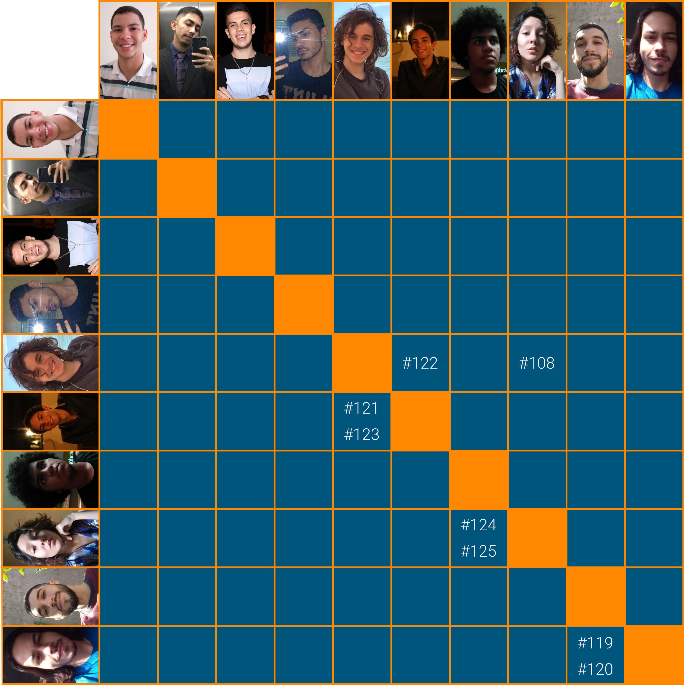

# Planejamento Sprint 09

Semana focada na manipulação dos dados de empréstimo (_lend_) e começo do fluxo de para atender algum pedido. Algumas refatorações foram levantadas para melhorar a integridade do sistema.

## Tamanho da Sprint 09

**Início:** 28/03/2021

**Término:** 03/04/2021

**Duração:** Sete dias

## Objetivos

|                             _Issue_                              |                Titulo                 | Pontos |                                                   _Assign_                                                   |
| :--------------------------------------------------------------: | :-----------------------------------: | :----: | :----------------------------------------------------------------------------------------------------------: |
| [#119](https://github.com/fga-eps-mds/2020.2-Lend.it/issues/119) |  [US23] - listar lend por categoria   |   5    | [Vinícius Saturnino](https://github.com/viniciussaturnino) e [Thiago Mesquita](https://github.com/thiagompc) |
| [#120](https://github.com/fga-eps-mds/2020.2-Lend.it/issues/120) |    [US10] - Ver suas solicitações     |   5    | [Vinícius Saturnino](https://github.com/viniciussaturnino) e [Thiago Mesquita](https://github.com/thiagompc) |
| [#121](https://github.com/fga-eps-mds/2020.2-Lend.it/issues/121) |      [US16] - ajudar solicitação      |   3    |   [Matheus Afonso](https://github.com/Matheusafonsouza) e [Mateus Maia](https://github.com/mateusmaiamaia)   |
| [#123](https://github.com/fga-eps-mds/2020.2-Lend.it/issues/123) | [US17] - mostrar dados para emprestar |   5    |   [Matheus Afonso](https://github.com/Matheusafonsouza) e [Mateus Maia](https://github.com/mateusmaiamaia)   |
| [#124](https://github.com/fga-eps-mds/2020.2-Lend.it/issues/124) |   [FIX] Testes nos serviços Python    |   3    |  [Thais Rebouças](https://github.com/Thais-ra) e [Matheus Monteiro](https://github.com/matheusyanmonteiro)   |
| [#125](https://github.com/fga-eps-mds/2020.2-Lend.it/issues/125) |       [FIX] Integração gateway        |   3    |  [Thais Rebouças](https://github.com/Thais-ra) e [Matheus Monteiro](https://github.com/matheusyanmonteiro)   |
| [#126](https://github.com/fga-eps-mds/2020.2-Lend.it/issues/126) |            [FIX] LendCard             |   3    |                               [Youssef Muhamad](https://github.com/youssef-md)                               |
| [#169](https://github.com/fga-eps-mds/2020.2-Lend.it/issues/169) |        Documentação Sprint 08         |   5    |                                [Rogério Júnior](https://github.com/rogerioo)                                 |

<b>Total de pontos planejados: 32</b>

### Dívida

|                             _Issue_                              |            Titulo             | Pontos |                                                 _Assign_                                                 |
| :--------------------------------------------------------------: | :---------------------------: | :----: | :------------------------------------------------------------------------------------------------------: |
|  [#79](https://github.com/fga-eps-mds/2020.2-Lend.it/issues/79)  |   Colocar theme no projeto    |   2    |                             [Youssef Muhamad](https://github.com/youssef-md)                             |
| [#108](https://github.com/fga-eps-mds/2020.2-Lend.it/issues/108) |     [US11] - Editar lend      |   5    |     [Thais Rebouças](https://github.com/Thais-ra) e [Mateus Maia](https://github.com/mateusmaiamaia)     |
| [#122](https://github.com/fga-eps-mds/2020.2-Lend.it/issues/122) | [US21] - confirmar emprestimo |   8    | [Matheus Afonso](https://github.com/Matheusafonsouza) e [Mateus Maia](https://github.com/mateusmaiamaia) |

<b>Total: 15</b>

---

 Total de pontos da <i>sprint</i>: 47 
  

<!---Colocar no link abaixo as issues alocadas no milestone da Sprint--->

> [_Sprint_ _Backlog_](https://github.com/fga-eps-mds/2020.2-Lend.it/milestone/9?closed=1)

## Pareamentos

## Papeis

**_Scrum Master_:** [Rogério Júnior](https://github.com/rogerioo)

**_Product Manager_:** [Esio Gustavo](https://github.com/EsioFreitas)

**_Arquiteto:_** [Youssef Muhamad](https://github.com/youssef-md)

**_DevOps_:** [Lucas Dutra](https://github.com/lucasdutraf)

**Equipe de Desenvolvimento:**

- [Mateus Maia](https://github.com/mateusmaiamaia)
- [Matheus Afonso](https://github.com/Matheusafonsouza)
- [Matheus Monteiro](https://github.com/matheusyanmonteiro)
- [Thais Rebouças](https://github.com/Thais-ra)
- [Thiago Mesquita](https://github.com/thiagompc)
- [Vinícius Saturnino](https://github.com/viniciussaturnino)

**Autor:** [Rogério Júnior](https://github.com/rogerioo)
