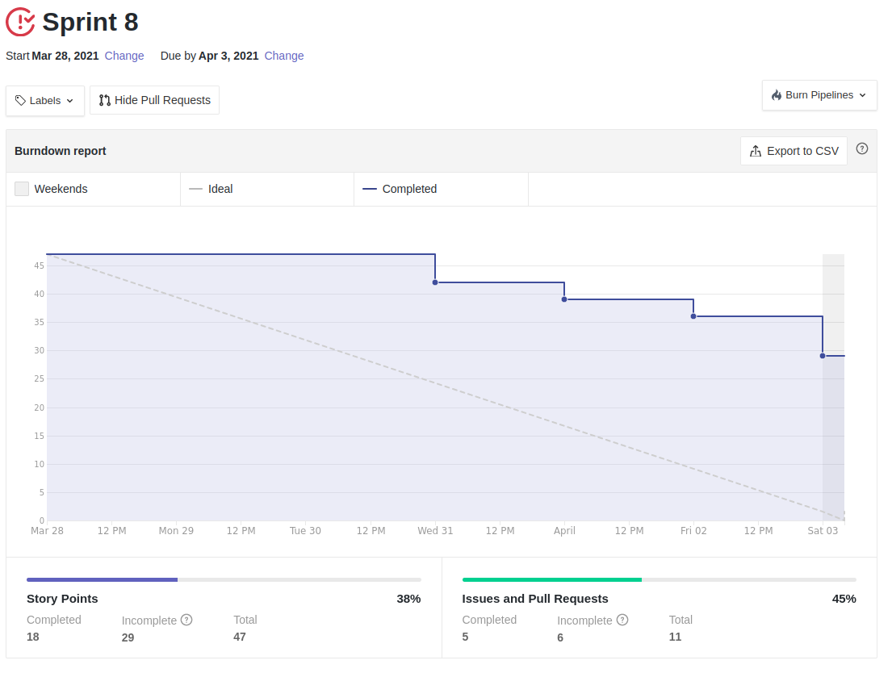
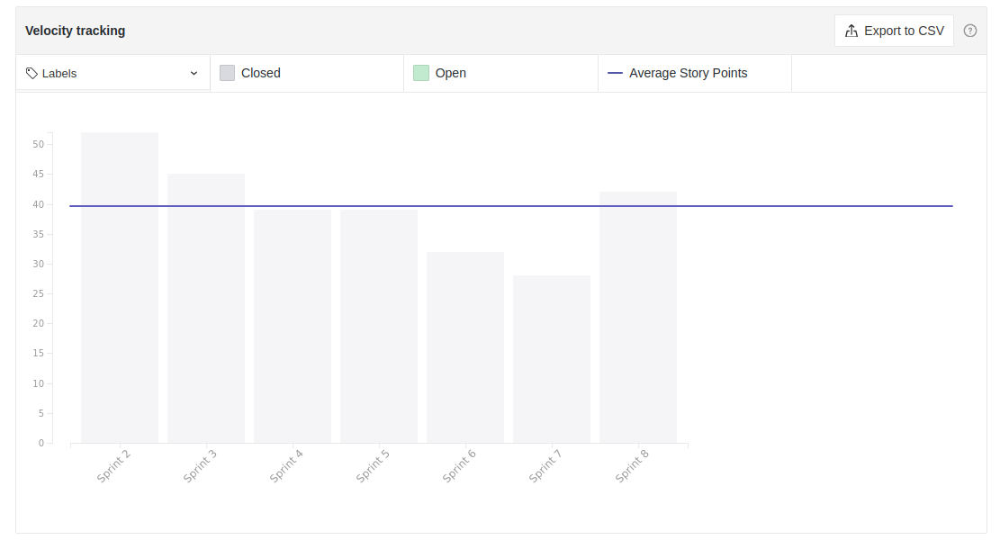

# Resultados Sprint 08

_Sprint_ focada no gerenciamento de solicitações e na confirmação de empréstimos (_lend's_) assim como a visualização do mesmo.

## Fechamento da Sprint

|                             _Issue_                              |                Título                 |    _Status_     | Pontos |
| :--------------------------------------------------------------: | :-----------------------------------: | :-------------: | :----: |
|  [#79](https://github.com/fga-eps-mds/2020.2-Lend.it/issues/79)  |       Colocar theme no projeto        |   _Concluído_   |   2    |
| [#108](https://github.com/fga-eps-mds/2020.2-Lend.it/issues/108) |         [US11] - Editar lend          |   _Concluído_   |   5    |
| [#119](https://github.com/fga-eps-mds/2020.2-Lend.it/issues/119) |  [US23] - listar lend por categoria   |   _Concluído_   |   5    |
| [#120](https://github.com/fga-eps-mds/2020.2-Lend.it/issues/120) |    [US10] - Ver suas solicitações     | _Não Concluído_ |   5    |
| [#121](https://github.com/fga-eps-mds/2020.2-Lend.it/issues/121) |      [US16] - ajudar solicitação      |   _Concluído_   |   3    |
| [#122](https://github.com/fga-eps-mds/2020.2-Lend.it/issues/122) |     [US21] - confirmar emprestimo     | _Não Concluído_ |   8    |
| [#123](https://github.com/fga-eps-mds/2020.2-Lend.it/issues/123) | [US17] - mostrar dados para emprestar | _Não Concluído_ |   5    |
| [#124](https://github.com/fga-eps-mds/2020.2-Lend.it/issues/124) |   [FIX] Testes nos serviços Python    | _Não Concluído_ |   3    |
| [#125](https://github.com/fga-eps-mds/2020.2-Lend.it/issues/125) |       [FIX] Integração gateway        |   _Concluído_   |   3    |
| [#126](https://github.com/fga-eps-mds/2020.2-Lend.it/issues/126) |            [FIX] LendCard             | _Não Concluído_ |   3    |
| [#169](https://github.com/fga-eps-mds/2020.2-Lend.it/issues/169) |        Documentação Sprint 08         |   _Concluído_   |   5    |

Pontos Planejados Concluídos: 23

Pontos de Dívida Concluídos: 7

Pontos Não Agregados: 24

> [_Sprint_ _Backlog_](https://github.com/fga-eps-mds/2020.2-Lend.it/milestone/9?closed=1)

## Burndown

O gráfico evidencia um ritmo semelhante a da _sprint_ anterior apesar do inicio de desenvolvimento tardio.

## Velocity

É possível ver que a entrega do time continua se mantendo em torno dos 40 pontos.

## Riscos

É possível indentificar nesse gráfico que, os riscos se mantiveram praticamento no mesmo nível que na _sprint_ anterior.

<iframe height="909" seamless frameborder="0" scrolling="yes" src="https://docs.google.com/spreadsheets/d/e/2PACX-1vSGve6AsoRvxahK_yskgryTE1aQStxGh6_ls8RDjuH0DrdupIi26AptTJj64YT4vspgkpsoBKA2MZTd/pubchart?oid=1614644097&amp;format=interactive"></iframe>

## Retrospectiva

O quadro de empatia revela que o time, de maneira geral, estava se sentido meio cansado e desanimado, por conta do resultado da _sprint_, pois nessa _sprint_, houve um aumento na complexidade do trabalho além de que, de acordo com alguns membros do grupo, houve um mal planejamento das issues.

<iframe height="1100" src="https://docs.google.com/spreadsheets/d/e/2PACX-1vTj1IyAJxxw19_Cq4hQ_79XLBX_i0j7eiWpLziOrktPOOr_dLWtZRZQcGtoepJl8LQeekhC2erEvBuL/pubhtml?gid=850500587&single=true"></iframe>

## Quadro de Conhecimento

O quadro mostra uma pequena melhora de alguns membros de MDS em relação as tecnologias utilizadas para o desenvolvimento do trabalho e assim como no quadro técnico de gerencia, o time de MDS demonstrou um pequeno aumento no conhecimento do conteúdo de EPS

<iframe height="600" src="https://docs.google.com/spreadsheets/d/e/2PACX-1vQt9zLphgqw_af_Kz6vaOhzGt4M4xnPEfbVTrtfh-CvbbsX1HziKhaXO5_nenI8iGToZQJNdfrqNvoJ/pubhtml?gid=1611743338&single=true"></iframe>

## Quadro de Sentimentos

O time esteve com um bom nível de sentimento, apesar de ter sido bem inferior ao que foi na _sprint_ passada, isso pode ser atribuído as faltas nas _dailys_ e ao feriado do dia 2 de abril que, nesses casos, tem-se o sentimento 0 (neutro) atribuídos a esses dias.

<iframe height="627" seamless frameborder="0" scrolling="no" src="https://docs.google.com/spreadsheets/d/e/2PACX-1vQfmC1hXrOlqXL8ZBsKvi7WktZEdpPOwa5KIKgUKkee2U96ua7g0-bkQL0XZRrCYFGCVWSukZ8ActfD/pubchart?oid=1265201788&format=interactive"></iframe>
<iframe height="509" seamless frameborder="0" scrolling="no" src="https://docs.google.com/spreadsheets/d/e/2PACX-1vQYTAqkgguUNHq1_L4lwKSwU04oXAoBtm2tj4GrTBb9ND0mj0pBrldy-VPLaeM5fp0KIPX7SbWDH9ia/pubchart?oid=1005011915&format=interactive"></iframe>
<iframe height="371" seamless frameborder="0" scrolling="no" src="https://docs.google.com/spreadsheets/d/e/2PACX-1vR7kDZjRAC-EVBplLf7K6B9FQOQW3As3S17ffv4DMo6_dn0-c43DWpxoylg1mpDB41mPCOX0Dcp34bB/pubchart?oid=2094905183&format=interactive"></iframe>

## Registro de Presença nas _Dailies_

|    Nome     | Segunda Feira | Terça Feira | Quarta Feira | Quinta Feira | Sexta Feira |
| :---------: | :-----------: | :---------: | :----------: | :----------: | :---------: |
|    Ésio     |       ✔       |      ✔      |      ✔       |      ✔       |      ✔      |
|    Lucas    |       ✘       |      ✔      |      ✔       |      ✘       |      ✔      |
|   M. Maia   |       ✔       |      ✘      |      ✔       |      ✔       |      ✔      |
|  M. Afonso  |       ✔       |      ✘      |      ✘       |      ✔       |      ✔      |
| M. Monteiro |       ✔       |      ✔      |      ✘       |      ✔       |      ✔      |
|   Rogério   |       ✔       |      ✘      |      ✔       |      ✔       |      ✔      |
|    Thaís    |       ✔       |      ✘      |      ✔       |      ✔       |      ✔      |
|   Thiago    |       ✔       |      ✘      |      ✔       |      ✔       |      ✔      |
|  Vinicius   |       ✔       |      ✔      |      ✘       |      ✘       |      ✔      |
|   Youssef   |       ✘       |      ✘      |      ✔       |      ✔       |      ✔      |

## Avaliação do Scrum Master

A _sprint_ foi bastante conturbada com as diversas tarefas da faculdade que os membros tiveram, que dificultaram na execução das tarefas, assim como a mal planejamento das _issues_. Os erros dessa semana serão levados como aprendizado para os próximos planejamentos.

**Autor:** [Rogério Júnior](https://github.com/rogerioo), [Thais Rebouças](https://github.com/Thais-ra), [Mateus Maia](https://github.com/mateusmaiamaia), [Thiago Mesquita](https://github.com/thiagompc) e [Matheus Monteiro](https://github.com/matheusyanmonteiro)
