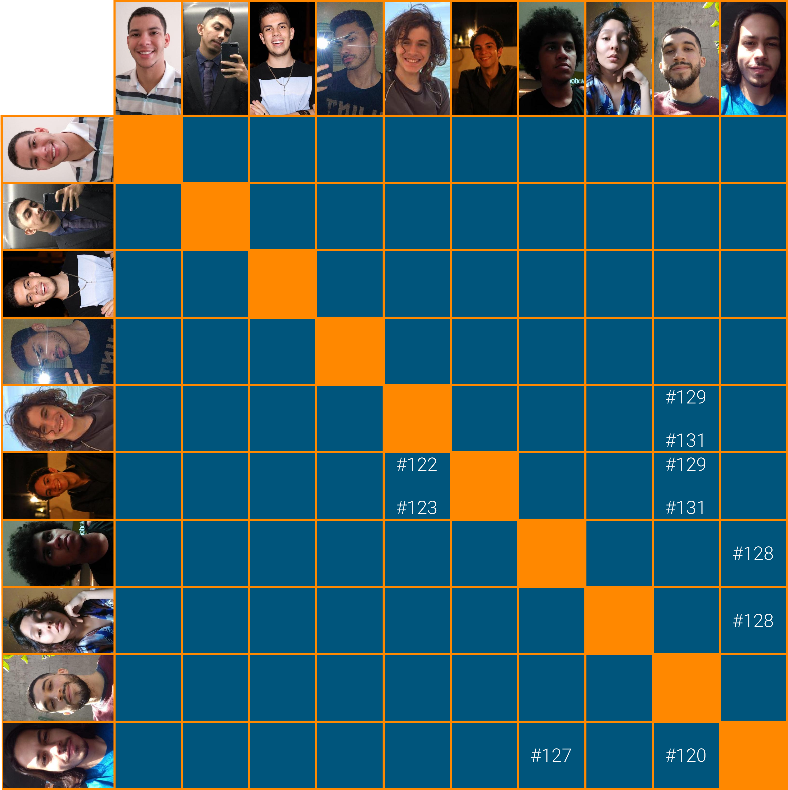

# Planejamento Sprint 09

Semana dedicada a mais uma etapa no fluxo de empréstimo e para criar as funcionalidades de edição de fluxo já iniciadas anteriormente.

## Tamanho da Sprint 09

**Início:** 04/04/2021

**Término:** 10/04/2021

**Duração:** Sete dias

## Objetivos

|                             _Issue_                              |                Titulo                 | Pontos |                                                                               _Assign_                                                                                |
| :--------------------------------------------------------------: | :-----------------------------------: | :----: | :-------------------------------------------------------------------------------------------------------------------------------------------------------------------: |
| [#120](https://github.com/fga-eps-mds/2020.2-Lend.it/issues/120) |    [US10] - Ver suas solicitações     |   5    |                             [Vinícius Saturnino](https://github.com/viniciussaturnino) e [Thiago Mesquita](https://github.com/thiagompc)                              |
| [#122](https://github.com/fga-eps-mds/2020.2-Lend.it/issues/122) |     [US21] - confirmar emprestimo     |   8    |                               [Matheus Afonso](https://github.com/Matheusafonsouza) e [Mateus Maia](https://github.com/mateusmaiamaia)                                |
| [#123](https://github.com/fga-eps-mds/2020.2-Lend.it/issues/123) | [US17] - mostrar dados para emprestar |   5    |                               [Matheus Afonso](https://github.com/Matheusafonsouza) e [Mateus Maia](https://github.com/mateusmaiamaia)                                |
| [#124](https://github.com/fga-eps-mds/2020.2-Lend.it/issues/124) |   [FIX] Testes nos serviços Python    |   3    |                               [Thais Rebouças](https://github.com/Thais-ra) e [Matheus Monteiro](https://github.com/matheusyanmonteiro)                               |
| [#128](https://github.com/fga-eps-mds/2020.2-Lend.it/issues/128) |         [US06] - Editar senha         |   5    | [Thais Rebouças](https://github.com/Thais-ra), [Vinícius Saturnino](https://github.com/viniciussaturnino) e [Matheus Monteiro](https://github.com/matheusyanmonteiro) |
| [#129](https://github.com/fga-eps-mds/2020.2-Lend.it/issues/129) |      [US08] - Editar localização      |   5    |       [Matheus Afonso](https://github.com/Matheusafonsouza), [Mateus Maia](https://github.com/mateusmaiamaia) e [Thiago Mesquita](https://github.com/thiagompc)       |
| [#131](https://github.com/fga-eps-mds/2020.2-Lend.it/issues/131) |        [US05] - editar perfil         |   5    |       [Matheus Afonso](https://github.com/Matheusafonsouza), [Mateus Maia](https://github.com/mateusmaiamaia) e [Thiago Mesquita](https://github.com/thiagompc)       |
| [#180](https://github.com/fga-eps-mds/2020.2-Lend.it/issues/180) |        Documentação Sprint 09         |   5    |                                                             [Thais Rebouças](https://github.com/Thais-ra)                                                             |

<b>Total de pontos planejados: 46</b>

### Dívida

|                             _Issue_                              |          Titulo          | Pontos |                                                        _Assign_                                                        |
| :--------------------------------------------------------------: | :----------------------: | :----: | :--------------------------------------------------------------------------------------------------------------------: |
| [#126](https://github.com/fga-eps-mds/2020.2-Lend.it/issues/126) |      [FIX] LendCard      |   3    |                                    [Youssef Muhamad](https://github.com/youssef-md)                                    |
| [#127](https://github.com/fga-eps-mds/2020.2-Lend.it/issues/127) | [US04] - Recuperar senha |   5    | [Vinícius Saturnino](https://github.com/viniciussaturnino) e [Matheus Monteiro](https://github.com/matheusyanmonteiro) |
| [#130](https://github.com/fga-eps-mds/2020.2-Lend.it/issues/130) |         Firebase         |   8    |                                    [Youssef Muhamad](https://github.com/youssef-md)                                    |

<b>Total: 11</b>

---

 Total de pontos da <i>sprint</i>: 57 
 

<!---Colocar no link abaixo as issues alocadas no milestone da Sprint--->

> [_Sprint_ _Backlog_](https://github.com/fga-eps-mds/2020.2-Lend.it/milestone/10?closed=1)

## Pareamentos

## Papeis

**_Scrum Master_:** [Rogério Júnior](https://github.com/rogerioo)

**_Product Manager_:** [Esio Gustavo](https://github.com/EsioFreitas)

**_Arquiteto:_** [Youssef Muhamad](https://github.com/youssef-md)

**_DevOps_:** [Lucas Dutra](https://github.com/lucasdutraf)

**Equipe de Desenvolvimento:**

- [Mateus Maia](https://github.com/mateusmaiamaia)
- [Matheus Afonso](https://github.com/Matheusafonsouza)
- [Matheus Monteiro](https://github.com/matheusyanmonteiro)
- [Thais Rebouças](https://github.com/Thais-ra)
- [Thiago Mesquita](https://github.com/thiagompc)
- [Vinícius Saturnino](https://github.com/viniciussaturnino)

**Autor:** [Rogério Júnior](https://github.com/rogerioo) e [Thais Rebouças](https://github.com/thais-ra)
