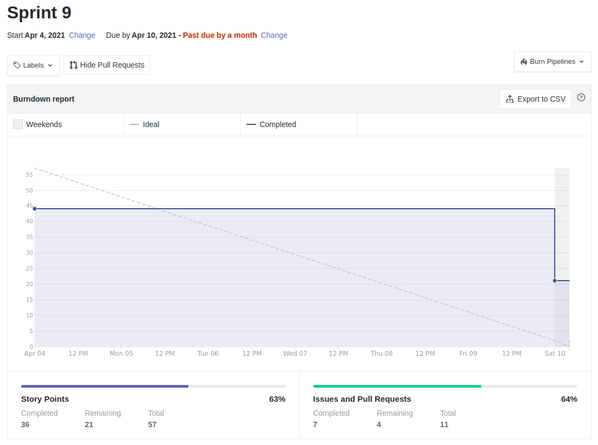
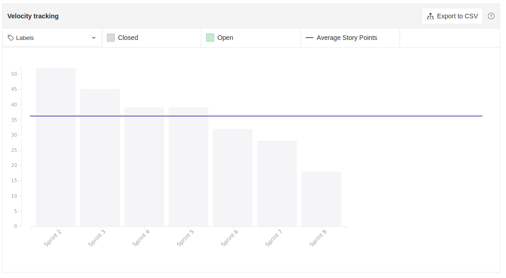

# Resultados Sprint 09

*Sprint* focada principalmente no gerenciamento do usuário (editar perfil) e na interação desse usuários com as solicitações de emprétimo.

## Fechamento da Sprint

|                             _Issue_                              |                Título                 |    _Status_     | Pontos |
| :--------------------------------------------------------------: | :-----------------------------------: | :-------------: | :----: |
| [#120](https://github.com/fga-eps-mds/2020.2-Lend.it/issues/120) | [US10] - Ver suas solicitações | _Concluído_ | 5 |
| [#122](https://github.com/fga-eps-mds/2020.2-Lend.it/issues/122) | [US21] - confirmar emprestimo | _Concluído_ | 8 |
| [#123](https://github.com/fga-eps-mds/2020.2-Lend.it/issues/123) | [US17] - mostrar dados para emprestar | _Concluído_ | 5 |
| [#124](https://github.com/fga-eps-mds/2020.2-Lend.it/issues/124) | [FIX] Testes nos serviços Python | _Concluído_ | 3 | 
| [#126](https://github.com/fga-eps-mds/2020.2-Lend.it/issues/126) | [FIX] LendCard | _Não Concluído_ | 3 |
| [#127](https://github.com/fga-eps-mds/2020.2-Lend.it/issues/127) | [US04] - Recuperar senha | _Não Concluído_ | 5 |
| [#128](https://github.com/fga-eps-mds/2020.2-Lend.it/issues/128) | [US06] - Editar senha | _Concluído_ | 5 |
| [#129](https://github.com/fga-eps-mds/2020.2-Lend.it/issues/129) | [US08] - Editar localização | _Concluído_ | 5 |
| [#130](https://github.com/fga-eps-mds/2020.2-Lend.it/issues/130) | Firebase | _Não Concluído_ | 8 |
| [#131](https://github.com/fga-eps-mds/2020.2-Lend.it/issues/131) | [US05] - editar perfil | _Concluído_ | 5 |
| [#180](https://github.com/fga-eps-mds/2020.2-Lend.it/issues/180) | Documentação Sprint 09 | _Não Concluído_ | 5 |

Pontos Planejados Concluídos: 36

Pontos de Dívida Concluídos: 21

Pontos Não Agregados: 24

> [_Sprint_ _Backlog_](https://github.com/fga-eps-mds/2020.2-Lend.it/milestone/10?closed=1)

## Burndown

O gráfico evidencia, como nas *sprints* anteriores, o padrão do time de finalizar as issues somente no sábado. Vale ressaltar que elas são feitas ao decorrer da semana, como evidencia o gráfico de produtividade.

## Velocity

É possível verificar no gráfico que houve uma diminuição nas entregas do time nessa *sprint*, enquanto que o valor esperado para essa entrega era de 40 pontos.

## Riscos

De acordo com o gráfico, podemos assumir que os riscos que tinham maior impacto mativeram a mesma pontuação da *sprint* anterior, porém alguns riscos que antes tinham uma pontuação menor, tiveram uma leve acentuada, principalmente por conta do aumento da complexidade.

<iframe height="909" seamless frameborder="0" scrolling="yes" src="https://docs.google.com/spreadsheets/d/e/2PACX-1vSGve6AsoRvxahK_yskgryTE1aQStxGh6_ls8RDjuH0DrdupIi26AptTJj64YT4vspgkpsoBKA2MZTd/pubchart?oid=275401813&format=interactive")></iframe>

## Retrospectiva

O quadro de empatia mostrou que o time está cada vez mais unido e bem empolgado com o desenvolvimento do projeto, apesar de que, nessa *sprint*, houve um aumento na carga de trabalho do semestre de maneira geral. Alem de que as issues estavam bastante atreladas, o que impediu alguns membros do time de trabalharem, pois era preciso que uma issue estivesse terminada para poder começar a outra.

<iframe height="1100" src="https://docs.google.com/spreadsheets/d/14-4FE5zWRdmAMZf-d78Q09VtxlNoTsXXANuJDr_bht8/edit#gid=720149146"></iframe>

<iframe height="1100" src="https://docs.google.com/spreadsheets/d/e/2PACX-1vTj1IyAJxxw19_Cq4hQ_79XLBX_i0j7eiWpLziOrktPOOr_dLWtZRZQcGtoepJl8LQeekhC2erEvBuL/pubhtml?gid=720149146&single=true"></iframe>

## Quadro de Conhecimento

Como o acompanhamento da evolução do conhecimento é feito a cada 15 dias, não houveram alterações com relação a *sprint* anterior.

<iframe height="600" src="https://docs.google.com/spreadsheets/d/e/2PACX-1vQt9zLphgqw_af_Kz6vaOhzGt4M4xnPEfbVTrtfh-CvbbsX1HziKhaXO5_nenI8iGToZQJNdfrqNvoJ/pubhtml?gid=1611743338&single=true"></iframe>

<iframe height="600" src="https://docs.google.com/spreadsheets/d/e/2PACX-1vQt9zLphgqw_af_Kz6vaOhzGt4M4xnPEfbVTrtfh-CvbbsX1HziKhaXO5_nenI8iGToZQJNdfrqNvoJ/pubhtml?gid=1611743338&single=true"></iframe>

## Quadro de Sentimentos

O quadro de sentimento mostra um humor bastante positivo do time, podendo ser atribuído como causa, a conclusão de atividades de outras matérias bem como a finalização das issues da *sprint*.

<iframe height="627" seamless frameborder="0" scrolling="no" src="https://docs.google.com/spreadsheets/d/e/2PACX-1vQfmC1hXrOlqXL8ZBsKvi7WktZEdpPOwa5KIKgUKkee2U96ua7g0-bkQL0XZRrCYFGCVWSukZ8ActfD/pubchart?oid=414867677&format=interactive"></iframe>
<iframe height="509" seamless frameborder="0" scrolling="no" src="https://docs.google.com/spreadsheets/d/e/2PACX-1vQYTAqkgguUNHq1_L4lwKSwU04oXAoBtm2tj4GrTBb9ND0mj0pBrldy-VPLaeM5fp0KIPX7SbWDH9ia/pubchart?oid=708314367&format=interactive"></iframe>
<iframe height="371" seamless frameborder="0" scrolling="no" src="https://docs.google.com/spreadsheets/d/e/2PACX-1vR7kDZjRAC-EVBplLf7K6B9FQOQW3As3S17ffv4DMo6_dn0-c43DWpxoylg1mpDB41mPCOX0Dcp34bB/pubchart?oid=435319136&format=interactive"></iframe>

## Registro de Presença nas *Dailies*

|     Nome    |   Segunda Feira   | Terça Feira      | Quarta Feira     | Quinta Feira      | Sexta Feira      |
| :---------: |:-----------------:|:----------------:|:----------------:|:-----------------:|:----------------:|
| Ésio        |         ✔         |         ✘        |         ✘        |         ✔         |         ✔      |
| Lucas       |         ✔         |         ✔        |         ✔        |         ✔         |         ✔      |
| M. Maia     |         ✘         |         ✔        |         ✔        |         ✔         |         ✔      |
| M. Afonso   |         ✔         |         ✘        |         ✔        |         ✔         |         ✔      |
| M. Monteiro |         ✔         |         ✘        |         ✘        |         ✔         |         ✔      |
| Rogério     |         ✔         |         ✔        |         ✔        |         ✘         |         ✘      |
| Thaís       |         ✔         |         ✔        |         ✔        |         ✘         |         ✔      |
| Thiago      |         ✔         |         ✘        |         ✔        |         ✔         |         ✔      |
| Vinicius    |         ✔         |         ✔        |         ✔        |         ✔         |         ✔      |
| Youssef     |         ✘         |         ✔        |         ✔        |         ✔         |         ✔      |

## Avaliação do Scrum Master

Vejo que o time continua unido. Sempre trabalham juntos e tirando dúvidas entre si. Porém nessa sprint houve uma queda nas entregas, que ocorreu devido ao cansaço dos membros em relação ao semestre e atividades de outras matérias. Em relação a isso, acredito que com o passar da semana, as atividades irão diminuir e as entregas voltarão ao normal.

**Autor:** [Rogério Júnior](https://github.com/rogerioo), [Thais Rebouças](https://github.com/Thais-ra), [Mateus Maia](https://github.com/mateusmaiamaia), [Thiago Mesquita](https://github.com/thiagompc) e [Matheus Monteiro](https://github.com/matheusyanmonteiro)
