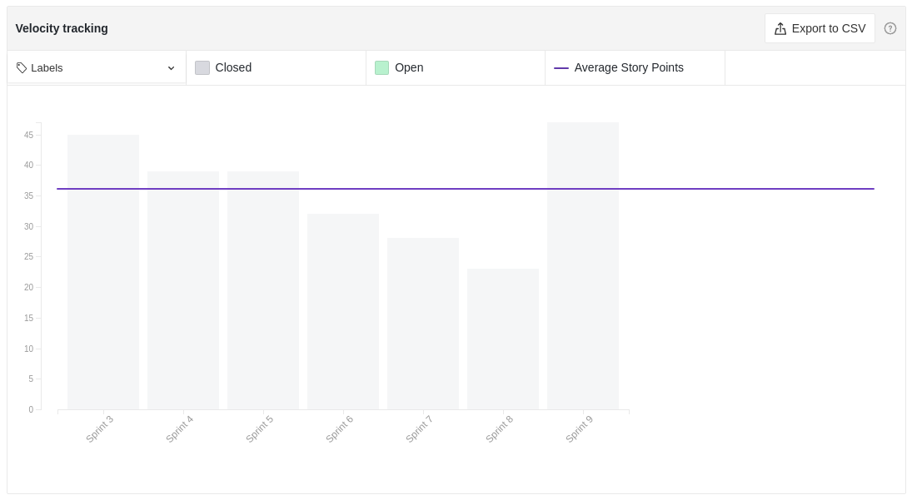

# Resultados Sprint 09

Fazer a restrospectiva da *sprint* explicando de forma detalhada qual foi o resultado e buscar sempre linkar com aquilo que seja relevante às explicações.

## Fechamento da Sprint

|                             _Issue_                              |                Título                 |    _Status_     | Pontos |
| :--------------------------------------------------------------: | :-----------------------------------: | :-------------: | :----: |
| [#120](https://github.com/fga-eps-mds/2020.2-Lend.it/issues/120) | [US10] - Ver suas solicitações | _Concluído_ | 5 |
| [#122](https://github.com/fga-eps-mds/2020.2-Lend.it/issues/122) | [US21] - confirmar emprestimo | _Concluído_ | 8 |
| [#123](https://github.com/fga-eps-mds/2020.2-Lend.it/issues/123) | [US17] - mostrar dados para emprestar | _Concluído_ | 5 |
| [#124](https://github.com/fga-eps-mds/2020.2-Lend.it/issues/124) | [FIX] Testes nos serviços Python | _Concluído_ | 3 | 
| [#126](https://github.com/fga-eps-mds/2020.2-Lend.it/issues/126) | [FIX] LendCard | _Não Concluído_ | 3 |
| [#127](https://github.com/fga-eps-mds/2020.2-Lend.it/issues/127) | [US04] - Recuperar senha | _Não Concluído_ | 5 |
| [#128](https://github.com/fga-eps-mds/2020.2-Lend.it/issues/128) | [US06] - Editar senha | _Concluído_ | 5 |
| [#129](https://github.com/fga-eps-mds/2020.2-Lend.it/issues/129) | [US08] - Editar localização | _Concluído_ | 5 |
| [#130](https://github.com/fga-eps-mds/2020.2-Lend.it/issues/130) | Firebase | _Não Concluído_ | 8 |
| [#131](https://github.com/fga-eps-mds/2020.2-Lend.it/issues/131) | [US05] - editar perfil | _Concluído_ | 5 |
| [#180](https://github.com/fga-eps-mds/2020.2-Lend.it/issues/180) | Documentação Sprint 09 | _Não Concluído_ | 5 |

Pontos Planejados Concluídos: 36

Pontos de Dívida Concluídos: 21

Pontos Não Agregados: 24

> [_Sprint_ _Backlog_](https://github.com/fga-eps-mds/2020.2-Lend.it/milestone/10?closed=1)

## Burndown

Explicação em cima dos dados.

## Velocity

Explicação em cima dos dados.

## Riscos

Explicação sobre os riscos.

## Retrospectiva

Breve resumo sobre a retrospectiva.

## Quadro de Conhecimento

Breve aval sobre o quadro de conhecimento.

## Quadro de Sentimentos

Breve explicação dos dados

## Registro de Presença nas *Dailies*

|     Nome    |   Segunda Feira   | Terça Feira      | Quarta Feira     | Quinta Feira      | Sexta Feira      |
| :---------: |:-----------------:|:----------------:|:----------------:|:-----------------:|:----------------:|
| Ésio        |         ✔         |         ✔        |         ✘        |         ✔         |         ✔      |
| Lucas       |         ✔         |         ✔        |         ✔        |         ✔         |         ✔      |
| M. Maia     |         ✔         |         ✔        |         ✔        |         ✔         |         ✔      |
| M. Afonso   |         ✔         |         ✔        |         ✔        |         ✔         |         ✔      |
| M. Monteiro |         ✔         |         ✔        |         ✘        |         ✔         |         ✔      |
| Rogério     |         ✔         |         ✔        |         ✔        |         ✔         |         ✘      |
| Thaís       |         ✔         |         ✘        |         ✔        |         ✔         |         ✔      |
| Thiago      |         ✔         |         ✔        |         ✔        |         ✔         |         ✔      |
| Vinicius    |         ✔         |         ✔        |         ✔        |         ✔         |         ✔      |
| Youssef     |         ✘         |         ✔        |         ✔        |         ✔         |         ✔      |

## Avaliação do Scrum Master

**Autor:** [Rogério Júnior](https://github.com/rogerioo)
