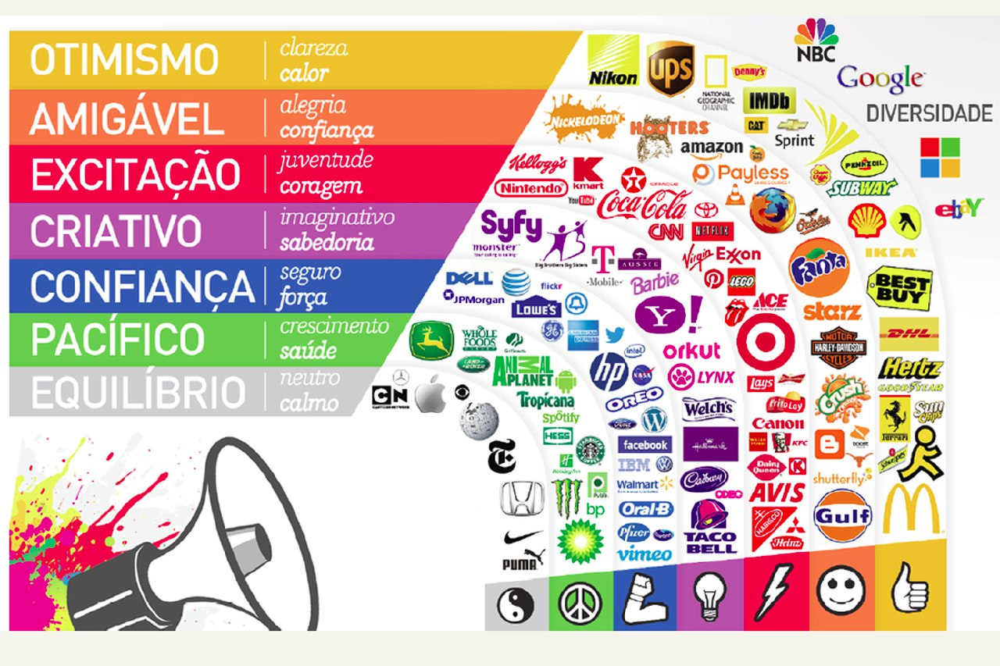
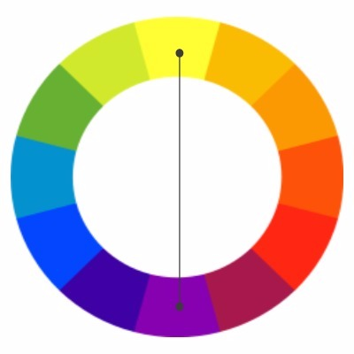
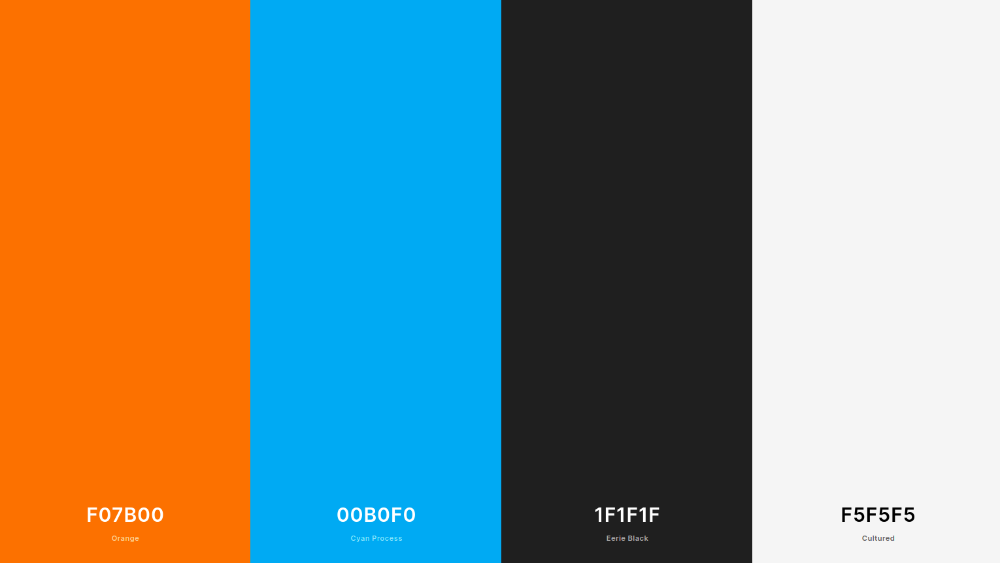
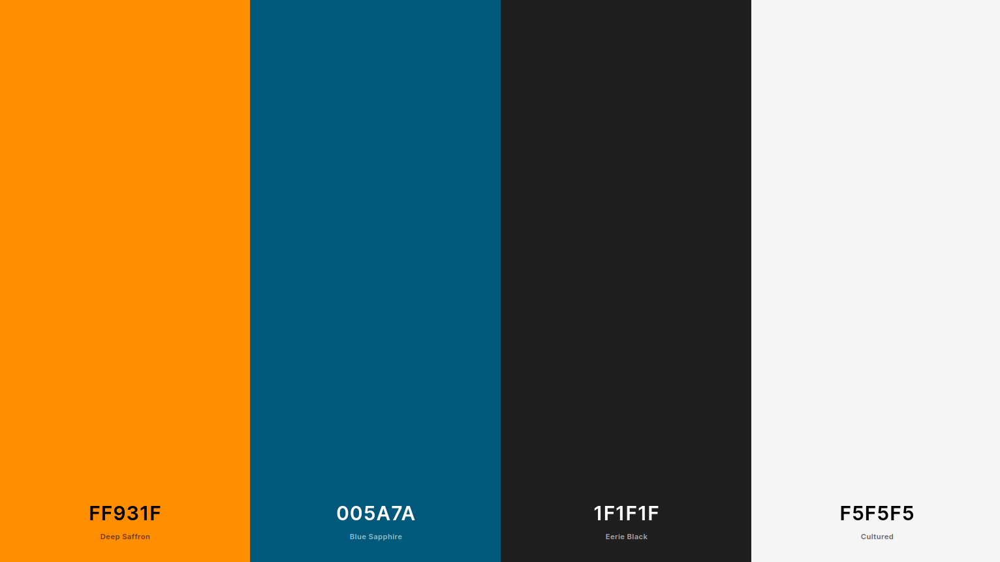

# Guia de Estilo e Identidade Visual

# Histórico de Revisão

| Data       | Versão | Modificação                                      | Autor           |
| :--------- | :----- | :----------------------------------------------- | :-------------- |
| 03/03/2021 | 1.0    | Criação da versão inicial do documento           | Thais Rebouças  |
| 04/03/2021 | 1.1    | Adição do tópico 1 e 4, e do subtópico 3.1 e 3.3 | Thais Rebouças  |
| 05/03/2021 | 1.2    | Revisão do documento                             | Youssef Muhamad |
| 06/03/2021 | 1.3    | Adição do link da apresentação                   | Thais Rebouças  |
| 06/03/2021 | 1.4    | Arrumando detalhes do documento                  | Esio Freitas    |

# 1 Introdução

O seguinte documento objetiva informar e detalhar tecnicamente a construção do conjunto de elementos que representam visualmente a aplicação.

# 2 Apresentação da Identidade Visual

<iframe src="https://docs.google.com/presentation/d/1TAPAFwuNAQyJIA_cmxViIjyWL4yyMdaiHPi4Km1c5iA/embed?start=true&loop=true&delayms=3000" frameborder="0" width="960" height="569" allowfullscreen="true" mozallowfullscreen="true" webkitallowfullscreen="true"></iframe>

# 3 Detalhamento e Justificativas

## 3.1 Nome da aplicação

A escolha do nome da aplicação foi feita pensando em um nome curto e prático para a escrita e fala: **Lend.it** do inglês, que significa "empreste-o". Uma referencia ao principal objetivo da aplicação.

## 3.2 Fontes

As fontes utilizadas na aplicação serão:

- **Poppins**(Open Font License), para títulos e
- **Open Sans**(Apache License, Version 2.0), para textos.

Elas foram escolhidas por serem fontes que passam uma ideia amistosa e que possuem licenças que permitem uso gratuito.

# 3.3 Paleta de cores

As cores foram selecionadas observando características do produto e sua finalidade, baseado na psicologia das cores.
Como a aplicação é baseada fortemente na confiança entre os usuários, por se tratar de empréstimos de objetos pessoais aos vizinhos, a cor primária que melhor se adequa para essa aplicação é o laranja.

O laranja sendo uma cor derivada do vermelho, tem características muito alegres e estimulantes, acabando por despertar o desejo de ação do usuário. Em relação ao vermelho, o laranja acaba tendo a vantagem de ser mais agradável aos olhos, menos agressivo.

Quando aplicado no mundo do marketing, ele pode significar criatividade, alegria e confiança.

A cor secundária escolhida é a cor complementar à primária no círculo cromático, o azul. Que tem como característica a capacidade de levar segurança e tranquilidade para as pessoas.

- Depois de adicionar o preto e o branco o resultado foi:

- Escurecendo um pouco mais as cores, o resultado final foi:

Primária: #FF931F,
Secundária: #005A7A.
