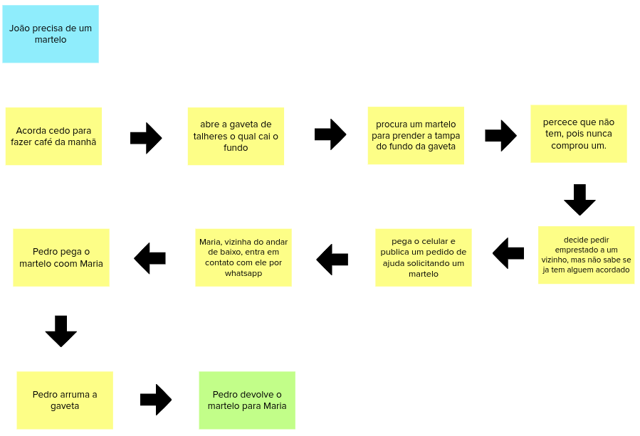
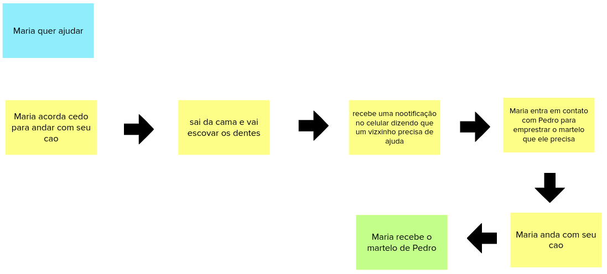

# Jornada do Usuário

A jornada do usuário descreve o percurso de um usuário por uma sequência de passos para alcançar um objetivo. Alguns desses passos representam diferentes pontos de contato com o produto, caracterizando a interação da pessoa com ele.

|    Data    | Versão |       Descrição        |  Autor(es)   |
| :--------: | :----: | :--------------------: | :----------: |
| 23/02/2021 |  1.0   | Adicionando versão 1.0 | Ésio Freitas |

## Jornada - pedir produto

## Jornada - emprestar produto

## Referências

- caroli.org. [Lean Inception] Novas Funcionalidades nas Jornadas. Disponível em: https://www.caroli.org/novas-funcionalidades-nas-jornadas/. Acesso em: 23 fev. 2021.
