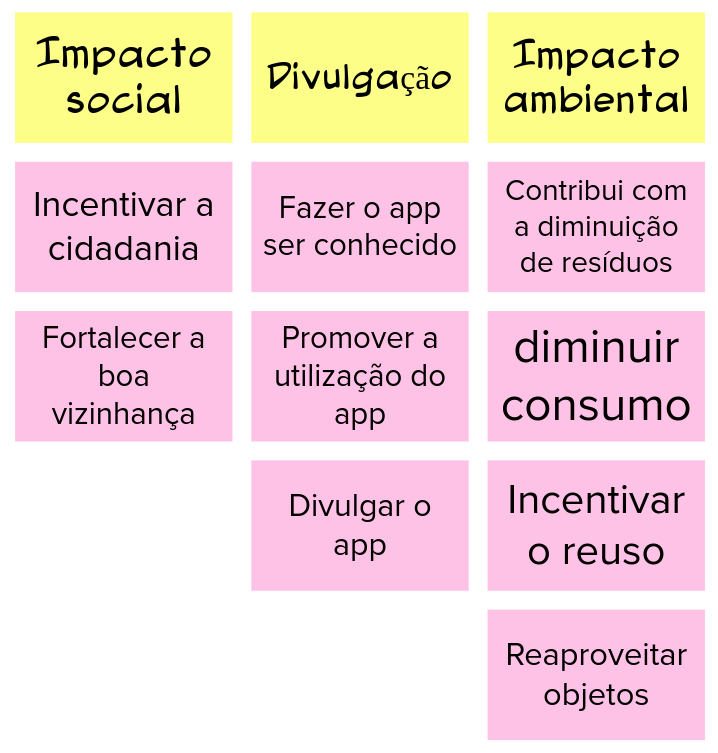

# Objetivos do Produto

A ideia desse artefato é compatilhar o que os membros entende como objetivo para o negocio e os varios pontos de vista discutidos que chegaram na decisão final de produto.

|    Data    | Versão |       Descrição        |  Autor(es)   |
| :--------: | :----: | :--------------------: | :----------: |
| 23/02/2021 |  1.0   | Adicionando versão 1.0 | Ésio Freitas |

## Versão 1.0

## Referências

- caroli.org. Lean Inception e os objetivos do produto, do negócio e dos usuários em: https://www.caroli.org/objetivos-produto-negocio-usuario/. Acesso em: 23 fev. 2021.
