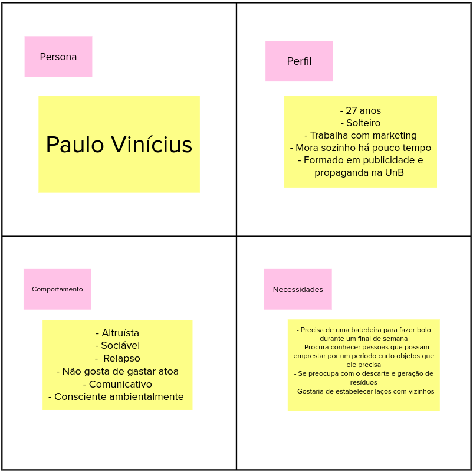

# Visão do Produto

Uma persona representa um usuário do sistema, descrevendo não só o seu papel, mas também suas necessidades específicas. Isto cria uma representação realística de usuários, auxiliando o time a descrever funcionalidades do ponto de vista de quem interagirá com o produto final.

|    Data    | Versão |       Descrição        |  Autor(es)   |
| :--------: | :----: | :--------------------: | :----------: |
| 23/02/2021 |  1.0   | Adicionando versão 1.0 | Ésio Freitas |

## Versão 1.0

## Referências

- caroli.org. Atividade: Identificando Personas. Disponível em: https://www.caroli.org/atividade-identificando-personas/. Acesso em: 23 fev. 2021.
