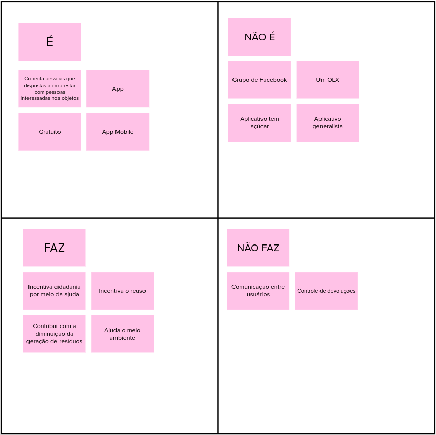

# O Produto É – Não é – Faz – Não faz

A atividade É-NãoÉ-Faz-NãoFaz ajuda a definir um produto. Por vezes é mais fácil descrever algo pelo que tal coisa não é ou deixa de fazer. Essa atividade busca clarificações desta forma, indagando especificamente cada aspecto positivo e negativo sobre o produto ser ou fazer algo.

|    Data    | Versão |       Descrição        |  Autor(es)   |
| :--------: | :----: | :--------------------: | :----------: |
| 23/02/2021 |  1.0   | Adicionando versão 1.0 | Ésio Freitas |

## Versão 1.0

## Referências

- caroli.org. O Produto É – Não é – Faz – Não faz. Disponível em: https://www.caroli.org/o-produto-e-nao-e-faz-nao-faz/#:~:text=3.,-Leia%20e%20agrupe&text=Decis%C3%B5es%20estrat%C3%A9gicas%20podem%20ser%20clarificadas,outra%20ainda%20n%C3%A3o%20deve%20fazer.. Acesso em: 23 fev. 2021.
