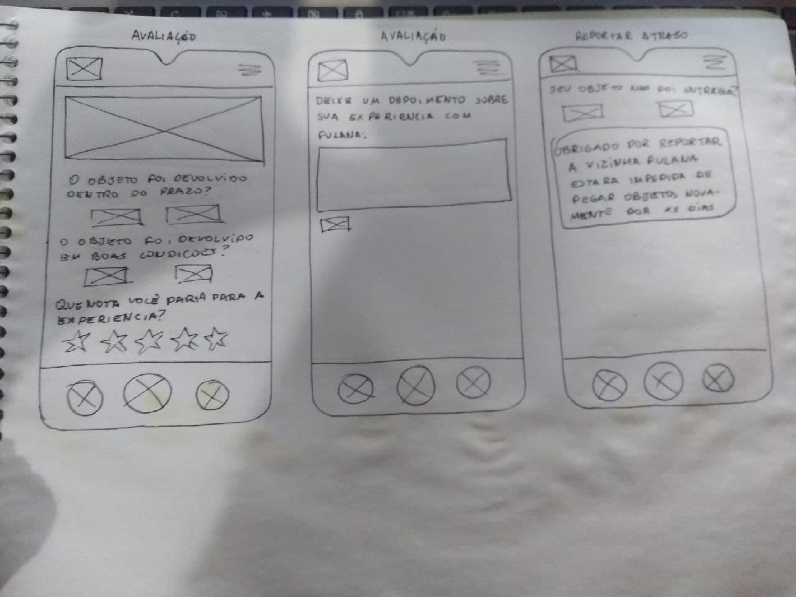

# Nome do documento

O Protótipo de Baixa Fidelidade simula algumas características do projeto, sendo que a ênfase é na funcionalidade e não na estética. Nesse tipo de modelo, geralmente, pretende-se obter um feedback de usuários que farão o teste preliminar. Ele é bastante utilizado em fases iniciais e exploratórias de um projeto para validar um conceito e decidir se uma ideia tem ou não valor funcional.

## Histórico de Revisões

|    Data    | Versão |            Descrição            |    Autor(es)    |
| :--------: | :----: | :-----------------------------: | :-------------: |
| 22/02/2021 |  1.0   | Adiciona imagens dos protótipos | Youssef Muhamad |

### [Esio Freitas](https://github.com/EsioFreitas)

### [Mateus Cunha](https://github.com/mateuscunhamaia)

### [Matheus Afonso](https://github.com/Matheusafonsouza)

### [Matheus Monteiro](https://github.com/matheusyanmonteiro)

### [Thais Rebouças](https://github.com/Thais-ra)

### [Thiago Mesquita](https://github.com/thiagompc)

### [Vinicius Saturnino](https://github.com/viniciussaturnino)

### [Youssef Muhamad](https://github.com/youssef-md)

## Referências

- ALEX, Jefferson. Protótipos de baixa, média e alta fidelidade. [S. l.], 2017. Disponível em: http://jeffersonalex.com.br/design/prototipos-de-baixa-media-e-alta-fidelidade/. Acesso em: 20 fev. 2021.

- FRANCISCO, Tatiane. Baixa, média ou alta fidelidade?. [S. l.], 2019. Disponível em: https://dextra.com.br/pt/baixa-media-ou-alta-fidelidade-conheca-as-diferencas-entre-os-tipos-de-prototipos/. Acesso em: 20 fev. 2021.
