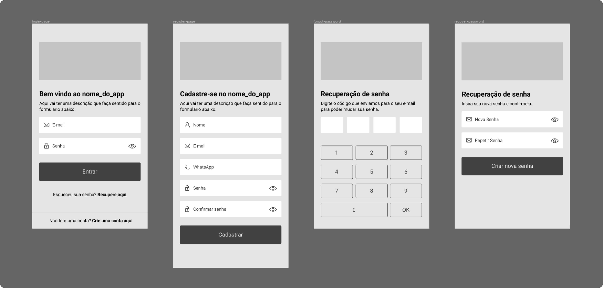
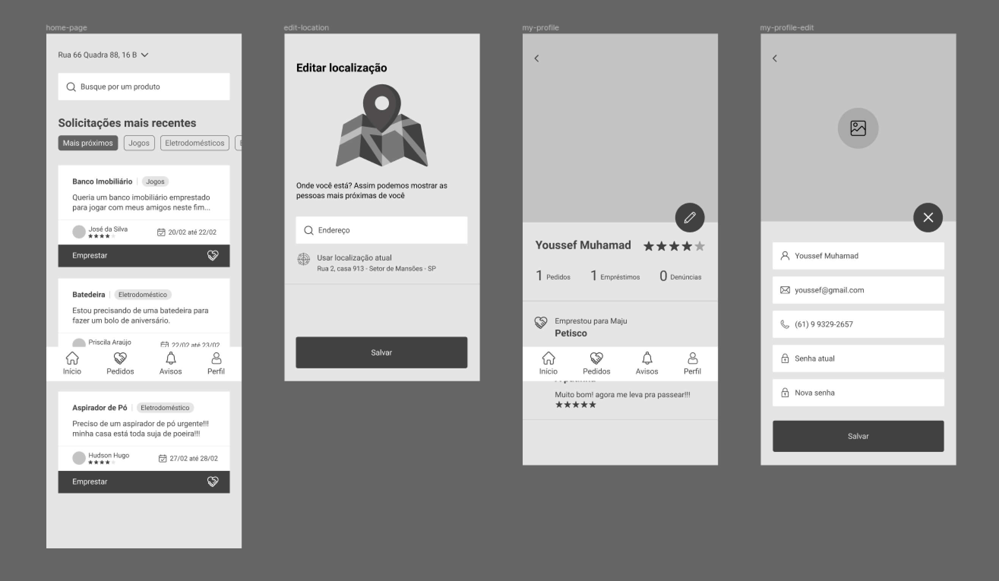
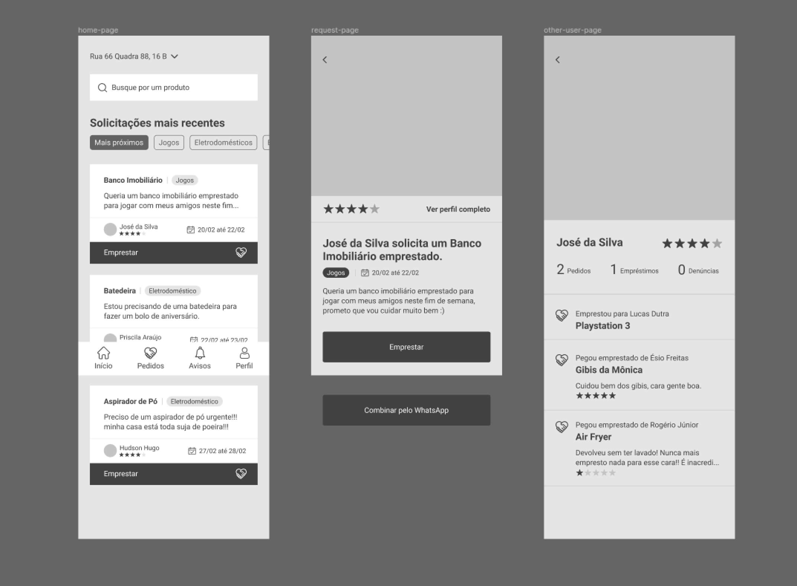
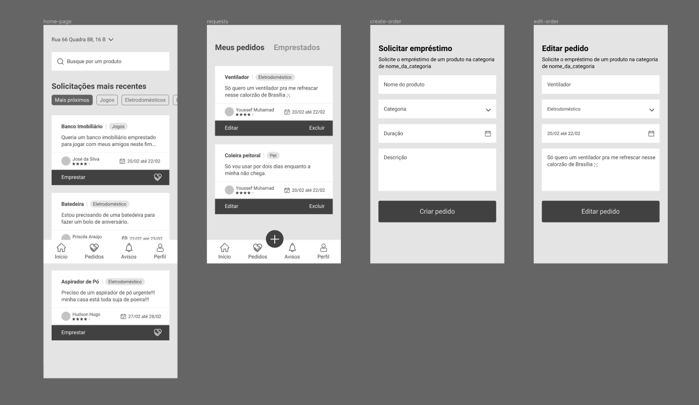
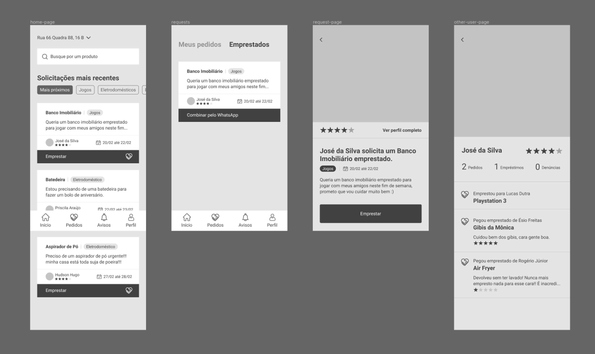
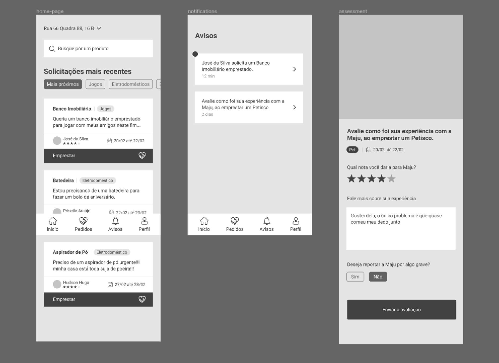

# Protótipo de Média Fidelidade

O protótipo de média fidelidade é um pouco mais completo que o de baixa, porém ainda não possui um acabamento visual de um produto final. O principal objetivo desse protótipo é validar os fluxos definidos pela equipe.

## Histórico de Revisões

| Data | Versão | Descrição | Autor(es) |
| :--: | :----: | :-------: | :-------: |
|   21/02/2020   | 1.0 |  Criação do documento | Vinicius Saturnino |
|   24/02/2020   | 1.1 |  Adição das imagens do protótipo         | Youssef Muhamad |

O Protótipo a seguir tem como finalidade condensar todos os brainstorms e fluxos que a equipe definiu. Esta etapa se provou necessária já que, até então, tínhamos os fluxos e features definidos no backlog para implementação, sendo necessário o densenvolvimento deste protótipo para futuros testes e validações de acordo com a necessidade dos usuários. Este documento está disponível <a href="https://www.figma.com/file/9QMXf9YyVXYTG6hYnwZAHK/Prot%C3%B3tipo-M%C3%A9dia-Fidelidade?node-id=67%3A2066">neste Figma</a> para a realização de testes de usabilidade.

### Autenticação - Recuperar senha

**Autores:** [Matheus Monteiro](https://github.com/matheusyanmonteiro), [Vinicius Saturnino](https://github.com/viniciussaturnino), [Youssef Muhamad](https://github.com/youssef-md).

### Home - Endereço - Perfil

**Autores:** [Matheus Monteiro](https://github.com/matheusyanmonteiro), [Vinicius Saturnino](https://github.com/viniciussaturnino), [Youssef Muhamad](https://github.com/youssef-md).

### Home - Emprestar - Perfil

**Autores:** [Matheus Monteiro](https://github.com/matheusyanmonteiro), [Vinicius Saturnino](https://github.com/viniciussaturnino), [Youssef Muhamad](https://github.com/youssef-md).

### Home - Pedido - Criar - Editar

**Autores:** [Matheus Monteiro](https://github.com/matheusyanmonteiro), [Vinicius Saturnino](https://github.com/viniciussaturnino), [Youssef Muhamad](https://github.com/youssef-md).

### Home - Emprestados - Perfil

**Autores:** [Matheus Monteiro](https://github.com/matheusyanmonteiro), [Vinicius Saturnino](https://github.com/viniciussaturnino), [Youssef Muhamad](https://github.com/youssef-md).

### Home - Avisos - Avaliar

**Autores:** [Matheus Monteiro](https://github.com/matheusyanmonteiro), [Vinicius Saturnino](https://github.com/viniciussaturnino), [Youssef Muhamad](https://github.com/youssef-md).

## Referências

* FRANCISCO, Tatiane. Baixa, média ou alta fidelidade?. [S. l.], 2019. Disponível em: https://dextra.com.br/pt/baixa-media-ou-alta-fidelidade-conheca-as-diferencas-entre-os-tipos-de-prototipos/. Acesso em: 9 set. 2019.
