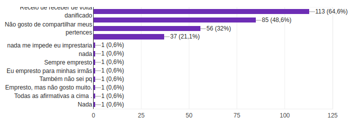

# Análise do questionário

Para que a ideia do projeto tivesse uma validação com os usuários, foi feito uma pesquisa sobre o tema. Obtivemos 175 respostas de pessoas de todas as faixas etárias. O questionário foi feito pelo Google Forms e as perguntas feitas e validadas por toda a equipe. Como haviam algumas perguntas discursivas relacionada às opniões dos respondentes, achamos conveniente usar algumas ferramentas de análise textual para que, assim, conseguíssemos obter as principais temáticas das respostas.  
A análise será divida em 3 partes, generalista, do usuário que tem costume de emprestar pertences e usuário que não tem costume de emprestar pertences.  
|    Data    | Versão |       Descrição        |  Autor(es)   |
| :--------: | :----: | :--------------------: | :----------: |
| 26/02/2021 |  1.0   | Adicionando versão 1.0 | Lucas Dutra |

## Generalista

### Faixa etária
As pessoas que responderam o formulário estão, em sua maioria, entre 18 e 25 anos, completando um total de 61,7% do público total. Tal fato não influencia diretamente na escolha de funcionalidades.

### Costume de emprestar objetos
A segunda pergunta do questionário foi "Você tem o costume de emprestar objetos para outras pessoas? (Familiares, vizinhos, colegas...)". Com ela conseguimos ver se o público alvo já tem esse hábito ou a ideia da aplicação incitou essa possível prática.

### Impedimentos de emprestar pertences
É de conhecimento geral o grande receio que emprestar pertences para outras pessoas gera, principalmente por medo de não receber de volta ou receber o objeto danificado. Levantamos essa pergunta para que, com base nela, possamos estreitar nossas políticas de uso e entender possíveis motivos de reports dentro do universo da aplicação.

### O que as pessoas não emprestariam
Por mais solícito que o indivíduo seja, existe um domínio de objetos que não são cogitados para emprestar para outra pessoa. Essa seção faz parte da pesquisa para que possamos restringir a área de atuação da nossa aplicação.

#### Wordcloud
Foi gerada uma nuvem das palavras mais frequentes mencionadas nessa questão. Vale ressaltar que, quanto maior a palavra, mais frequente.

### O que as pessoas emprestariam
Da mesma maneira que, para definir o domínio da aplicação, é conveniente saber o que o público não emprestaria, o que o público emprestaria também se torna bastante necessário.

#### Wordcloud
Foi gerada uma nuvem das palavras mais frequentes mencionadas nessa questão. Vale ressaltar que, quanto maior a palavra, mais frequente.

### Adesão da aplicação
Foi levantado se em um cenário o qual houvessem diretrizes de uso e regras de punição e bonificação, o público alvo utilizaria uma aplicação que possibilitaria o empréstimo de objetos para pessoas da mesma cidade.

### Motivos para usar a aplicação
Para o fluxo de pessoas que utilizariam a aplicação proposta anteriormente, indagamos quais motivos as levariam utilizar o app, para que a partir das respostas, tracemos jornadas de usuário mais precisas. 

### Motivos para não usar a aplicação
Porém, para as pessoas que disseram que não seriam utilizariam da aplicação proposta, perguntamos os motivos, com a finalidade de mitigação de restrição de público com base na premissa do app.  
Essas foram as palavras mais mencionadas no campo de texto livre.  

## Análise de pessoas que possuem o costume de emprestar objetos
### O que emprestariam
Foi gerada uma nuvem das palavras mais frequentes mencionadas desse grupo.

### O que não emprestariam
Foi gerada uma nuvem das palavras mais frequentes mencionadas desse grupo.

### Adesão ao projeto
Com o uso da biblioteca Pandas, analisamos a porcentagem de pessoas que tem o costume de emprestar objetos e utilizariam o app.  
#### Resultados
- 82% dos usuários utilizariam o app.
- 18% dos usuários não utilizariam o app.

## Análise de pessoas que NÃO possuem o costume de emprestar objetos
### O que emprestariam
Foi gerada uma nuvem das palavras mais frequentes mencionadas desse grupo.

### O que não emprestariam
Foi gerada uma nuvem das palavras mais frequentes mencionadas desse grupo.

### Adesão ao projeto
Com o uso da biblioteca Pandas, analisamos a porcentagem de pessoas que tem o não costume de emprestar objetos e mesmo assim utilizariam o app.  
#### Resultados
- 68% dos usuários utilizariam o app.
- 32% dos usuários não utilizariam o app.

**Autor(es)**: Lucas Dutra Ferreira do Nascimento

## Referências

- forms-analytics. Análise de questionário do grupo 1. Disponível em: https://github.com/lucasdutraf/forms-analytics. Acesso em: 27 fev. 2021.