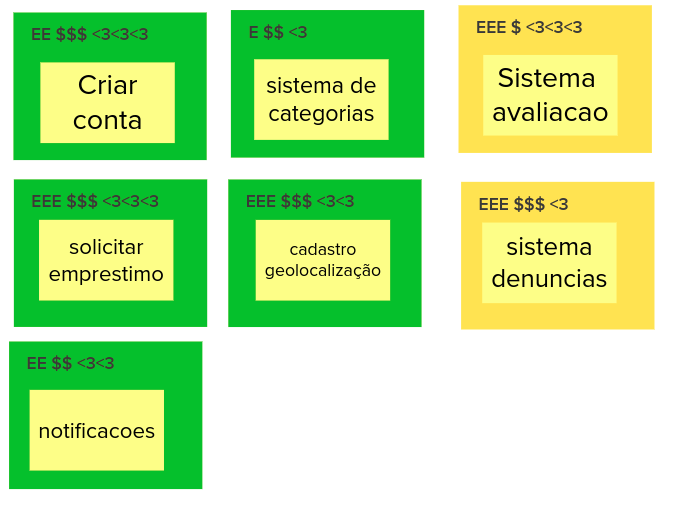

# Revisão Técnica, negócio e de UX

Esta revisão tem o objetivo de discutir como a equipe se sente em relação ao entendimento tecnico, o de negocio e o de UX para cada funcionalidade. 

|    Data    | Versão |       Descrição        |  Autor(es)   |
| :--------: | :----: | :--------------------: | :----------: |
| 23/02/2021 |  1.0   | Adicionando versão 1.0 | Ésio Freitas |

## Versão 1.0

## Referências

- caroli.org. Exemplo de Lean Inception: EasyBola. Disponível em: https://www.caroli.org/easy-bola/. Acesso em: 23 fev. 2021.
