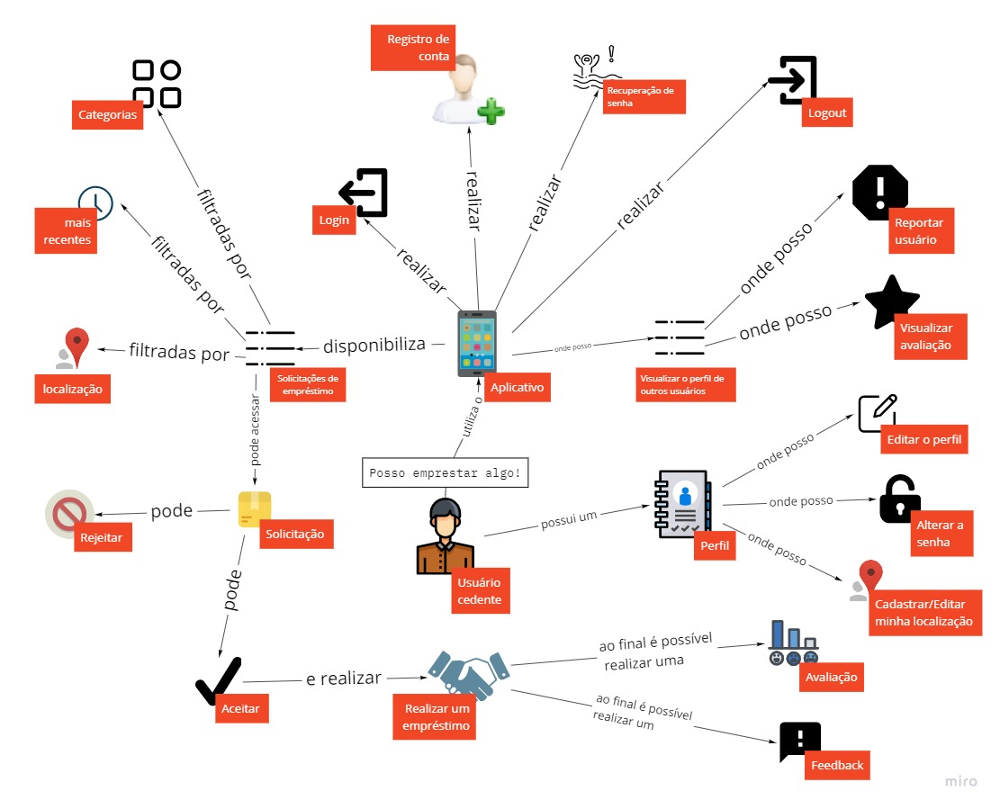

# Rich picture

Um rich picture é um documento que é composto por representações de desenho que indentificam todas as partes interessadas (stakeholders), suas preocupações e o universo de informação do que pretende-se modelar. Um rich picture é uma ferramenta de manter registros e raciocínios sobre diversos aspectos do contexto de trabalho, e em principalmente, os relacionamentos e seus efeitos. É uma ferramenta no sentido de uma notação ou representação de uma aplicação.

## Histórico de Revisões

|    Data    | Versão |              Descrição              |          Autor(es)           |
| :--------: | :----: | :---------------------------------: | :--------------------------: |
| 23/02/2021 |  0.1   |        Criação do documento         |         Mateus Maia          |
| 24/02/2021 |  0.2   | Inserção dos documentos e descrição | Mateus Maia e Matheus Afonso |

&nbsp;

**Autores:** [Mateus Maia](https://github.com/mateuscunhamaia), [Matheus Afonso](https://github.com/Matheusafonsouza).

## Versão 2.0

Após conversas entre o time, foi reparado o erro de que nas versões 1.0 existia a possibilidade do usuário pesquisar e solicitar o empréstimo de algum objeto por parte do cedente. Contudo, na versão 2.0 este erro foi corrigido.

Outro erro corrigido foi o de que o usuário cedente poderia recurar solicitações.

## RP Usuário V2

&nbsp;

**Autor:** [Matheus Afonso](https://github.com/Matheusafonsouza)

&nbsp;

## RP Usuário Cedente V2

&nbsp;

**Autor:** [Matheus Afonso](https://github.com/Matheusafonsouza)

&nbsp;

&nbsp;

**Autor:** [Mateus Maia](https://github.com/mateuscunhamaia)

&nbsp;

## RP Usuário V1

&nbsp;

**Autor:** [Matheus Afonso](https://github.com/Matheusafonsouza)

&nbsp;

&nbsp;

**Autor:** [Mateus Maia](https://github.com/mateuscunhamaia)

&nbsp;

## RP Usuário Cedente V1

&nbsp;

**Autor:** [Matheus Afonso](https://github.com/Matheusafonsouza)

&nbsp;

&nbsp;

**Autor:** [Mateus Maia](https://github.com/mateuscunhamaia)

&nbsp;

## Referências

- MONK, Andrew; HOWARD, Steve. The Rich Picture: A Tool for Reasoning about Work Context. Methods and Tools, ACM 1072-5220/98/0300, pp. 21-30, April 1998.
