# Testes de Usabilidade

Teste de usabilidade é uma técnica de pesquisa utilizada para avaliar um produto ou serviço. Os testes são realizados com usuários representativos do público-alvo. Cada participante tenta realizar tarefas típicas da aplicação e o analista colhe os resultados para validar a usabiliade da aplicação. Para elaborar os nossos testes, configuramos nosso [Protótipo de Média Fidelidade](../prototipo_media_fidelidade.md) na plataforma [Usability Hub](https://usabilityhub.com/) e compartilhamos os [links dos testes](https://github.com/fga-eps-mds/2020.2-Lend.it/issues/53#issuecomment-786994175) para diversas pessoas que não são do curso de Engenharia de Software.

## Histórico de Revisões

| Data | Versão | Descrição | Autor(es) |
| :--: | :----: | :-------: | :-------: |
|  09/03/2021    | 1.0 |   Documentando os resultados dos testes  |  Youssef Muhamad, Mateus Maia |

### Fluxo #1: Emprestar/Pedir produto
[Link para o resultado](https://app.usabilityhub.com/tests/bd76f02ed528/results/e0463c9bc887)

> #### Suponha que você tem um banco imobiliário em casa e deseja emprestá-lo para alguém, como você faria isso?

**Home**

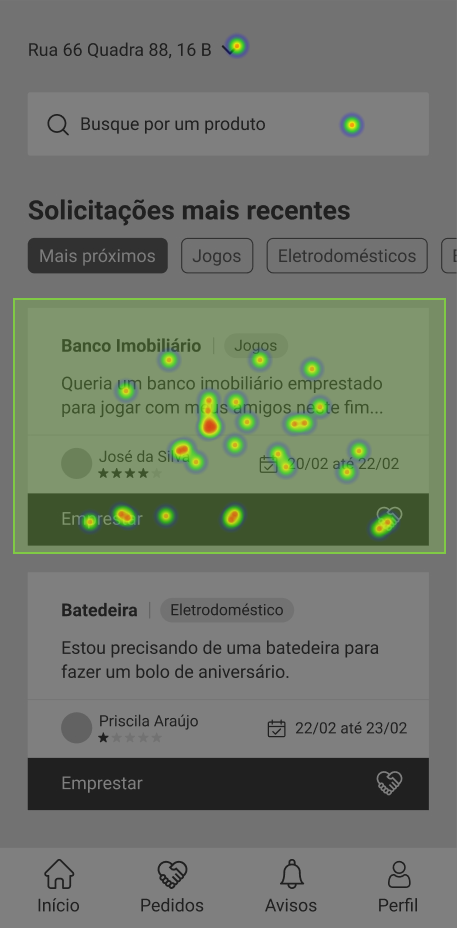

**Detalhes do Pedido**

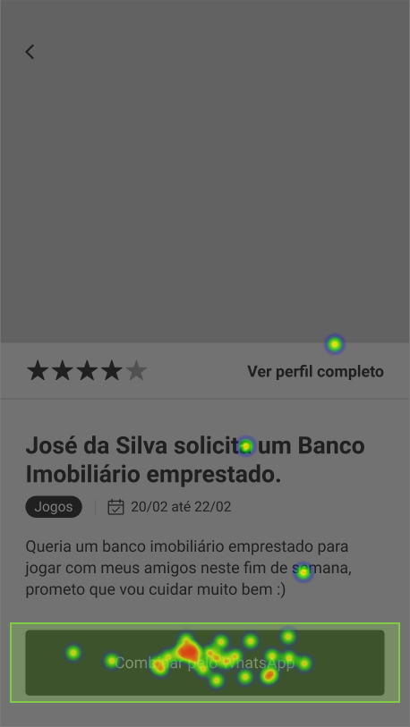

> #### Suponha que você quer pedir emprestado algum produto, como você faria isso?

**Home**

**Meus Pedidos**

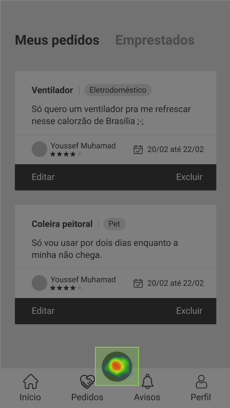

**Criar um Pedido**

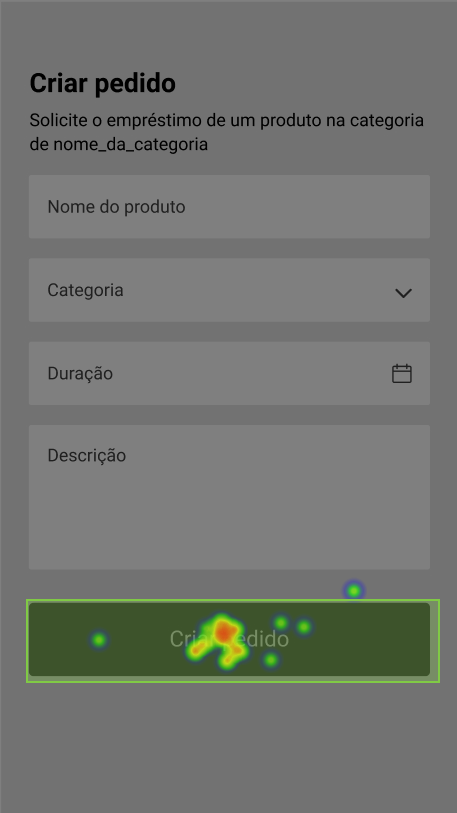

!> Embora existiram alguns poucos erros, a grande maioria acertou todo o fluxo.

---

### Fluxo #2: Confiança do usuário
[Link para o resultado](https://app.usabilityhub.com/tests/a64012e15619/results/714732678470)

> #### Você tem uma batedeira parada em casa e quer ajudar outra pessoa emprestando-a. Você emprestaria para a pessoa que esta pedindo no aplicativo?

**Home**

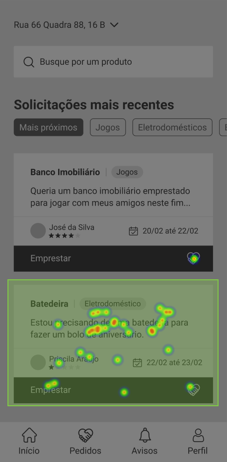

**Detalhes do Pedido**

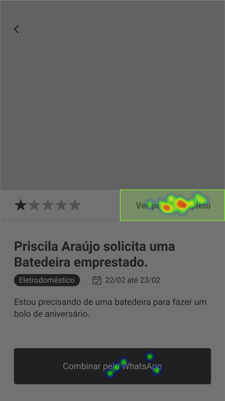

**Perfil do Usuário pedinte**

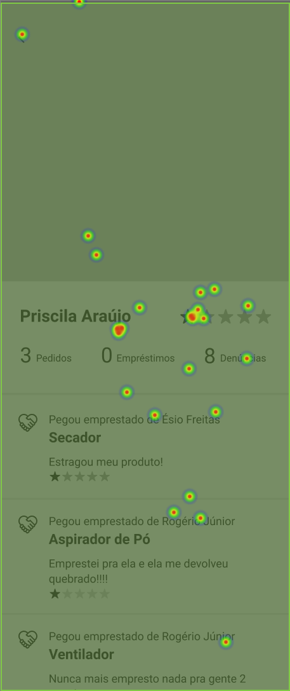

**Após a última tela, foi passado uma pergunta para os usuários:**

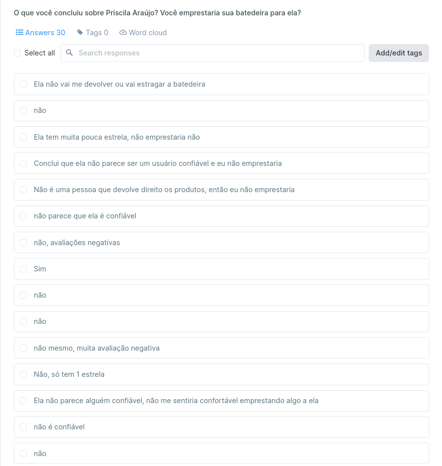

!> A abordagem de estrelas para determinar a confiança de um usuário foi bastante efetiva. O fluxo para chegar no perfil do usuário pedinte a partir da tela de detalhes de pedido também está bem intuitivo.

---

### Fluxo #3: Editar Localização / Perfil
[Link para o resultado](https://app.usabilityhub.com/tests/f2f30ab3d1eb/results/d22781ce2f3e)

> #### Suponha que você quer editar a sua localização no aplicativo, como você faria isso?

**Home**

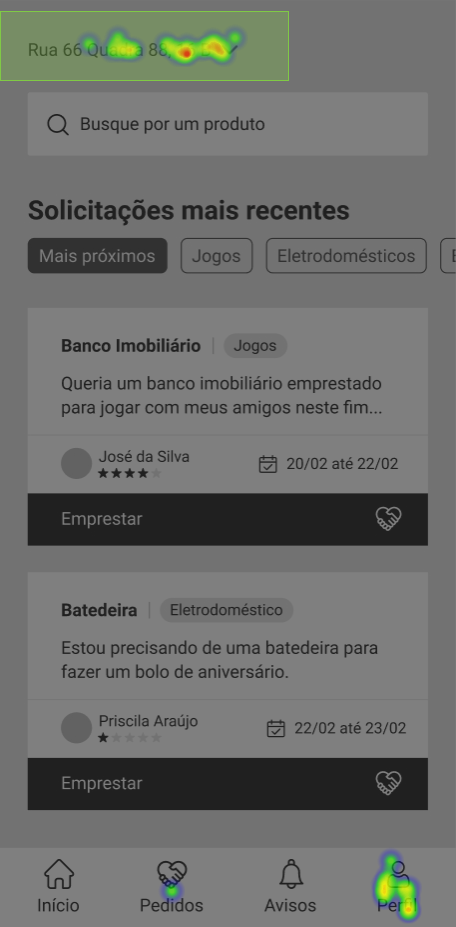

**Editar Localização**

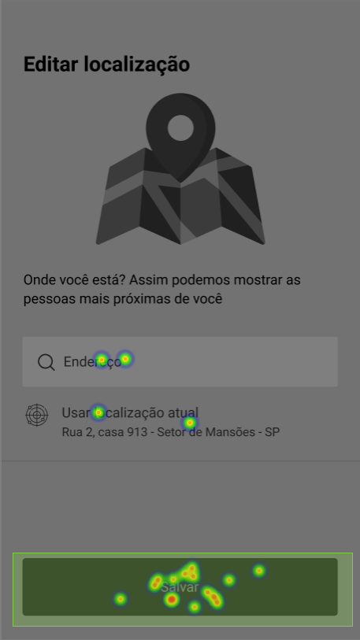

!> Podemos ver claramente que houve muito erro, diversos usuários foram em Perfil ao invés de irem no endereço presente no header. Isso será levado em conta no protótipo de alta fidelidade.

> #### Suponha que você queira editar seu perfil, como faria isso?

**Home**

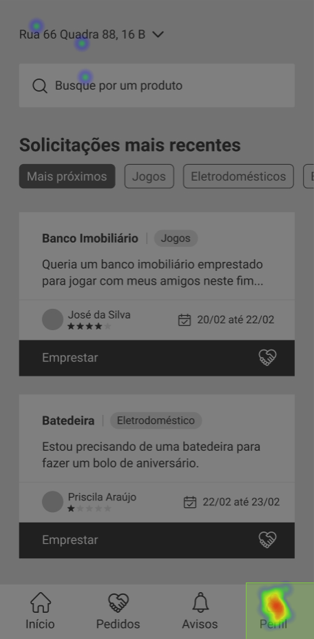

**Meu Perfil/Editar**

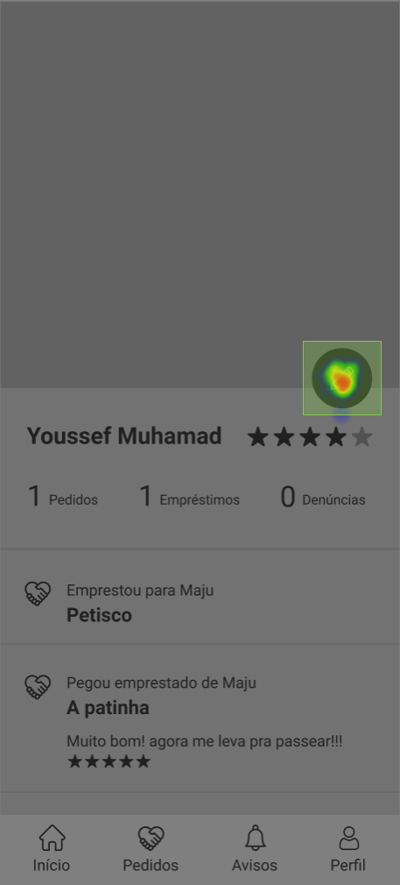

**Meu Perfil/Editado**

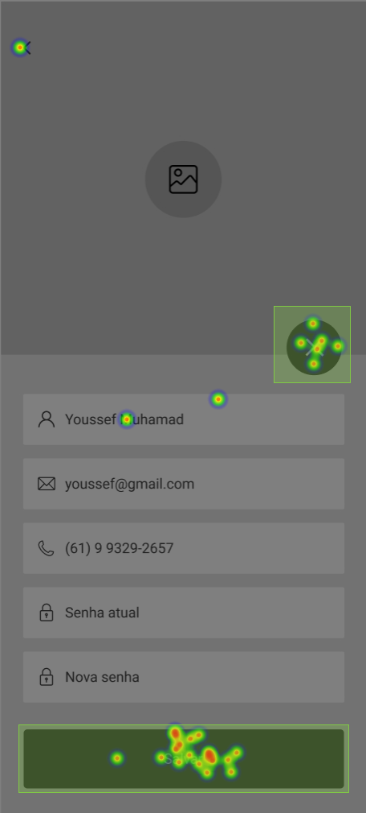

!> O fluxo de edição de perfil está intuitivo, só na última tela que alguns usuários decidiram salvar a edição e outros a cancelaram.

---

### Fluxo #4: Produto Emprestado
[Link para o resultado](https://app.usabilityhub.com/tests/728c642f333f/results/64bf19714054)

> #### Suponha que você esqueceu o objeto que você emprestou, como você o encontraria no aplicativo?

**Home**

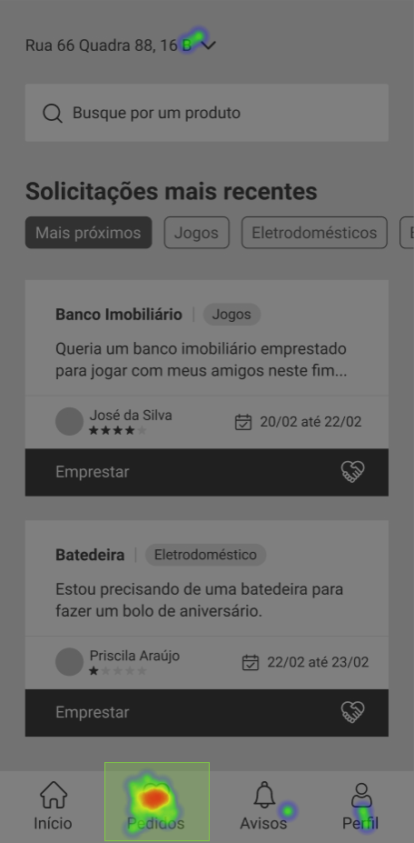

**Meus Pedidos**

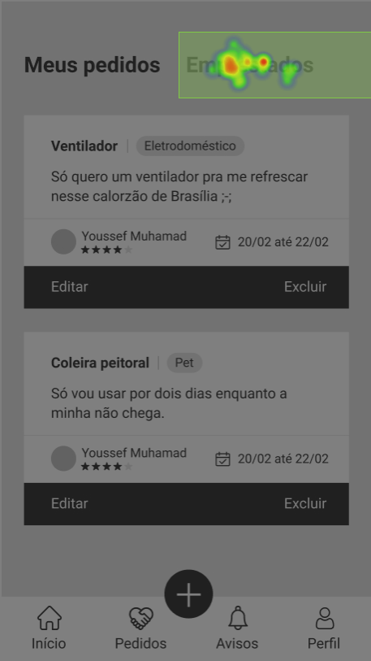

**Pedidos Emprestados**

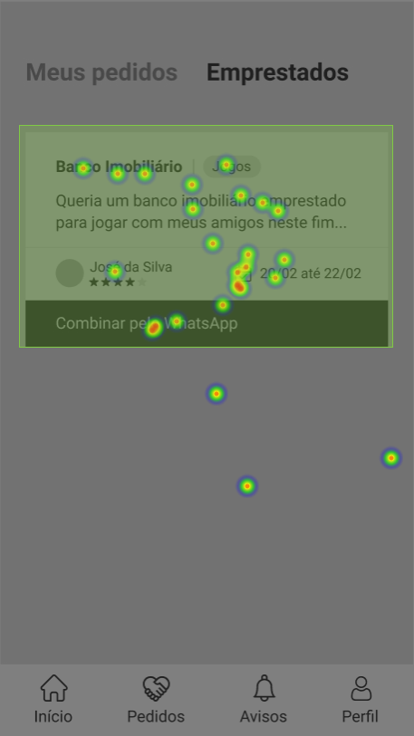

**Após a última tela, foi passado uma pergunta para os usuários:**

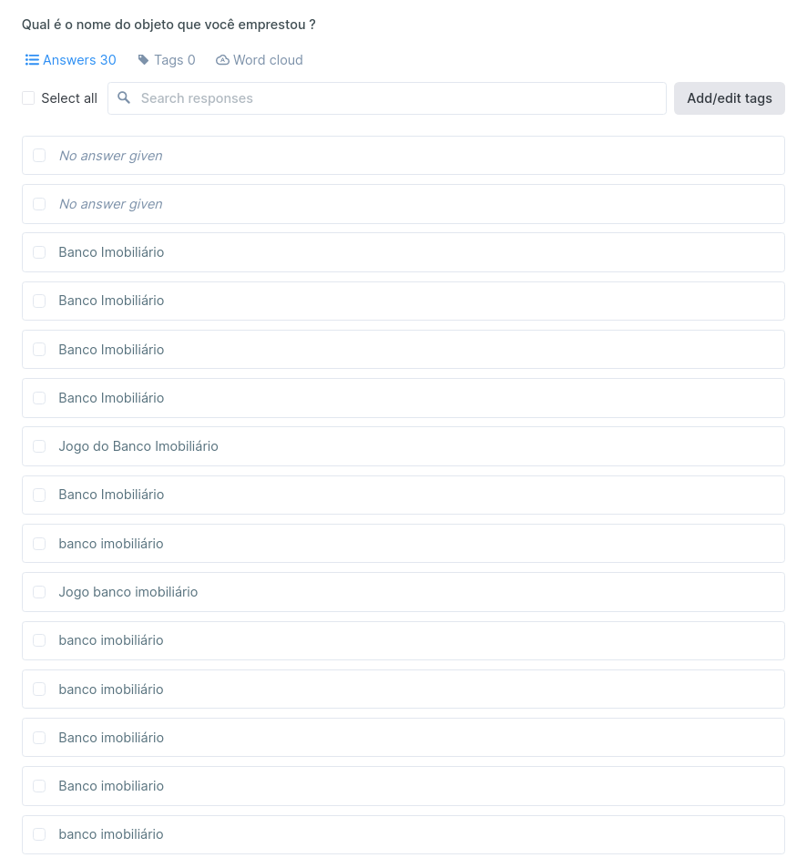

!> Podemos ver que um fluxo complexo com diversas telas teve muito sucesso, pois as telas seguem um padrão de layout que outros aplicativos também seguem(Tab Navigation).

---

### Fluxo #5: Avaliar usuário
[Link para o resultado](https://app.usabilityhub.com/tests/8afbcea36921/results/2cc09c678b5e)

> #### Você recebeu um aviso de uma avaliação pendente, o que você faria?

**Home**

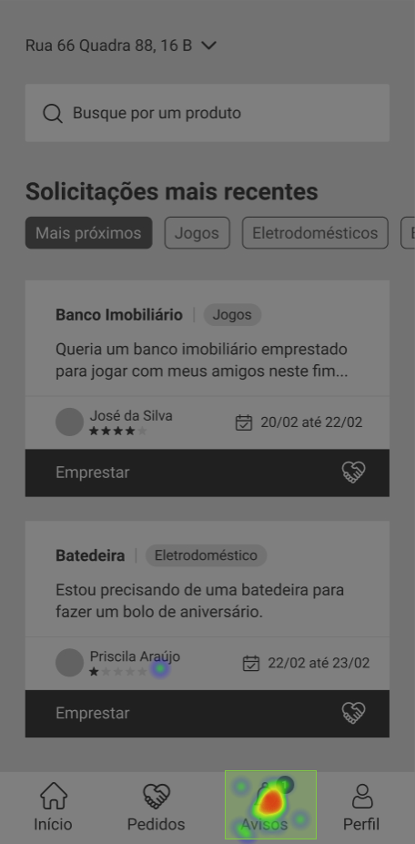

**Avisos**

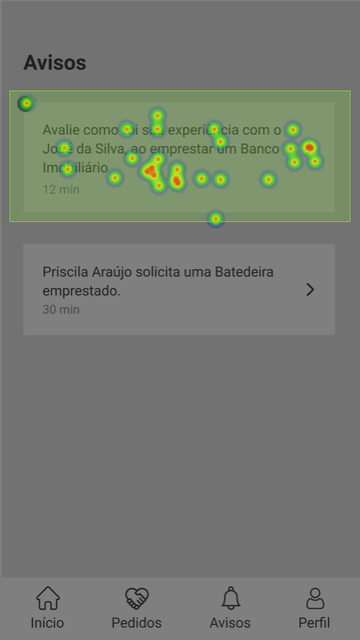

**Avaliar Usuário**

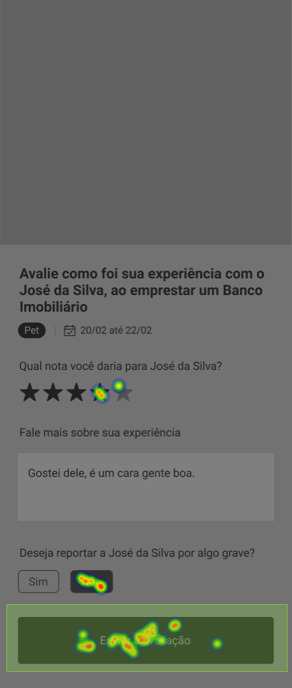

!> O fluxo de avaliação/denunciar usuário está intuitivo, somente na última tela que alguns usuários tentaram preencher de fato a avalição, coisa que não é o foco desse teste.

## Referências

- VOLPATO, Elisa. Teste de usabilidade: o que é e para que serve?. Disponível em: https://brasil.uxdesign.cc/teste-de-usabilidade-o-que-%C3%A9-e-para-que-serve-de3622e4298b. Acesso em: 9 março. 2021.
