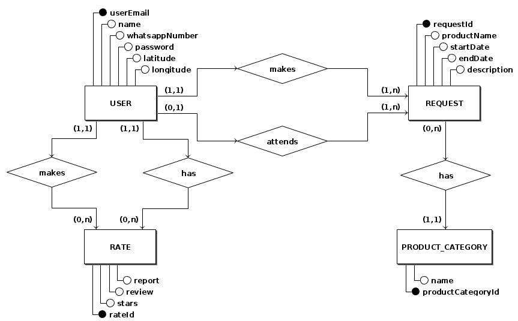
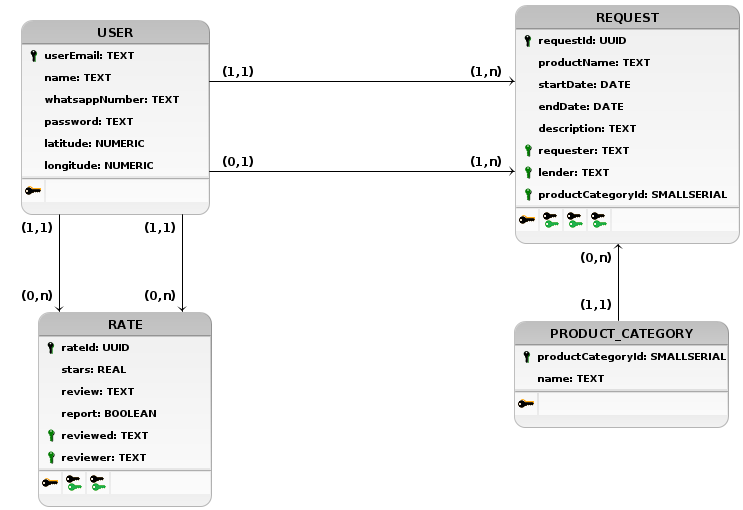

# Diagramas de Banco de Dados

Com o intuito de modelar o banco de dados, de acordo com os requisitos exigidos pelo Backlog, optou-se pelo uso de três documentos que precedem a criação do banco e guiam sua correta estruturação, são eles: Diagrama Entidade-Relacionamentos (DE-R) e Diagrama Lógico (DL).

O DE-R é a representação gráfica e a principal ferramenta de visualização dos relacionamentos entre as entidades do sistema. E por fim, o DL descreve como os dados serão armazenados no banco e também seus relacionamentos.

## Histórico de Revisões

| Data | Versão | Descrição | Autor(es) |
| :--: | :----: | :-------: | :-------: |
| 26/02/2021 | 1.0 | Adiciona primeira versão dos diagramas | Rogério Júnior & Thiago Mesquita |

## Diagrama Entidade-Relacionamentos (DE-R)

## Diagrama Lógico (DL)

**Autores:**
- [Rogério Júnior](https://github.com/rogerioo)
- [Thiago Mesquita](https://github.com/thiagompc)
