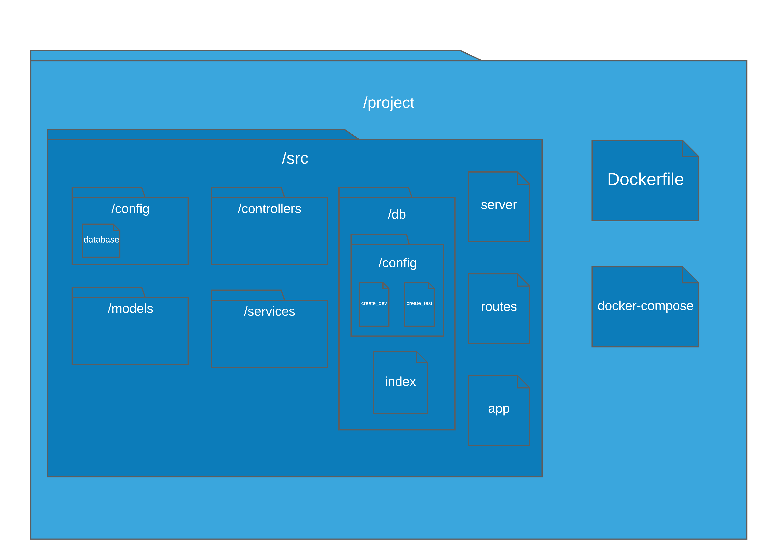
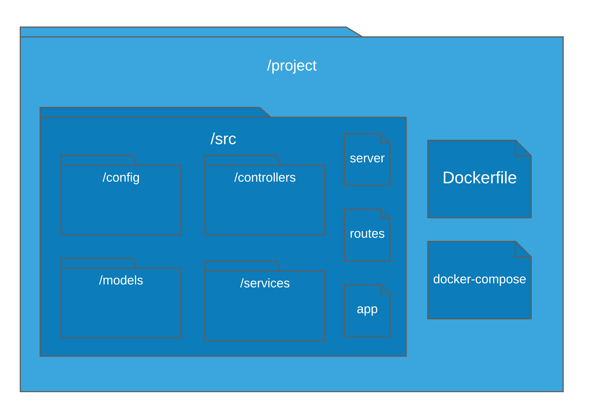
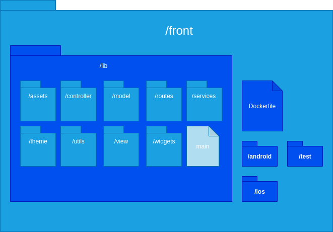
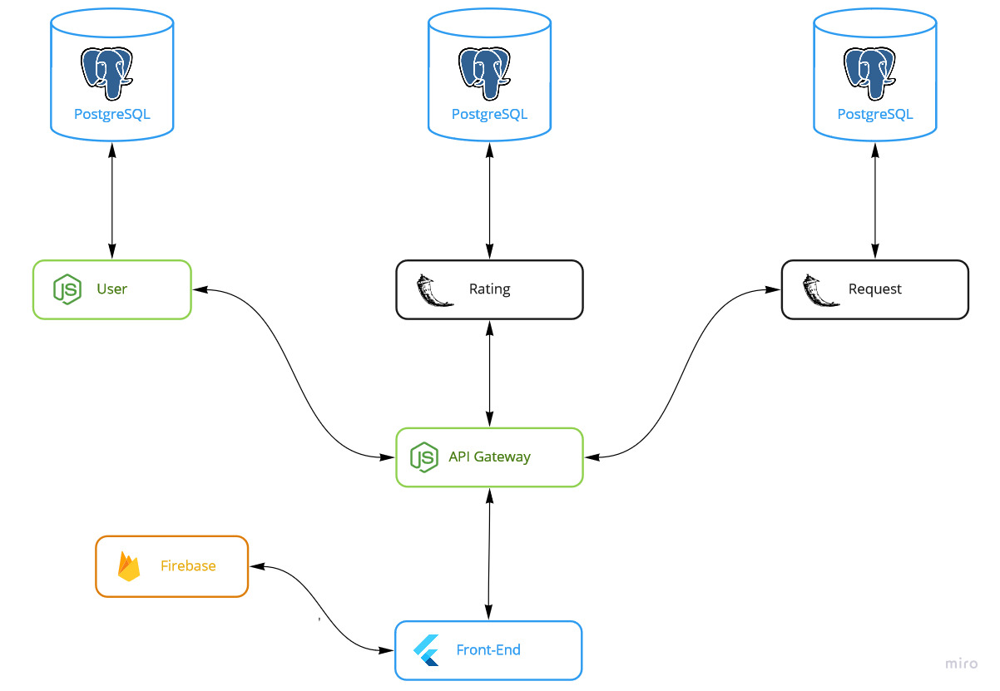
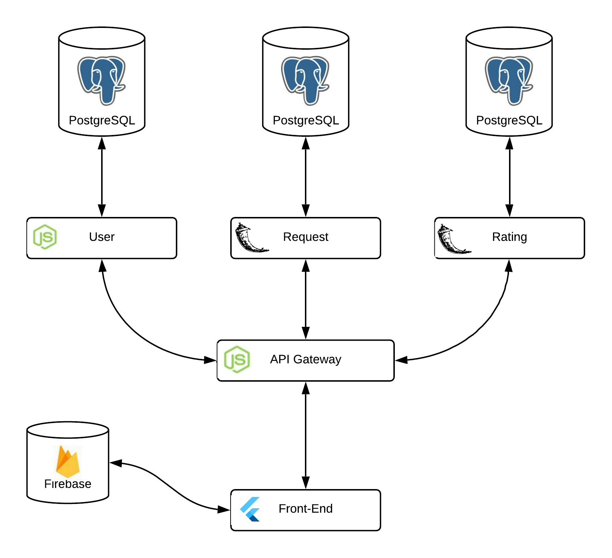
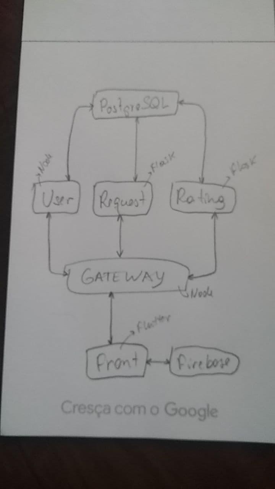

# Documento de arquitetura

## Histórico de revisão

| Data       | Versão | Modificação                                         | Autor              |
| :--------- | :----- | :-------------------------------------------------- | :----------------- |
| 22/02/2021 | 0.1    | Criação do documento                                | Thais Rebouças     |
| 23/02/2021 | 0.2    | Criação dos tópicos 1, 2 e 3                        | Thais Rebouças     |
| 24/02/2021 | 0.3    | Criação dos tópicos 4 e 5                           | Thais Rebouças     |
| 25/02/2021 | 0.4    | Adição do Diagrama de Pacotes                       | Vinicius Saturnino |
| 27/02/2021 | 0.5    | Adição do Diagrama de Caso de Uso                   | Matheus Monteiro   |
| 27/02/2021 | 0.5.1  | Remoçao do subtópico 1.3 e 1.4 e modificação do 1.2 | Thais Rebouças     |
| 05/03/2021 | 0.6    | Inclusão dos diagramas dos pacotes do back-end      | Matheus Afonso     |
| 05/03/2021 | 0.7    | Inclusão dos diagramas de contexto                  | Mateus Maia        |
| 05/03/2021 | 0.8    | Inclusão do DE-R e DLD na visão de dados            | Thiago Mesquita    |

## 1. Introdução

### 1.1 Finalidade

Este documento de arquitetura tem a função de especificar e documentar decisões arquiteturais relevantes na produção e implementação do projeto descrevendo os aspectos do sistema de forma clara, estruturada e objetiva.

### 1.2 Escopo

Este documento se aplica ao processo de desenvolvimento da aplicação, que possibilitará que um usuário solicite um objeto para empréstimo e/ou atender uma solicitação de pedido de empréstimo.

As visões contempladas por esse modelo são:

- Visão de Casos de Uso;
- Visão Lógica;

## 2. Representação da Arquitetural

Modelo de representação dos serviços implementados e as interações estabelecidas entre esses serviços, bem como a natureza dessas interações.

### 2.1 Tecnologias

### 2.1.1 Front End

- **Flutter**

Flutter é o kit de ferramentas de interface do usuário do Google para criar aplicativos compilados nativamente para dispositivos móveis, Web e desktop a partir de uma única base de código. É um framework que possui como linguagem base o Dart.

O Flutter foi escolhido por ser uma tecnologia em ascensão, que está se consolidando no mercado, e possui uma curva de aprendizado que se encaixava bem no escopo do projeto. A grande vantagem encontrada foi na velocidade de desenvolvimento de interfaces utilizando o Flutter, que é consideravelmente maior em relação ao seu principal concorrente, o React Native.

### 2.1.2 Back End

- **Express**
  O Express é um framework para aplicações web em Node.js. Pequeno e flexível, fornecendo um conjunto robusto de recursos para aplicativos web e mobile.

O Express demonstra todo o seu valor em sua escolha quando se trata de serviços de real-time, e também, por sua ampla comunidade que mantém o framework ativamente, além de sua simplicidade.

### 2.1.3 Banco de Dados

- **MySQL**
  O MySQL é um sistema de gerenciamento de banco de dados, que utiliza a linguagem SQL como interface. É atualmente um dos sistemas de gerenciamento de bancos de dados mais populares da Oracle Corporation, com mais de 10 milhões de instalações pelo mundo.

A utilização do MySQL se baseou em sua robustez, por ser um dos bancos mais utilizados do mundo, e um dos mais comuns em serviços de cloud.

- **Firebase**
  O Realtime Database do Firebase é um banco de dados não relacional (NoSQL) que permite a distribuição de conteúdos cross-platform.

O Firebase é uma tecnologia da Google, portanto, sua integração com o Flutter é muito boa, e sua escolha foi justificada pelo uso de real-time, onde o firebase também se sai muito bem.

## 3. Requisitos e Restrições de Arquitetura

### Requisitos

| Escalabilidade                 | Segurança                                                                  | Deploy                                       |
| ------------------------------ | -------------------------------------------------------------------------- | -------------------------------------------- |
| A aplicação deve ser escalável | A aplicação deve tratar de forma de segura os dados sensíveis dos usuários | A aplicação deve possuir deploy automatizado |

### Restrições

| Conectividade                                              | Plataforma                                    | Linguagem                                            | Equipe                                | Prazo                                                          |
| ---------------------------------------------------------- | --------------------------------------------- | ---------------------------------------------------- | ------------------------------------- | -------------------------------------------------------------- |
| É necessária a conexão com internet para utilização do App | A aplicação terá suporte somente para Android | A aplicação será desenvolvida em português do Brasil | A equipe possui apenas 10 integrantes | O escopo proposto deve ser terminado até o final da disciplina |

## 4. Visão de Casos de Uso

A Visão de Casos de Uso descreve um modelo com alta significância de alto nível em relação às funcionalidades do sistema. Normalmente feito através do Diagrama de Casos de Uso.

### 4.1 Diagrama de Casos de Uso

O Diagrama de Casos de Uso descreve as principais funcionalidades que o sistema pretende ter. Ele é constituído de atores, que representam os reais usuários do sistema e as funcionalidade do aplicativo proposto.

Segue o diagrama de casos de uso do projeto:

Autor: [Matheus Monteiro](https://github.com/matheusyanmonteiro)

## 5. Visão Lógica

A Visão Lógica mostra como está a organização conceitual do sistema em termos de camadas, pacotes, classes e interfaces.

### 5.1 Diagrama de Pacotes

O Diagrama de Pacotes tem como objetivo estruturar hierarquicamente as pastas que compõem o projeto.

Segue o diagrama de pacotes do projeto:

## Diagrama de pacotes Node.js V2

Autor: [Matheus Afonso](https://github.com/matheusafonsouza)

## Diagrama de pacotes Node.js V1

Autor: [Matheus Afonso](https://github.com/matheusafonsouza)

## Diagrama de pacotes Flutter V1

Autor: [Vinicius Saturnino](https://github.com/viniciussaturnino)

## Diagrama de pacotes Flask V1

Autor: [Matheus Afonso](https://github.com/matheusafonsouza)

## 6. Diagrama de contexto

Diagrama de contexto é uma ferramenta para modelar o escopo através de um diagrama. Em desenvolvimento de sistemas, ele é considerado o diagrama de fluxo de dados de maior nível, isto é, um diagrama que representa todo o sistema. Além disso, ele demonstra como as partes interessadas e outras entidades interagem com o sistema indicando suas entradas e saídas.

## Diagrama de contexto V4

## Diagrama de contexto V3

Autor: [Mateus Maia](https://github.com/mateusmaiamaia)

## Diagrama de contexto V2

Autor: [Mateus Maia](https://github.com/mateusmaiamaia)

## Diagrama de contexto V1

Autor: [Thais Rebouças](https://github.com/Thais-ra)

## 7. Visão de Dados (banco)

A Visão de Dados mostra como está arquiteturada a camada de persistência do projeto, mapeando os objetos e os modelos de dados.

## Modelo Conceitual

.png>)

Autores: [Rogério Júnior](https://github.com/rogerioo), [Thiago Mesquita](https://github.com/thiagompc)

## Modelo Lógico

.png>)

Autores: [Rogério Júnior](https://github.com/rogerioo), [Thiago Mesquita](https://github.com/thiagompc)

## 8 Referências

- DONG, Tao. Flutter. [S. l.], 2019. Disponível em: https://medium.com/flutter. Acesso em: 23 fev. 2021.

- FLASK (FRAMEWORK WEB). In: WIKIPÉDIA, a enciclopédia livre. Flórida: Wikimedia Foundation, 2019. Disponível em: https://pt.wikipedia.org/w/index.php?title=Flask_(framework_web)&oldid=55329171. Acesso em: 23 fev. 2021.

- NODE.JS. In: WIKIPÉDIA, a enciclopédia livre. Flórida: Wikimedia Foundation, 2019. Disponível em: https://pt.wikipedia.org/w/index.php?title=Node.js&oldid=55592828. Acesso em: 23 fev. 2021.
